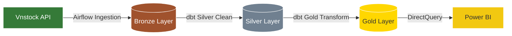

# Vietnam Stock Market Data Engineering Pipeline

Một hệ thống tự động cào, xử lý dữ liệu thị trường chứng khoán Việt Nam hàng ngày theo kiến trúc **Medallion (Bronze -> Silver -> Gold)**, được điều phối bởi **Apache Airflow** và biến đổi bằng **dbt**, kết nối trực tiếp đến **Power BI**.

---

## 🏗️ Luồng dữ liệu (Data Flow)



* **Bronze Layer**: Lưu trữ dữ liệu thô (raw JSON) thu thập từ các nguồn (KBS, VCI...) thông qua thư viện Vnstock.
* **Silver Layer**: Làm sạch dữ liệu, kiểm tra chất lượng (Data Quality Gates) và loại bỏ trùng lặp.
* **Gold Layer**: Tính toán các chỉ báo tài chính (EMA, RSI, MACD, Bollinger Bands) theo mô hình hình sao (Star Schema).

---

## 🚀 Khởi chạy hệ thống (2 bước duy nhất)

Nhờ cấu hình Docker tự động hóa, bạn chỉ cần thực hiện 2 lệnh sau ở thư mục gốc:

### Bước 1: Tạo cấu hình môi trường
```bash
cp .env.example .env
```
*(Mở file `.env` ra và điền khóa `VNSTOCK_API_KEY` của bạn).*

### Bước 2: Khởi chạy Docker Compose
```bash
docker compose up -d
```
> [!NOTE]
> Lệnh này sẽ tự động dựng toàn bộ hạ tầng, khởi tạo cấu trúc cơ sở dữ liệu Postgres (Bronze schema) và tải sẵn các thư viện dbt cần thiết.

---

## ⚙️ Quản lý & Chạy thủ công

### 1. Airflow Web UI (Điều phối daily)
* Truy cập địa chỉ: `http://localhost:8080`
* Tài khoản mặc định: **admin** / **admin**
* Bật/Trigger DAG `daily_stock_pipeline` để bắt đầu chạy pipeline cào và xử lý dữ liệu.

### 2. Chạy dbt thủ công (Biến đổi dữ liệu)
Nếu muốn chạy trực tiếp các lệnh dbt để tạo lại bảng Silver/Gold hoặc chạy test:
```bash
docker exec airflow-container bash -c "cd /opt/airflow/project/dbt && dbt build --profiles-dir ."
```

### 3. Kết nối Power BI
Kết nối client Power BI Desktop của bạn trực tiếp vào Database:
* **Host**: `localhost`
* **Port**: `5432`
* **Database**: `stock_db`
* **Username/Password**: `airflow` / `airflow`
* **Tables**: Kết nối trực tiếp vào các bảng tầng `gold` (như `dim_stock`, `fact_stock_indicators`).
