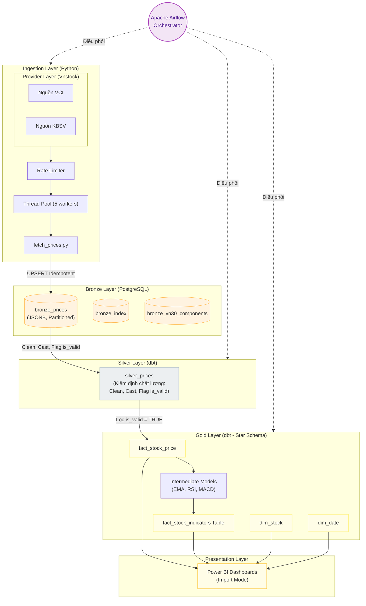

# Vietnam Stock Market Data Engineering Pipeline

Một hệ thống tự động cào, xử lý dữ liệu thị trường chứng khoán Việt Nam hàng ngày theo kiến trúc **Medallion (Bronze -> Silver -> Gold)**, được điều phối bởi **Apache Airflow** và biến đổi bằng **dbt**, kết nối trực tiếp đến **Power BI**.

---

## 🏗️ Kiến trúc hệ thống & Luồng dữ liệu (Architecture & Data Flow)



* **Bronze Layer**: Lưu trữ dữ liệu thô (raw JSON) thu thập từ các nguồn (KBS, VCI...) thông qua thư viện Vnstock.
* **Silver Layer**: Làm sạch dữ liệu, kiểm tra chất lượng (Data Quality Gates) và loại bỏ trùng lặp.
* **Gold Layer**: Tính toán các chỉ báo tài chính (EMA, RSI, MACD, Bollinger Bands) theo mô hình hình sao (Star Schema).

---

## 🚀 Khởi chạy hệ thống (2 bước duy nhất)

Nhờ cấu hình Docker tự động hóa, bạn chỉ cần thực hiện 2 lệnh sau ở thư mục gốc:

### Bước 1: Tạo cấu hình môi trường
```bash
cp .env.example .env
```
*(Mở file `.env` ra và điền khóa `VNSTOCK_API_KEY` của bạn).*

### Bước 2: Khởi chạy Docker Compose
```bash
docker compose up -d
```
> [!NOTE]
> Lệnh này sẽ tự động dựng toàn bộ hạ tầng, khởi tạo cấu trúc cơ sở dữ liệu Postgres (Bronze schema) và tải sẵn các thư viện dbt cần thiết.

---

## ⚙️ Quản lý & Chạy thủ công

### 1. Airflow Web UI (Điều phối daily)
* Truy cập địa chỉ: `http://localhost:8080`
* Tài khoản mặc định: **admin** / **admin**
* Bật/Trigger DAG `daily_stock_pipeline` để bắt đầu chạy pipeline cào và xử lý dữ liệu.

### 2. Chạy dbt thủ công (Biến đổi dữ liệu)
Nếu muốn chạy trực tiếp các lệnh dbt để tạo lại bảng Silver/Gold hoặc chạy test:
```bash
docker exec airflow-container bash -c "cd /opt/airflow/project/dbt && dbt build --profiles-dir ."
```

### 3. Mở Power BI Dashboard (Đã thiết kế sẵn)
Dự án đã tích hợp sẵn Dashboard chuyên nghiệp tại: `reports/Daily_OHLCV_analysis.pbix`.
Để sử dụng:
1. Mở file `reports/Daily_OHLCV_analysis.pbix` bằng phần mềm **Power BI Desktop**.
2. Trên thanh menu Home, bấm nút **Refresh** (Làm mới) để tự động đồng bộ và hiển thị dữ liệu mới nhất từ database PostgreSQL local của bạn.
*(Nếu bạn thay đổi cổng hoặc thông tin kết nối DB trong `.env`, hãy vào **Transform data** -> **Data source settings** -> **Change Source** để cập nhật lại thông số).*

### 4. Mở Dashboard HTML Dự phòng (Plan B)
Dự án tích hợp sẵn Dashboard HTML tương tác vẽ bằng Plotly.js để xem dữ liệu nhanh không cần cài Power BI:
* **Cách mở nhanh trên Windows (từ WSL)**: Chạy lệnh sau trong terminal để tự động chuyển đổi đường dẫn và mở bằng trình duyệt mặc định (tránh lỗi đường dẫn UNC):
  ```bash
  powershell.exe -c "Start-Process '$(wslpath -w reports/dashboard_backup.html)'"
  ```
  Hoặc mở thư mục chứa file bằng Windows Explorer từ WSL:
  ```bash
  explorer.exe reports
  ```
  rồi click đúp vào file `dashboard_backup.html`.
* **Cách cập nhật dữ liệu mới**: Chạy script Python sau để kéo dữ liệu mới nhất từ PostgreSQL vào file HTML:
  ```bash
  ./venv/bin/python scripts/generate_dashboard_backup.py
  ```
