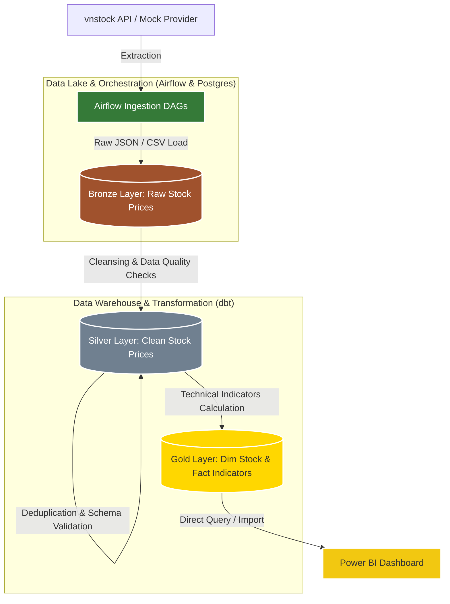

# Vietnam Stock Market Data Engineering Pipeline

A robust, production-ready daily-batch data engineering pipeline that automatically extracts Vietnam stock market data, orchestrates the ingestion into a PostgreSQL Data Warehouse via Apache Airflow, performs data transformations using dbt (data build tool) following the Medallion Architecture, and visualizes market insights through Power BI.

---

## 🏗️ Architecture & Data Flow



### Key Components:
- **Bronze Layer (Raw)**: Captures raw JSON/CSV data from VNStock or Mock providers. Kept as history.
- **Silver Layer (Cleansing)**: Cleanses data, filters out negatives/outliers, checks for data quality constraints, and de-duplicates stock records.
- **Gold Layer (Analytical)**: Computes complex financial indicators (Moving Averages, Relative Strength Index - RSI, Moving Average Convergence Divergence - MACD) in a dimensional model layout (`dim_stock`, `fact_stock_indicators`).
- **Orchestration**: Apache Airflow controls daily pipelines and historical backfills.
- **Transformation**: dbt (Data Build Tool) handles the Medallion incremental pipeline.

---

## 🚀 Getting Started

### 1. Prerequisites
Make sure you have the following installed on your system:
- **Docker** and **Docker Compose**
- **Python 3.12+** (Optional, only for local scripts running)

### 2. Configuration
Clone the repository and initialize your environment configurations:
```bash
cp .env.example .env
```
Edit the `.env` file to set your database credentials, Airflow settings, and data provider mode (e.g., `PROVIDER=vnstock` or `PROVIDER=mock` for fallback mock data).

### 3. Start the Infrastructure
Spin up the PostgreSQL Data Warehouse and the Apache Airflow orchestration engine:
```bash
docker compose up -d
```
Check if all containers are running successfully:
```bash
docker ps
```

### 4. Initialize Data Warehouse Schema
Apply the database schemas and structure initialization on your PostgreSQL container:
```bash
docker exec -i postgres-container psql -U airflow -d stock_db < sql/init_schema.sql
```

### 5. Access Apache Airflow Web UI
Open your browser and navigate to `http://localhost:8080`.
* **Username**: `admin`
* **Password**: `admin`

---

## ⚙️ Running the Pipeline

### Historical Backfill (Optional)
To backfill data historically before running daily scheduled pipelines, execute the backfill script:
```bash
./trigger_backfill.sh
```
Alternatively, you can manually trigger the `manual_backfill_pipeline` directly from the **Airflow Web UI**.

### Installing dbt Packages (Required for the first run)
Run the following command to download and install the required dbt dependencies (`dbt_utils`):
```bash
docker exec airflow-container bash -c "cd /opt/airflow/project/dbt && dbt deps --profiles-dir ."
```

### Running Transformations (dbt)
Run the dbt model transformations and validation checks (Silver and Gold layers):
```bash
docker exec airflow-container bash -c "cd /opt/airflow/project/dbt && dbt build --profiles-dir ."
```

---

## 🛠️ Demo & Verification Utility
The project includes a utility script `scripts/demo_helper.py` to easily manage, reset, and check the status of your database and environments:

* **Check System Status** (Configured provider and row counts per table):
  ```bash
  python3 scripts/demo_helper.py status
  ```
* **Switch to Demo Mode** (Uses local database config and offline Mock Provider):
  ```bash
  python3 scripts/demo_helper.py switch-demo
  ```
* **Switch to Real Production Mode** (Uses live PostgreSQL connection and Vnstock API):
  ```bash
  python3 scripts/demo_helper.py switch-real
  ```
* **Reset Database** (Clears all records from Bronze/Silver/Gold tables and reconstructs schema):
  ```bash
  python3 scripts/demo_helper.py reset
  ```

---

## 📊 Visualization
To build or view the analytics dashboards, connect your Power BI Desktop client directly to the PostgreSQL database:
- **Host**: `localhost` (or your Docker host IP)
- **Database**: `stock_db`
- **Schema**: `gold`
- **Tables**: `dim_stock`, `fact_stock_indicators`

---

## 📂 Local Documentation
Detailed design documents, rule books, and engineering notes are maintained locally inside the `docs/` directory for development reference:
- 📑 **Context & Scope** (`docs/CONTEXT.md`): Business goals and structural scope.
- 📐 **Data Contracts** (`docs/DATA_CONTRACTS.md`): Schema constraints between Bronze, Silver, and Gold.
- ⚙️ **Project Rules & Conventions** (`docs/PROJECT_RULES.md`): Code quality guidelines.
- 📈 **SQL Indicator Specifications** (`docs/SKILL_sql_indicators.md`): Math formulas used for technical indicators.
- 🧪 **Test Reports** (`docs/TEST_REPORTS.md`): Log history of pytest and dbt tests.
