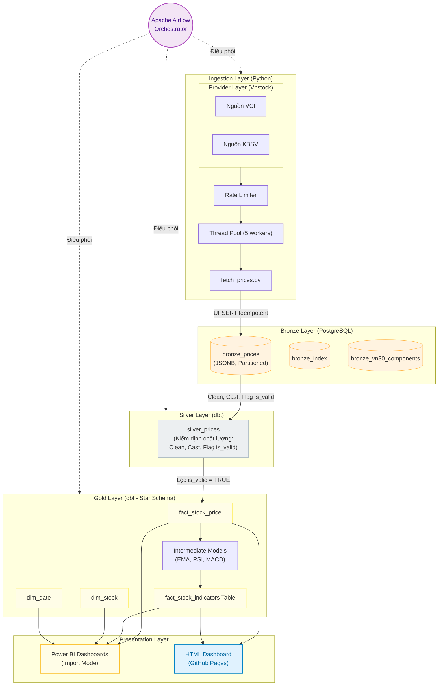

# Vietnam Stock Market Data Engineering Pipeline

Một hệ thống tự động thu thập, xử lý và trực quan hóa dữ liệu thị trường chứng khoán Việt Nam hàng ngày theo kiến trúc **Medallion (Bronze -> Silver -> Gold)**, được điều phối bởi **Apache Airflow**, biến đổi dữ liệu bằng **dbt (PostgreSQL)**, và kết nối báo cáo qua **Power BI** & **HTML Dashboard**.

---

## 🏗️ 1. Giới thiệu & Kiến trúc hệ thống (Architecture)



* **Bronze Layer**: Lưu trữ dữ liệu thô (raw JSON) thu thập từ các nguồn (KBS, VCI...) thông qua thư viện Vnstock.
* **Silver Layer**: Làm sạch dữ liệu, kiểm tra chất lượng (Data Quality Gates) và loại bỏ trùng lặp.
* **Gold Layer**: Tính toán các chỉ báo tài chính (EMA, RSI, MACD, Bollinger Bands) theo mô hình hình sao (Star Schema).

---

## 🚀 2. Hướng dẫn khởi chạy nhanh (Quick Start)

Nhờ cấu hình Docker tự động hóa, bạn chỉ cần thực hiện 2 bước đơn giản sau tại thư mục gốc của dự án:

### Bước 1: Thiết lập tệp cấu hình môi trường
```bash
cp .env.example .env
```
*(Mở file `.env` vừa tạo ra và điền khóa `VNSTOCK_API_KEY` của bạn).*

### Bước 2: Khởi chạy hạ tầng container
```bash
docker compose up -d
```
> [!NOTE]
> Lệnh này dựng toàn bộ hạ tầng (Postgres, Airflow, dbt) và tự động khởi tạo cấu trúc cơ sở dữ liệu, phân vùng bảng, và tải sẵn các package dbt cần thiết.

---

## ⚙️ 3. Quản lý vận hành & Dashboard Báo cáo

### A. Vận hành & Giám sát Data Pipeline (Operations)
* **Airflow Web UI (Điều phối daily)**:
  * Địa chỉ: `http://localhost:8080` (Tài khoản mặc định: `admin` / `admin`).
  * Sử dụng: Bật/Trigger DAG `daily_stock_pipeline` để bắt đầu cào và xử lý dữ liệu tự động.
* **Biến đổi dữ liệu thủ công (dbt CLI)**:
  Nếu muốn chạy trực tiếp dbt để test hoặc tạo lại bảng Silver/Gold:
  ```bash
  docker exec airflow-container bash -c "cd /opt/airflow/project/dbt && dbt build --profiles-dir ."
  ```

### B. Trực quan hóa & Phân tích số liệu (Dashboards)

Hệ thống cung cấp hai phương án trực quan hóa dữ liệu trực tuyến (online) phục vụ báo cáo và phân tích kỹ thuật:

| Dashboard | Trạng thái / Link Online | Mô tả vai trò | Hướng dẫn sử dụng |
| :--- | :--- | :--- | :--- |
| **Power BI Web Report** | [](https://app.powerbi.com/view?r=your_actual_powerbi_share_link) | **Báo cáo phân tích chuyên sâu (Primary)**: Kết nối database Gold, chứa các phân tích đa chiều nâng cao, biểu đồ phân tích kỹ thuật tổng hợp, và tính năng time-intelligence. | Click vào badge để xem trực tuyến trên trình duyệt (hoặc tải file offline `.pbix` trong thư mục `reports/`). |
| **HTML Dashboard** | [](https://kei312.github.io/smalldestocktotngiep/) | **Trang web truy cập nhanh & Dự phòng (Web/Offline Backup)**: Chạy serverless trên GitHub Pages, tự động cập nhật lúc 18h20, nhẹ nhàng, xem được trên mọi thiết bị và hoạt động offline không cần mạng. | Click vào badge để xem trực tuyến.<br>Để mở file local từ terminal:<br>• **WSL**: `powershell.exe -c "Start-Process '$(wslpath -w docs/index.html)'"`<br>• **Linux**: `xdg-open docs/index.html`<br>• **macOS**: `open docs/index.html` |

> [!TIP]
> - **Cấu hình tự động publish HTML**: Xem hướng dẫn tại [DASHBOARD_PUBLISH_GUIDE.md](file:///home/naeouad/deproject/docs/DASHBOARD_PUBLISH_GUIDE.md).
> - **Cập nhật dữ liệu thủ công local cho HTML**: Chạy lệnh: `docker exec -it airflow-container python /opt/airflow/project/scripts/generate_dashboard_backup.py`
