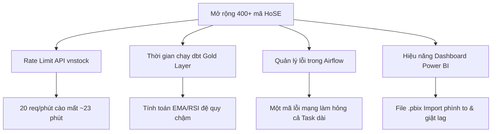

# Kế Hoạch Mở Rộng Hệ Thống (Scaling Plan) — Universe HoSE ~400 Mã

Tài liệu này phác thảo các thách thức kỹ thuật và đề xuất các giải pháp kiến trúc chi tiết để mở rộng quy mô đường ống dữ liệu (data pipeline) hiện tại của dự án từ **30 mã (VN30)** lên toàn bộ sàn HoSE với **khoảng 400+ mã**.

---

## 1. Thách thức lớn khi mở rộng quy mô (Scaling Bottlenecks)

Khi số lượng mã chứng khoán tăng gấp **13 lần** (từ 30 lên 400+), hệ thống sẽ gặp phải 4 điểm nghẽn chính sau:



### A. Tần suất giới hạn API (API Rate Limit)
- **vnstock Guest limit** giới hạn ở mức 20 requests/phút (giãn cách ~3.1s - 3.5s/request). 
- Với 400 mã, chỉ cào 1 ngày (daily run) đã mất **400 requests ≈ 23.3 phút**.
- Nếu chạy backfill lịch sử (ví dụ nạp lại dữ liệu 5 năm dưới dạng chia nhỏ chunk), số request tăng lên hàng ngàn và thời gian cào sẽ kéo dài vài tiếng đồng hồ, làm tăng nguy cơ bị chặn IP tạm thời.

### B. Hiệu năng tính toán của dbt (dbt Bottleneck)
- Với 400 mã và 5 năm lịch sử, số dòng dữ liệu thô trong Bronze sẽ đạt mức **~560,000 dòng** (400 mã × ~260 ngày giao dịch/năm × 5.5 năm).
- Hiện tại, các model trung gian như `int_rsi14`, `int_ema12`, `int_ema26`, `int_macd_signal` đang cấu hình `materialized='table'` (tức là tính toán đệ quy lại từ đầu cho toàn bộ lịch sử mỗi lần `dbt run`). Khi dữ liệu tăng gấp 13 lần, việc rebuild toàn bộ chuỗi thời gian đệ quy đứt gãy sẽ cực kỳ chậm và ngốn CPU của Postgres.

### C. Quản lý lỗi điều phối (Airflow Task Reliability)
- Một task `fetch_prices` chạy kéo dài liên tục hơn 20 phút rất dễ bị thất bại giữa chừng do sự cố đường truyền mạng. 
- Do đang chạy tuần tự, nếu task bị fail ở mã thứ 380, việc khởi động lại và cào lại từ đầu (ngay cả khi có skip-resume) vẫn tốn nhiều thời gian kiểm tra.

### D. Dung lượng và Hiệu năng Power BI
- File `.pbix` sử dụng chế độ Import sẽ phình to dung lượng bộ nhớ RAM của client khi lưu trữ hàng triệu dòng chỉ báo kỹ thuật của 400 mã cổ phiếu, làm chậm trải nghiệm tương tác của người dùng.

---

## 2. Giải pháp Kiến trúc chi tiết (Proposed Architecture Solutions)

### Phần A: Tối ưu hóa tầng Ingestion (Rate-Limit & Parallelization)

#### 1. Nâng cấp API hoặc Cơ chế Xoay vòng (Rotation)
*   **Giải pháp 1 (Khuyên dùng):** Nâng cấp tài khoản lên chương trình **VNSTOCK Insiders**. Mức quota tăng lên 5 lần (100 requests/phút), cho phép giảm thời gian sleep từ 3.1s xuống còn **0.5s**. Tổng thời gian cào 400 mã sẽ giảm từ 23 phút xuống chỉ còn **~3.5 phút**.
*   **Giải pháp 2 (Dự phòng):** Cấu hình cơ chế xoay vòng tài khoản (credential rotation) hoặc xoay vòng IP (proxy rotation) ở tầng `VnstockProvider` để chia đều lượng request gửi lên SSI/TCBS/DNSE.

#### 2. Áp dụng Dynamic Task Mapping trong Airflow
*   Thay vì cấu hình 1 task `fetch_prices` cào tuần tự 400 mã, ta sẽ chia danh sách mã thành các lô nhỏ (ví dụ 8 lô, mỗi lô 50 mã).
*   Sử dụng tính năng **Dynamic Task Mapping** (`.expand()`) của Airflow để sinh ra 8 task chạy song song trên các worker.
*   **Lợi ích:** Rút ngắn thời gian cào tối đa và nếu 1 lô bị lỗi mạng, Airflow chỉ cần chạy lại lô 50 mã đó chứ không làm ảnh hưởng đến các lô đã cào thành công khác.

```python
# Minh họa Dynamic Task Mapping trong Airflow DAG
from airflow.decorators import task

@task
def get_symbol_batches():
    # Chia 400 mã thành 8 danh sách, mỗi danh sách 50 mã
    return [symbols[i:i+50] for i in range(0, len(symbols), 50)]

@task
def fetch_batch_prices(symbol_batch):
    # Lệnh gọi python -m ingestion.fetch_prices cho từng batch
    ...

# Trong DAG:
batches = get_symbol_batches()
fetch_batch_prices.expand(symbol_batch=batches)
```

---

### Phần B: Tối ưu hóa dbt & PostgreSQL (Tầng Warehouse)

#### 1. Chuyển đổi mô hình dbt sang Incremental (Tầng Trung Gian)
Các model tính toán đệ quy trong thư mục `dbt/models/gold/intermediate/` bắt buộc phải được chuyển từ `table` sang `incremental` với cơ chế **Lookback Window**:

*   **Logic:** Mỗi lần chạy hàng ngày, hệ thống chỉ lấy dữ liệu giá của **30 ngày gần nhất** (lookback) để tính toán RSI/EMA mới nhất, rồi lưu đè/chèn thêm vào bảng Gold thay vì tính lại từ năm 2021.
*   Đoạn cấu hình mẫu cho `int_rsi14.sql` chạy incremental:
    ```sql
    {{ config(
        materialized='incremental',
        unique_key=['symbol', 'trade_date']
    ) }}

    WITH source_data AS (
        SELECT * FROM {{ ref('fact_stock_price') }}
        
        -- Chỉ lấy dữ liệu từ ngày cũ nhất cần tính (ví dụ: ngày chạy hiện tại trừ đi 30 ngày đệm)
        WHERE trade_date >= (SELECT MAX(trade_date) FROM {{ this }}) - INTERVAL '30 days'
        
    )
    ...
    ```

#### 2. Thiết lập Index & Partitioning chuyên sâu
*   **Postgres Partitions:** Tiếp tục duy trì chia partition theo năm cho bảng `bronze_prices` và `fact_stock_indicators`.
*   **Database Indexes:** Tạo chỉ mục hỗn hợp (Composite Index) trên các cột khóa ngoại thường xuyên JOIN và FILTER:
    ```sql
    CREATE INDEX IF NOT EXISTS idx_indicators_symbol_date 
    ON gold.fact_stock_indicators (symbol, trade_date);
    ```

---

### Phần C: Quản lý danh mục và lọc mã rác

#### 1. Xây dựng Bảng Danh mục Cổ phiếu (Symbol Registry)
*   Không hardcode danh sách 400 mã. Xây dựng một bảng cấu hình `dim_symbol_registry` lưu thông tin: `symbol`, `exchange`, `status` (`ACTIVE`, `DELISTED`, `SUSPENDED`).
*   Tiến trình Airflow hằng ngày sẽ truy vấn bảng này để lấy danh sách các mã `ACTIVE` đang giao dịch thực tế trên HoSE nhằm loại bỏ các mã đã hủy niêm yết hoặc ngừng giao dịch, tránh gửi các request lỗi lên API vnstock.

---

### Phần D: Tối ưu hóa Power BI cho dữ liệu lớn

#### 1. Chế độ Kết nối Hybrid (Import + DirectQuery)
*   **Import Mode:** Dùng cho bảng `dim_stock`, `dim_date` và các dữ liệu tổng hợp thị trường `fact_market_summary` (vì số dòng ít, cần tính toán nhanh).
*   **DirectQuery Mode:** Dùng cho bảng chi tiết chỉ báo cổ phiếu `fact_stock_indicators` (vài triệu dòng) để Power BI truy vấn trực tiếp từ PostgreSQL theo thời gian thực khi người dùng lọc (filter) mã, tránh việc tải toàn bộ dữ liệu lên RAM của báo cáo.
