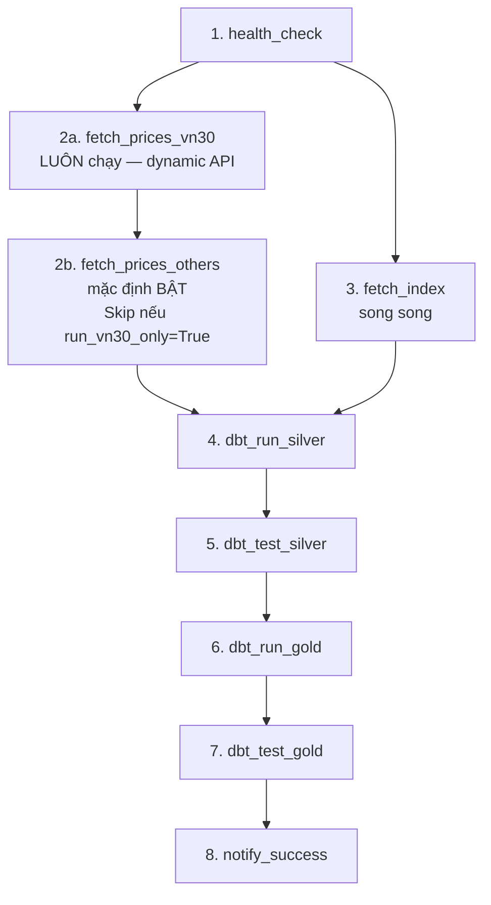
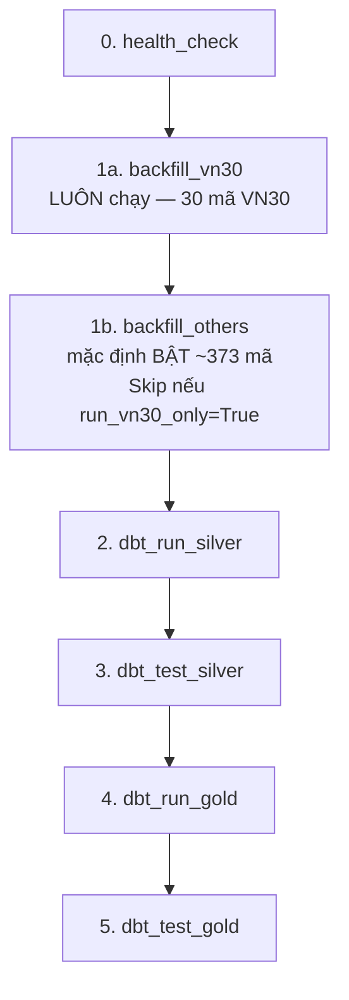

# HƯỚNG DẪN VẬN HÀNH & KỊCH BẢN CHẠY PIPELINE
## (OPERATIONAL GUIDE & RUN SCENARIOS)

Tài liệu này cung cấp hướng dẫn vận hành chi tiết và các kịch bản chạy (E2E run scenarios) của dự án **Vietnam Stock Market Data Engineering Pipeline** trong mọi trường hợp: Demo Offline, Vận hành thật (Real/Dev), Chạy kiểm thử (Testing), Điều phối tự động (Airflow) và Xử lý sự cố.

---

## 🗺️ TỔNG QUAN CÁC MÔI TRƯỜNG & CHẾ ĐỘ CHẠY

Dự án hỗ trợ 2 môi trường hoạt động chính được điều khiển qua file cấu hình `.env`:

| Tiêu chí | Môi trường Demo Offline (`switch-demo`) | Môi trường Thật / Phát triển (`switch-real`) |
| :--- | :--- | :--- |
| **Database** | `stock_db_demo` (Cô lập hoàn toàn) | `stock_db` (Database chính) |
| **Provider** | `mock` (Đọc dữ liệu fixture cục bộ) | `vnstock` (Gọi trực tiếp API Vnstock thực tế) |
| **Mạng Internet** | Không yêu cầu (Chạy hoàn toàn Offline) | Bắt buộc để cào dữ liệu |
| **Mục đích** | Trình diễn trước hội đồng, reset dữ liệu nhanh | Phát triển tính năng mới, cào dữ liệu thực tế |

---

## 1. 🌟 KỊCH BẢN 1: CHẠY DEMO OFFLINE (PRODUCT DEMO MODE)
*Mục tiêu: Trình diễn toàn bộ pipeline E2E mà không cần internet, bảo vệ an toàn cho cơ sở dữ liệu phát triển.*

### Bước 1.1: Khởi tạo database demo (Chỉ cần chạy 1 lần duy nhất)
Tạo database demo trống trong Postgres container:
```bash
docker exec -it postgres-container psql -U airflow -d stock_db -c "CREATE DATABASE stock_db_demo;"
```

### Bước 1.2: Chuyển cấu hình và khởi động lại
1. Chuyển cấu hình `.env` sang chế độ demo:
   ```bash
   python scripts/demo_helper.py switch-demo
   ```
2. Áp dụng biến môi trường mới vào Docker Compose:
   ```bash
   docker compose down
   docker compose up -d
   ```
   *Đợi khoảng 30s để các service Airflow khởi động và tạo tài khoản admin tự động trên database demo.*

### Bước 1.3: Reset database demo về trạng thái rỗng
Làm sạch hoàn toàn dữ liệu cũ và tái tạo schema Bronze trống:
```bash
python scripts/demo_helper.py reset
```

### Bước 1.4: Kiểm tra trạng thái rỗng trước khi chạy
Hiển thị số lượng dòng trong các tầng:
```bash
python scripts/demo_helper.py status
```
*Yêu cầu:* Toàn bộ các bảng hiển thị `0` hoặc `Chưa tạo (Rỗng)`.

### Bước 1.5: Thực thi Ingestion (Bronze Layer)
1. Hiển thị 5 dòng đầu của dữ liệu mẫu (Input):
   ```bash
   head -n 5 tests/fixtures/mock_prices.csv
   ```
2. Chạy module cào giá cổ phiếu thủ công:
   ```bash
   docker exec -it airflow-container python -m ingestion.fetch_prices --start 2024-01-01 --end 2024-01-05 --symbols VNM ACB
   ```
3. Chạy module cào chỉ số index thị trường thủ công:
   ```bash
   docker exec -it airflow-container python -m ingestion.fetch_index --start 2024-01-01 --end 2024-01-05
   ```
4. Kiểm tra dữ liệu thô đã được ghi vào Bronze:
   ```bash
   docker exec -it postgres-container psql -U airflow -d stock_db_demo -c "SELECT code, date, open, close, source, ingested_at FROM bronze.bronze_prices LIMIT 5;"
   ```

### Bước 1.6: Thực thi Clean & Validate (Silver Layer)
1. Chạy dbt chuyển đổi tầng Silver:
   ```bash
   docker exec -it airflow-container bash -c "cd /opt/airflow/project/dbt && dbt run --select models/silver --profiles-dir ."
   ```
2. Kiểm tra dữ liệu đã chuẩn hóa (chữ in hoa mã, định dạng ngày, gắn cờ hợp lệ):
   ```bash
   docker exec -it postgres-container psql -U airflow -d stock_db_demo -c "SELECT symbol, trade_date, open_price, close_price, is_valid, dq_flag FROM public_silver.silver_prices LIMIT 5;"
   ```

### Bước 1.7: Demo Data Quality Gate (Điểm cộng lớn khi trình bày)
*Chứng minh pipeline tự động phát hiện và đánh dấu bản ghi bị lỗi.*
1. Chèn thủ công một dòng dữ liệu lỗi (giá đóng cửa âm) trực tiếp vào Bronze:
   ```bash
   docker exec -it postgres-container psql -U airflow -d stock_db_demo -c "INSERT INTO bronze.bronze_prices (code, date, open, high, low, close, volume, source, ingested_at) VALUES ('VNM', '2024-01-06', 70000, 71000, 69000, -100, 500000, 'mock', now());"
   ```
2. Chạy lại dbt model silver:
   ```bash
   docker exec -it airflow-container bash -c "cd /opt/airflow/project/dbt && dbt run --select models/silver --profiles-dir ."
   ```
3. Query kiểm tra trạng thái bản ghi lỗi tại tầng Silver:
   ```bash
   docker exec -it postgres-container psql -U airflow -d stock_db_demo -c "SELECT symbol, trade_date, close_price, is_valid, dq_flag FROM public_silver.silver_prices WHERE trade_date = '2024-01-06';"
   ```
   *Kết quả mong đợi:* Cột `is_valid = false` và cột `dq_flag = 'invalid_close_price'`. Dữ liệu lỗi sẽ bị chặn lại ở đây và không đi tiếp lên tầng Gold.

### Bước 1.8: Thực thi Business & Indicator (Gold Layer)
1. Chạy dbt model gold:
   ```bash
   docker exec -it airflow-container bash -c "cd /opt/airflow/project/dbt && dbt run --select models/gold --profiles-dir ."
   ```
2. Kiểm tra bảng Fact giá sạch (Dòng lỗi ở ngày 2024-01-06 phải bị loại bỏ hoàn toàn):
   ```bash
   docker exec -it postgres-container psql -U airflow -d stock_db_demo -c "SELECT * FROM public_gold.fact_stock_price WHERE symbol = 'VNM' AND trade_date >= '2024-01-05';"
   ```
3. Kiểm tra tính toán các chỉ số phân tích kỹ thuật (MA5, MA20, RSI, MACD):
   ```bash
   docker exec -it postgres-container psql -U airflow -d stock_db_demo -c "SELECT symbol, trade_date, close_price, ma5, rsi14, macd_line, macd_signal FROM public_gold.fact_stock_indicators LIMIT 5;"
   ```

---

## 2. ⚡ KỊCH BẢN 2: VẬN HÀNH THẬT / PHÁT TRIỂN (REAL RUN MODE)
*Mục tiêu: Cào dữ liệu thực tế từ API Vnstock và lưu trữ lâu dài tại database phát triển chính.*

### Bước 2.1: Chuyển cấu hình và khởi động lại
1. Chuyển cấu hình `.env` sang chế độ thật:
   ```bash
   python scripts/demo_helper.py switch-real
   ```
2. Áp dụng cấu hình và restart Docker Compose:
   ```bash
   docker compose down
   docker compose up -d
   ```
3. Đảm bảo cấu hình schema Bronze đã được khởi tạo trong database chính `stock_db`:
   ```bash
   docker exec -i postgres-container psql -U airflow -d stock_db < sql/init_schema.sql
   ```

### Bước 2.2: Chạy Backfill dữ liệu lịch sử bằng CLI
*Chạy script backfill để nạp khối lượng lớn dữ liệu lịch sử trong quá khứ.*
```bash
docker exec -it airflow-container python -m ingestion.backfill --start 2023-01-01 --end 2023-12-31 --symbols VNM HPG VIC
```

### Bước 2.3: Chạy Ingestion hàng ngày thủ công
```bash
docker exec -it airflow-container python -m ingestion.fetch_prices --start 2026-06-18 --end 2026-06-18 --symbols VNM HPG VIC
```

### Bước 2.4: Build toàn bộ kho dữ liệu bằng dbt
Chạy lệnh `dbt build` để thực hiện biên dịch, chạy các transformation models và tự động test tính toàn vẹn của dữ liệu ở tất cả các tầng:
```bash
docker exec -it airflow-container bash -c "cd /opt/airflow/project/dbt && dbt build --profiles-dir ."
```

---

## 3. 🧪 KỊCH BẢN 3: KIỂM THỬ CHẤT LƯỢNG CODE & DỮ LIỆU (TESTING)
*Mục tiêu: Chạy toàn bộ các bài kiểm thử tự động để bảo vệ logic hệ thống.*

### Bước 3.1: Chuyển đổi môi trường test (Khuyến nghị dùng mock database)
Để tránh làm nhiễu dữ liệu chính, khuyến nghị chuyển sang database demo trước khi test:
```bash
python scripts/demo_helper.py switch-demo
docker compose up -d
```

### Bước 3.2: Chạy Python Unit & Integration Tests (pytest)
Chạy các bài kiểm tra logic Python, API providers, Mock data fallback và các hàm tiện ích:
```bash
docker exec -it airflow-container pytest -v -s
```

### Bước 3.3: Chạy dbt Tests (Kiểm thử dữ liệu)
Chạy các kiểm định schema, ràng buộc khóa ngoại, khoảng dữ liệu, logic nghiệp vụ trên database:
```bash
docker exec -it airflow-container bash -c "cd /opt/airflow/project/dbt && dbt test --profiles-dir ."
```
*Kiểm tra cụ thể một model:*
```bash
docker exec -it airflow-container bash -c "cd /opt/airflow/project/dbt && dbt test --select fact_stock_indicators --profiles-dir ."
```

---

## 4. 🎛️ KỊCH BẢN 4: ĐIỀU PHỐI TỰ ĐỘNG BẰNG AIRFLOW (DAILY ORCHESTRATION)
*Mục tiêu: Vận hành pipeline tự động hàng ngày thông qua Apache Airflow.*

### Bước 4.1: Truy cập Airflow Web UI
- URL: `http://localhost:8080`
- Username: `admin`
- Password: `admin`

### Bước 4.2: Vận hành DAG hàng ngày (`daily_stock_pipeline`)
- **Lịch trình tự động:** DAG được cấu hình tự động chạy vào lúc **18:00 hàng ngày (Giờ Việt Nam)** từ Thứ Hai đến Thứ Sáu (`0 11 * * 1-5` UTC).
- **Trigger thủ công:** Bấm vào nút **Trigger DAG** ở góc phải màn hình.
- **Luồng chạy:**
  ```mermaid
  graph TD
      subgraph Ingestion Layer
          health_check[health_check: Kiểm tra DB/API]
          fetch_prices_vn30[fetch_prices_vn30: Cào giá VN30]
          fetch_prices_others[fetch_prices_others: Cào giá còn lại]
          fetch_index[fetch_index: Cào chỉ số VNINDEX/VN30]
      end

      subgraph Silver Layer (Quality Gate)
          dbt_run_silver[dbt_run_silver: Lưu và Gắn nhãn DQ]
          dbt_test_silver{dbt_test_silver: Kiểm định Silver}
      end

      subgraph Gold Layer (Publish)
          dbt_run_gold[dbt_run_gold: Lọc sạch & Tính chỉ báo]
          dbt_test_gold[dbt_test_gold: Kiểm định Gold]
      end

      health_check --> fetch_prices_vn30
      fetch_prices_vn30 --> fetch_prices_others
      health_check --> fetch_index
      
      fetch_prices_others --> dbt_run_silver
      fetch_index --> dbt_run_silver
      
      dbt_run_silver --> dbt_test_silver
      dbt_test_silver -- PASS --> dbt_run_gold
      dbt_test_silver -- FAIL --> STOP[Dừng khẩn cấp: Hủy pipeline]
      
      dbt_run_gold --> dbt_test_gold
      dbt_test_gold --> notify_success[notify_success: Báo cáo thành công]
  ```

  **Lưu ý quan trọng về Thứ tự Chạy dbt trong DAG:**
  - Quy trình vận hành bắt buộc tuân theo **Run (Lưu) -> Test (Kiểm định) -> Run Gold (Publish)**.
  - dbt model (Silver/Gold) phải chạy `dbt run` để biên dịch SQL và ghi/lưu kết quả vào database trước, sau đó `dbt test` mới có thể thực hiện kiểm thử SQL trực tiếp trên các bảng đã lưu này.
  - Sơ đồ trên thể hiện rõ vai trò **Quality Gate** ở tầng Silver: Task `dbt_test_silver` hoạt động như một chốt chặn. Nếu phát hiện vi phạm nghiêm trọng (ví dụ: null trường bắt buộc, sai định dạng), task test sẽ fail, Airflow lập tức dừng pipeline (Fail Fast), ngăn chặn việc chạy `dbt_run_gold` và bảo vệ tầng Gold luôn sạch sẽ.


### Bước 4.3: Vận hành DAG Backfill thủ công (`manual_backfill_pipeline`)
- Sử dụng khi muốn tải lại dữ liệu lịch sử của một khoảng thời gian dài thông qua giao diện.
1. Chọn DAG `manual_backfill_pipeline`.
2. Chọn **Trigger DAG w/ config**.
3. Điền tham số `start_date` và `end_date` dưới định dạng JSON:
   ```json
   {
     "start_date": "2023-01-01",
     "end_date": "2023-06-30"
   }
   ```
4. Bấm **Trigger** và theo dõi tiến trình chạy.

> [!TIP]
> Để hiểu rõ các trường hợp xảy ra khi chạy các DAG này (Happy Path, Lỗi API, Ngày nghỉ giao dịch, Vi phạm kiểm thử chất lượng, v.v.) và kết quả đầu ra (output) dự tính tương ứng tại từng tầng, vui lòng tham khảo chi tiết tại: **[Kịch bản Vận hành Airflow DAG & Output Dự tính (DAG_SCENARIOS.md)](docs/DAG_SCENARIOS.md)**.


---

## 5. 🧹 KỊCH BẢN 5: DỌN DẸP & KHÔI PHỤC SAU DEMO (CLEANUP)
*Mục tiêu: Đưa hệ thống quay trở lại trạng thái phát triển bình thường.*

1. Switch cấu hình về Thật:
   ```bash
   python scripts/demo_helper.py switch-real
   ```
2. Restart docker compose để cập nhật cấu hình:
   ```bash
   docker compose down
   docker compose up -d
   ```
3. Xóa database demo để giải phóng không gian ổ đĩa:
   ```bash
   docker exec -it postgres-container psql -U airflow -d stock_db -c "DROP DATABASE stock_db_demo;"
   ```

---

## 🛠️ 6. KỊCH BẢN 6: XỬ LÝ SỰ CỐ THƯỜNG GẶP (TROUBLESHOOTING)

### 🚨 Lỗi 1: API Vnstock bị chặn hoặc mất mạng internet
- **Triệu chứng:** Ingestion task thất bại liên tục, log ghi nhận lỗi `HTTP 429` (Rate limit) hoặc `ConnectionTimeout`.
- **Cách xử lý:**
  1. Tạm thời chuyển pipeline sang Mock Provider bằng cách mở `.env` và sửa `PROVIDER=mock` (hoặc chạy `python scripts/demo_helper.py switch-demo`).
  2. Khởi động lại container (`docker compose up -d`).
  3. Ghi lỗi vào file `docs/TEST_REPORTS.md` và tiếp tục chạy với mock data.

### 🚨 Lỗi 2: Trùng lặp dữ liệu (Data Duplication) ở tầng Gold
- **Triệu chứng:** Số lượng dòng dữ liệu ở tầng Gold tăng đột biến khi chạy lại nhiều lần cho cùng một ngày.
- **Cách xử lý:**
  - Mặc dù hệ thống đã sử dụng cơ chế `delete+insert` với lookback 60 ngày để chống trùng lặp, nếu vẫn bị duplicate, hãy chạy full-refresh để dọn dẹp và nạp lại toàn bộ:
    ```bash
    docker exec -it airflow-container bash -c "cd /opt/airflow/project/dbt && dbt run --full-refresh --profiles-dir ."
    ```

### 🚨 Lỗi 3: Lỗi phân quyền ghi log hoặc dbt target folder (Permission Denied)
- **Triệu chứng:** Lỗi crash khi dbt hoặc Airflow ghi file log hoặc compile models.
- **Cách xử lý:** Cấp lại toàn bộ quyền truy cập ghi đọc cho project folder bên trong container:
  ```bash
  docker exec -u root airflow-container chmod -R 777 /opt/airflow/project
  ```
# Kế hoạch Demo Sản phẩm (Chế độ Offline & Cô lập Database)

Tài liệu này hướng dẫn chi tiết cách chạy demo sản phẩm E2E pipeline dữ liệu chứng khoán trong môi trường **hoàn toàn không có mạng Internet (offline)**, trình diễn rõ ràng **Input/Output của từng layer (Bronze -> Silver -> Gold)** và đảm bảo **tuyệt đối không ảnh hưởng đến database phát triển hiện tại**.

Đặc biệt, dự án cung cấp bộ công cụ tự động hóa **[demo_helper.py](file://wsl.localhost/Ubuntu/home/naeouad/deproject/scripts/demo_helper.py)** để chuyển đổi môi trường và làm sạch dữ liệu nhanh chóng chỉ với 1 câu lệnh.

---

## 1. Nguyên tắc Demo & Cơ chế hoạt động

Để bảo vệ và trình diễn dự án một cách an toàn nhất, kế hoạch demo dựa trên hai trụ cột:
1. **MockProvider (Offline Mode):** Khi cấu hình biến môi trường `PROVIDER=mock`, hệ thống sẽ tự động chuyển sang đọc dữ liệu mẫu từ các file CSV fixture có sẵn trong máy (`mock_prices.csv` và `mock_index.csv`), giả lập y hệt hành vi cào dữ liệu từ API Vnstock mà không cần kết nối mạng.
2. **Database-level Isolation (Cô lập Database):** Tạo một database demo riêng biệt là `stock_db_demo` để chạy toàn bộ pipeline. Điều này giúp:
   - Giữ nguyên dữ liệu thật và lịch sử chạy cũ của bạn trong database `stock_db`.
   - Tạo một giao diện Airflow và Database sạch sẽ, dễ theo dõi cho hội đồng chấm.
   - Dễ dàng làm sạch/reset dữ liệu để chạy lại demo nhiều lần mà không cần xóa database hay restart container.

---

## 2. Chuẩn bị môi trường Demo (Nhanh & Tự động)

Thực hiện các bước sau trước khi hội đồng vào đánh giá:

### Bước 2.1: Tạo Database Demo (Chỉ cần chạy 1 lần duy nhất)
Kết nối vào Postgres container và tạo database `stock_db_demo`:
```bash
docker exec -it postgres-container psql -U airflow -d stock_db -c "CREATE DATABASE stock_db_demo;"
```

### Bước 2.2: Chuyển cấu hình sang môi trường Demo
Chạy công cụ helper để tự động sửa đổi cấu hình trong file `.env` (chuyển sang `stock_db_demo` và `PROVIDER=mock`):
```bash
python scripts/demo_helper.py switch-demo
```

### Bước 2.3: Khởi động lại Docker Compose để áp dụng cấu hình
```bash
docker compose down
docker compose up -d
```
*Đợi khoảng 30 - 45 giây để Airflow container khởi động hoàn tất và tự tạo tài khoản admin trên database demo.*

### Bước 2.4: Khởi tạo schema và Reset dữ liệu rỗng
Làm sạch database demo và nạp lại cấu hình schema Bronze chuẩn:
```bash
python scripts/demo_helper.py reset
```

---

## 3. Kịch bản Demo từng phần (Show Input & Output)

Trình bày cho hội đồng theo luồng đi tuần tự của dữ liệu. Bạn có thể mở 2 cửa sổ terminal: một bên chạy lệnh và một bên chạy câu lệnh kiểm tra trạng thái dữ liệu.

### 🔍 Kiểm tra trạng thái rỗng trước khi chạy
Chạy lệnh hiển thị thống kê dữ liệu hiện tại (tất cả các bảng đều phải rỗng hoặc chưa tạo):
```bash
python scripts/demo_helper.py status
```

---

### 🌟 PHẦN 1: Ingestion Layer (Bronze Layer - Dữ liệu thô)

* **Input (Dữ liệu fixture):** 
  - Chỉ ra file CSV fixture chứa dữ liệu thô tại: `tests/fixtures/mock_prices.csv`
  - Show 5 dòng đầu của file CSV này cho hội đồng xem bằng lệnh:
    ```bash
    head -n 5 tests/fixtures/mock_prices.csv
    ```

* **Thực thi Ingestion (Chạy thủ công):**
  Chạy script python để cào dữ liệu cho 2 mã cổ phiếu (ví dụ: `VNM`, `ACB`) từ ngày `2024-01-01` đến `2024-01-05`:
  ```bash
  docker exec -it airflow-container python -m ingestion.fetch_prices --start 2024-01-01 --end 2024-01-05 --symbols VNM ACB
  ```

* **Output (Bronze Database):**
  Truy vấn dữ liệu thô vừa chèn vào:
  ```bash
  docker exec -it postgres-container psql -U airflow -d stock_db_demo -c "SELECT code, date, open, high, low, close, volume, source, ingested_at FROM bronze.bronze_prices LIMIT 5;"
  ```
  👉 **Điểm nhấn cần giải thích với Hội đồng:**
  - Cột `source` hiển thị giá trị là `mock` (thể hiện đang chạy offline).
  - Có cột `raw_json` lưu trữ định dạng JSONB nguyên bản từ API để phục vụ đối soát.
  - Dữ liệu được ghi vào các bảng phân vùng vật lý (Partition) theo năm (ví dụ: `bronze.bronze_prices_2024`).

---

### 🌟 PHẦN 2: Clean & Validate Layer (Silver Layer - Chuẩn hóa dữ liệu)

* **Input:** Bảng dữ liệu thô `bronze.bronze_prices`.
* **Thực thi biến đổi (dbt Run):**
  Chạy dbt để chuẩn hóa kiểu dữ liệu, viết hoa mã chứng khoán và kiểm tra chất lượng:
  ```bash
  docker exec -it airflow-container bash -c "cd /opt/airflow/project/dbt && dbt run --select models/silver --profiles-dir ."
  ```

* **Output (Silver Database):**
  Kiểm tra dữ liệu đã chuẩn hóa trong schema `public_silver`:
  ```bash
  docker exec -it postgres-container psql -U airflow -d stock_db_demo -c "SELECT symbol, trade_date, open_price, close_price, is_valid, dq_flag FROM public_silver.silver_prices LIMIT 5;"
  ```

* **🔥 Kịch bản Demo Data Quality (Điểm cộng cực lớn):**
  Chứng minh hệ thống tự động phát hiện và đánh dấu dữ liệu lỗi:
  1. Chèn thủ công một dòng dữ liệu lỗi (giá đóng cửa âm) vào Bronze:
     ```bash
     docker exec -it postgres-container psql -U airflow -d stock_db_demo -c "INSERT INTO bronze.bronze_prices (code, date, open, high, low, close, volume, source, ingested_at) VALUES ('VNM', '2024-01-06', 70000, 71000, 69000, -100, 500000, 'mock', now());"
     ```
  2. Chạy lại dbt model silver:
     ```bash
     docker exec -it airflow-container bash -c "cd /opt/airflow/project/dbt && dbt run --select models/silver --profiles-dir ."
     ```
  3. Query dòng dữ liệu lỗi đó ở Silver:
     ```bash
     docker exec -it postgres-container psql -U airflow -d stock_db_demo -c "SELECT symbol, trade_date, close_price, is_valid, dq_flag FROM public_silver.silver_prices WHERE trade_date = '2024-01-06';"
     ```
     *Kết quả mong đợi:* Dòng này có cột `is_valid = false` và cột `dq_flag = 'invalid_close_price'`. Điều này chứng tỏ dữ liệu lỗi đã bị gắn cờ và loại khỏi bảng Gold.

---

### 🌟 PHẦN 3: Business & Indicator Layer (Gold Layer - Thứ cấp & Chỉ số)

* **Input:** View `public_silver.silver_prices` (chỉ lấy các dòng có `is_valid = true`).
* **Thực thi dbt Run:**
  Chạy dbt để build các Dimension, Fact tables và tính toán các chỉ số phân tích kỹ thuật:
  ```bash
  docker exec -it airflow-container bash -c "cd /opt/airflow/project/dbt && dbt run --select models/gold --profiles-dir ."
  ```

* **Output (Gold Database):**
  1. **Bảng Fact giá cổ phiếu sạch** (Loại hoàn toàn bản ghi lỗi ở ngày 2024-01-06 vừa test):
     ```bash
     docker exec -it postgres-container psql -U airflow -d stock_db_demo -c "SELECT * FROM public_gold.fact_stock_price WHERE symbol = 'VNM' AND trade_date >= '2024-01-05';"
     ```
     *Kết quả mong đợi:* Chỉ hiển thị ngày `2024-01-05` (hợp lệ), ngày `2024-01-06` (lỗi) đã bị lọc sạch.
     
  2. **Bảng Fact chỉ số kỹ thuật** (MA5, MA20, RSI, MACD, Bollinger Bands):
     ```bash
     docker exec -it postgres-container psql -U airflow -d stock_db_demo -c "SELECT symbol, trade_date, close_price, ma5, rsi14, macd_line, macd_signal FROM public_gold.fact_stock_indicators LIMIT 5;"
     ```
     👉 **Điểm nhấn cần giải thích với Hội đồng:**
     - Chỉ số kỹ thuật được tính toán tự động qua dbt macros.
     - Phép toán MACD Signal sử dụng EMA9 chuẩn xác (đệ quy thực thụ) chứ không dùng SMA9 xấp xỉ sai số lớn.

---

### 🌟 PHẦN 4: Điều phối tự động (Airflow E2E Orchestration)

Trình diễn chạy tự động toàn bộ luồng trên giao diện đồ họa:

1. Mở trình duyệt và truy cập Airflow UI tại: `http://localhost:8080` (Tài khoản: `admin` / Mật khẩu: `admin`).
2. Tìm DAG có tên `dag_daily`.
3. Nhấp vào nút **Trigger DAG** để bắt đầu chạy pipeline.
4. Chuyển sang tab **Graph** hoặc **Grid View** để chỉ cho hội đồng thấy các task chạy tuần tự từ cào đến kiểm thử và tổng hợp chỉ số.

---

## 4. Reset và Chạy lại Demo nhiều lần

Nếu bạn cần demo cho nhiều nhóm chấm khác nhau hoặc chạy thử lại nhiều lần:
**KHÔNG cần xóa database hay restart container docker.**
Bạn chỉ cần chạy duy nhất lệnh sau để làm sạch toàn bộ dữ liệu về trạng thái ban đầu:
```bash
python scripts/demo_helper.py reset
```
Hệ thống sẽ dọn sạch 3 schema dữ liệu và tái tạo cấu trúc rỗng trong vòng chưa đầy 1 giây! Bạn có thể dùng `python scripts/demo_helper.py status` để kiểm tra kết quả reset.

---

## 5. Dọn dẹp & Khôi phục sau Demo

Sau khi hoàn thành xuất sắc các buổi demo, hãy khôi phục lại database phát triển:

### Bước 5.1: Khôi phục cấu hình môi trường Thật
Chạy lệnh helper để khôi phục cấu hình trong file `.env`:
```bash
python scripts/demo_helper.py switch-real
```

### Bước 5.2: Khởi động lại Docker Compose
```bash
docker compose down
docker compose up -d
```

### Bước 5.3: Xóa database demo để giải phóng bộ nhớ
```bash
docker exec -it postgres-container psql -U airflow -d stock_db -c "DROP DATABASE stock_db_demo;"
```

Hệ thống đã quay trở lại trạng thái phát triển bình thường với toàn bộ dữ liệu lịch sử và lịch sử chạy Airflow nguyên vẹn!


# BỔ SUNG TỪ DAG_SCENARIOS

# KỊCH BẢN VẬN HÀNH AIRFLOW DAG & SỰ THAY ĐỔI DATABASE
## (DAG RUN SCENARIOS, EXPECTED OUTPUTS & DATABASE MUTATIONS)

Tài liệu này chi tiết hóa các kịch bản vận hành của các Apache Airflow DAGs (`daily_stock_pipeline` và `manual_backfill_pipeline`), so sánh sự khác biệt khi chạy vào **Trong tuần** (phiên giao dịch) so với **Cuối tuần** (ngày nghỉ), và mô tả trực quan sự thay đổi dữ liệu (số dòng, trạng thái cột) ở từng tầng database (Bronze $\rightarrow$ Silver $\rightarrow$ Gold).

---

## 🗺️ TỔNG QUAN LUỒNG ĐIỀU PHỐI (DAG FLOW)

### DAG Daily — `daily_stock_pipeline`

Mặc định chạy **TẤT CẢ mã HOSE** (403 mã STOCK đang niêm yết, lấy động từ API).
Bật `run_vn30_only=True` để chỉ kéo 30 mã VN30 (~5 phút, dùng cho demo/test nhanh).



**Tham số trigger DAG Daily:**

| Tham số | Kiểu | Mặc định | Ý nghĩa |
|---|---|---|---|
| `run_vn30_only` | boolean | `False` | `False` = chạy tất cả (VN30 + ~373 mã còn lại); `True` = chỉ VN30 |

---

### DAG Backfill — `manual_backfill_pipeline`

Mặc định backfill **TẤT CẢ mã HOSE** theo khoảng thời gian cấu hình.
VN30 luôn chạy trước (`backfill_vn30`), sau đó mới đến ~373 mã còn lại (`backfill_others`).



**Tham số trigger DAG Backfill:**

| Tham số | Kiểu | Mặc định | Ý nghĩa |
|---|---|---|---|
| `start_date` | string (date) | `2021-01-01` | Ngày bắt đầu backfill |
| `end_date` | string (date) | `2026-06-24` | Ngày kết thúc backfill |
| `run_vn30_only` | boolean | `False` | `False` = backfill tất cả; `True` = chỉ VN30 |

---

### Danh sách mã động — Không hardcode

| Nhóm | Số mã | Nguồn lấy |
|---|---|---|
| VN30 | 30 | `Listing(source='VCI').symbols_by_group('VN30')` — gọi API mỗi lần |
| HOSE STOCK | 403 | `Listing(source='VCI').symbols_by_exchange()` lọc `type=='STOCK' & exchange=='HSX'` |
| Others | ~373 | `HOSE(403) - VN30(30)` |

> **Lưu ý:** `config.symbols_pilot` (30 mã cứng) chỉ là **fallback** cho `MockProvider` khi không có mạng. Production luôn dùng API động.

---

## 📅 MA TRẬN KỊCH BẢN: TRONG TUẦN VS CUỐI TUẦN

| DAG & Thời điểm chạy | Trạng thái Task | Dữ liệu cào về | Sự thay đổi Database (Bronze → Silver → Gold) |
| :--- | :--- | :--- | :--- |
| **1. DAG Daily** *(Trong tuần, run_vn30_only=False — mặc định)* | **Success (Xanh toàn bộ)** | ~403 dòng (1 dòng/mã/ngày). VN30 (30 mã) xong trước, Others (~373 mã) chạy tiếp. | **Tăng thêm dữ liệu:**<br>• **Bronze:** +403 dòng thô.<br>• **Silver:** +403 dòng (`is_valid=true`).<br>• **Gold:** +403 dòng giá sạch vào `fact_stock_price` + cập nhật chỉ số 120 ngày vào `fact_stock_indicators`. |
| **2. DAG Daily** *(Trong tuần, run_vn30_only=True)* | **Success (Xanh)** | 30 dòng (chỉ VN30). `fetch_prices_others` in `[SKIP]`. | **Tăng thêm giới hạn:**<br>• **Bronze & Silver:** +30 dòng (VN30 only).<br>• **Gold:** cập nhật chỉ số chỉ cho 30 mã VN30. |
| **3. DAG Daily** *(Cuối tuần — T7, CN)* | **Success (Xanh toàn bộ)** | 0 dòng (thị trường đóng). | **Không thay đổi:** Không INSERT vào bất kỳ tầng nào. |
| **4. DAG Backfill** *(run_vn30_only=False — mặc định)* | **Success (Xanh toàn bộ)** | Lịch sử VN30 (30 × D ngày) → xong → lịch sử Others (~373 × D ngày). | **Tăng dữ liệu lịch sử:**<br>• **Bronze & Silver:** +(403 × D) dòng.<br>• **Gold:** tính toán lại chỉ số 120 ngày. |
| **5. DAG Backfill** *(run_vn30_only=True)* | **Success (Xanh)** | Lịch sử VN30 (30 × D ngày). `backfill_others` in `[SKIP]`. | Chỉ lịch sử VN30 được thêm vào Bronze/Silver/Gold. |
| **6. DAG Backfill** *(Khoảng cuối tuần)* | **Success (Xanh)** | 0 dòng (không có ngày giao dịch). | **Không thay đổi:** Skip logic phát hiện `trading_days=0`. |

---

## 🔍 CHI TIẾT SỰ THAY ĐỔI TRONG DATABASE (DATABASE MUTATIONS)

### 1. Khi có dữ liệu mới phát sinh (Trong tuần / Ngày giao dịch)

* **Tầng Bronze (`bronze.bronze_prices` / `bronze.bronze_index`):**
  - Upsert (ON CONFLICT DO UPDATE) theo `(code, date)` — idempotent, chạy lại không duplicate.
  - Cột `ingested_at` nhận thời gian chạy hiện tại (dạng `TIMESTAMPTZ`).
  - Cột `source` nhận giá trị `'vnstock_vci'` hoặc `'vnstock_kbs'` (tùy source rotation).

* **Tầng Silver (`public_silver.silver_prices` / `silver_index`):**
  - Rebuild toàn bộ (dbt `materialized='table'`) — DROP + CREATE, không accumulate lỗi.
  - Cột `is_valid` = `TRUE` và `dq_flag` = `'ok'` cho bản ghi hợp lệ.
  - Cột `is_valid` = `FALSE` + `dq_flag` mô tả lỗi cho bản ghi xấu (không xóa, chỉ flag).

* **Tầng Gold (Schema `public_gold`):**
  * Bảng `fact_stock_price`:
    - Lọc `is_valid = TRUE` từ Silver rồi INSERT.
  * Bảng `fact_stock_indicators` (Incremental delete+insert):
    - **Bước 1 (Delete):** Xóa 120 ngày gần nhất tính từ MAX(trade_date) để tính lại sạch.
      ```sql
      DELETE FROM public_gold.fact_stock_indicators
      WHERE trade_date > (SELECT MAX(trade_date) - INTERVAL '120 days'
                          FROM public_gold.fact_stock_indicators);
      ```
    - **Bước 2 (Insert):** Tính lại MA5/MA20/RSI14/MACD/Bollinger cho window 120 ngày.
    - Lookback 120 ngày = đủ warmup cho MACD Signal (35 ngày) × safety margin 3×.

---

### 2. Khi không có dữ liệu mới (Cuối tuần / Ngày nghỉ / Lỗi API)

* **Hành vi ghi Database:**
  - Số dòng từ API = 0 → không thực hiện bất kỳ `INSERT` nào.
  - Các bảng Bronze, Silver, Gold giữ nguyên tuyệt đối, không phát sinh dòng rác.
  - Logs ghi nhận: *"0 rows fetched, skipping write."*

---

## 📋 CHI TIẾT CÁC KỊCH BẢN XỬ LÝ LỖI & DQ GATES

### 🟢 TRƯỜNG HỢP A: THÀNH CÔNG TOÀN BỘ (HAPPY PATH)
*Môi trường hoạt động bình thường, kết nối khỏe mạnh, dữ liệu hợp lệ.*
- **Trạng thái Task:** Toàn bộ các Task từ `health_check` $\rightarrow$ `notify_success` đều màu **Xanh (Success)**.
- **Output:** Dữ liệu mới được ghi nhận đầy đủ ở cả 3 tầng, chỉ số kỹ thuật được cập nhật chính xác.

### 🔴 TRƯỜNG HỢP B: LỖI API INGESTION (RATE LIMIT / TIMEOUT)
*Lỗi xảy ra khi API Vnstock bị chặn (HTTP 429) hoặc mất kết nối mạng.*
- **Cơ chế:** Provider tự động rotate source (vci → kbs) + pause 62 giây khi 429. Airflow retry 3 lần. Nếu vẫn thất bại, task Ingestion báo **Đỏ (Failed)**, các task dbt phía sau báo **Cam nhạt (Upstream Failed)**.
- **Cảnh báo:** Callback `on_failure_callback` ghi log lỗi chi tiết.
- **Database:** Giữ nguyên dữ liệu cũ, không ghi nhận thêm dữ liệu lỗi nửa chừng.
- **Kịch bản backfill:** Nếu `backfill_vn30` thành công nhưng `backfill_others` fail → có thể retry chỉ task `backfill_others` mà không cần chạy lại VN30.

### 🟠 TRƯỜNG HỢP C: CÀO THÀNH CÔNG NHƯNG CÓ DỮ LIỆU BẨN (DATA QUALITY GATE)
*API trả dữ liệu thành công nhưng có bản ghi bị lỗi logic (ví dụ: giá đóng cửa âm, hoặc giá cao nhất < giá thấp nhất).*
- **Trạng thái Task:** Toàn bộ các Task đều hoàn thành màu **Xanh (Success)**.
- **Cơ chế xử lý:**
  1. Bronze lưu trữ dữ liệu bẩn bình thường để giữ tính nguyên bản.
  2. Silver phân tích logic và gán cột `is_valid = FALSE` kèm theo lý do cụ thể tại cột `dq_flag` (ví dụ: `'invalid_close_price'`).
  3. `dbt test` tầng Silver vẫn **Pass** để tránh block pipeline vì dữ liệu lỗi của nhà cung cấp.
  4. Tầng Gold (`fact_stock_price`) lọc sạch: `SELECT * FROM silver_prices WHERE is_valid = TRUE`.
- **Database Mutation:**
  - Dòng lỗi có mặt ở `bronze.bronze_prices`.
  - Dòng lỗi có mặt ở `public_silver.silver_prices` nhưng bị đánh dấu `is_valid = false`.
  - Dòng lỗi **không xuất hiện** ở `public_gold.fact_stock_price` và `public_gold.fact_stock_indicators`.

### 🔴 TRƯỜNG HỢP D: VI PHẠM RÀNG BUỘC CHỈ SỐ Ở GOLD (DBT TEST FAIL)
*Dữ liệu chỉ số kỹ thuật bị sai logic toán học nghiêm trọng (ví dụ: RSI14 > 100 hoặc Bollinger Band trên nhỏ hơn Bollinger Band dưới).*
- **Trạng thái Task:** Các Task chạy đến `dbt_run_gold` đều **Xanh (Success)**. Task `dbt_test_gold` báo **Đỏ (Failed)**, task `notify_success` bị **Skipped**.
- **Cảnh báo:** Airflow ghi nhận log thất bại kèm theo exception chi tiết của dbt test vi phạm.
- **Database Mutation:** Dữ liệu lỗi tạm thời được ghi nhận tại Gold (do `dbt run` chạy trước `dbt test`). Tuy nhiên, pipeline bị chặn lại và báo đỏ để lập trình viên xử lý, ngăn không cho dữ liệu sai này được hiển thị lên Power BI.
