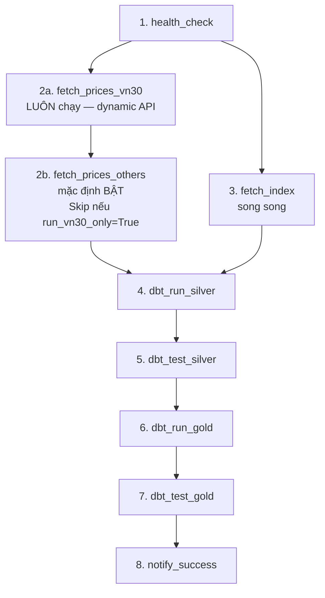
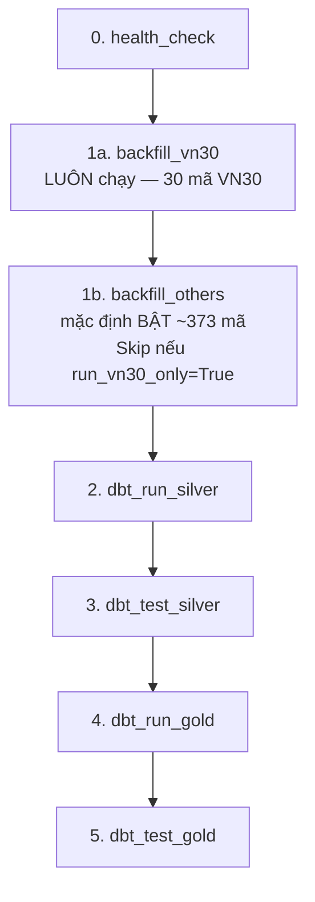

# HƯỚNG DẪN VẬN HÀNH & KỊCH BẢN CHẠY PIPELINE
## (OPERATIONAL GUIDE & RUN SCENARIOS)

Tài liệu này cung cấp hướng dẫn vận hành chi tiết và các kịch bản chạy (E2E run scenarios) của dự án **Vietnam Stock Market Data Engineering Pipeline** trong mọi trường hợp: Demo Offline, Vận hành thật (Real/Dev), Chạy kiểm thử (Testing), Điều phối tự động (Airflow) và Xử lý sự cố.

---

## 🗺️ TỔNG QUAN CÁC MÔI TRƯỜNG & CHẾ ĐỘ CHẠY

Dự án hỗ trợ 2 môi trường hoạt động chính được điều khiển qua file cấu hình `.env`:

| Tiêu chí | Cấu hình Hệ thống |
| :--- | :--- |
| **Database** | `stock_db` (Database chính, PostgreSQL 17) |
| **Provider** | `vnstock` (Gọi trực tiếp API Vnstock thực tế qua VCI/KBS) |
| **Mạng Internet** | Bắt buộc để cào dữ liệu |
| **Mục đích** | Vận hành hàng ngày, cào dữ liệu thực tế và phân tích |

---

---

## 1. ⚡ KỊCH BẢN 1: VẬN HÀNH THẬT / PHÁT TRIỂN (REAL RUN MODE)
*Mục tiêu: Cào dữ liệu thực tế từ API Vnstock và lưu trữ lâu dài tại database phát triển chính.*

### Bước 1.1: Chạy Backfill dữ liệu lịch sử bằng CLI
*Chạy script backfill để nạp khối lượng lớn dữ liệu lịch sử trong quá khứ.*
```bash
docker exec -it airflow-container python -m ingestion.backfill --start 2023-01-01 --end 2023-12-31 --symbols VNM HPG VIC
```

### Bước 1.2: Chạy Ingestion hàng ngày thủ công
```bash
docker exec -it airflow-container python -m ingestion.fetch_prices --start 2026-06-18 --end 2026-06-18 --symbols VNM HPG VIC
```

### Bước 1.3: Build toàn bộ kho dữ liệu bằng dbt
Chạy lệnh `dbt build` để thực hiện biên dịch, chạy các transformation models và tự động test tính toàn vẹn của dữ liệu ở tất cả các tầng:
```bash
docker exec -it airflow-container bash -c "cd /opt/airflow/project/dbt && dbt build --profiles-dir ."
```

---

## 2. 🧪 KỊCH BẢN 2: KIỂM THỬ CHẤT LƯỢNG CODE & DỮ LIỆU (TESTING)
*Mục tiêu: Chạy toàn bộ các bài kiểm thử tự động để bảo vệ logic hệ thống.*

### Bước 2.1: Chạy Python Unit & Integration Tests (pytest)
Chạy các bài kiểm tra logic Python, API providers, Mock data fallback và các hàm tiện ích:
```bash
docker exec -it airflow-container pytest -v -s
```

### Bước 2.2: Chạy dbt Tests (Kiểm thử dữ liệu)
Chạy các kiểm định schema, ràng buộc khóa ngoại, khoảng dữ liệu, logic nghiệp vụ trên database:
```bash
docker exec -it airflow-container bash -c "cd /opt/airflow/project/dbt && dbt test --profiles-dir ."
```
*Kiểm tra cụ thể một model:*
```bash
docker exec -it airflow-container bash -c "cd /opt/airflow/project/dbt && dbt test --select fact_stock_indicators --profiles-dir ."
```

---

## 3. 🎛️ KỊCH BẢN 3: ĐIỀU PHỐI TỰ ĐỘNG BẰNG AIRFLOW (DAILY ORCHESTRATION)
*Mục tiêu: Vận hành pipeline tự động hàng ngày thông qua Apache Airflow.*

### Bước 3.1: Truy cập Airflow Web UI
- URL: `http://localhost:8080`
- Username: `admin`
- Password: `admin`

### Bước 3.2: Vận hành DAG hàng ngày (`daily_stock_pipeline`)
- **Lịch trình tự động:** DAG được cấu hình tự động chạy vào lúc **18:00 hàng ngày (Giờ Việt Nam)** từ Thứ Hai đến Thứ Sáu (`0 11 * * 1-5` UTC).
- **Trigger thủ công:** Bấm vào nút **Trigger DAG** ở góc phải màn hình.
- **Luồng chạy:**
  ```mermaid
  graph TD
      subgraph Ingestion Layer
          health_check[health_check: Kiểm tra DB/API]
          fetch_prices_vn30[fetch_prices_vn30: Cào giá VN30]
          fetch_prices_others[fetch_prices_others: Cào giá còn lại]
          fetch_index[fetch_index: Cào chỉ số VNINDEX/VN30]
      end

      subgraph Silver Layer (Quality Gate)
          dbt_run_silver[dbt_run_silver: Lưu và Gắn nhãn DQ]
          dbt_test_silver{dbt_test_silver: Kiểm định Silver}
      end

      subgraph Gold Layer (Publish)
          dbt_run_gold[dbt_run_gold: Lọc sạch & Tính chỉ báo]
          dbt_test_gold[dbt_test_gold: Kiểm định Gold]
      end

      health_check --> fetch_prices_vn30
      fetch_prices_vn30 --> fetch_prices_others
      health_check --> fetch_index
      
      fetch_prices_others --> dbt_run_silver
      fetch_index --> dbt_run_silver
      
      dbt_run_silver --> dbt_test_silver
      dbt_test_silver -- PASS --> dbt_run_gold
      dbt_test_silver -- FAIL --> STOP[Dừng khẩn cấp: Hủy pipeline]
      
      dbt_run_gold --> dbt_test_gold
      dbt_test_gold --> notify_success[notify_success: Báo cáo thành công]
  ```

  **Lưu ý quan trọng về Thứ tự Chạy dbt trong DAG:**
  - Quy trình vận hành bắt buộc tuân theo **Run (Lưu) -> Test (Kiểm định) -> Run Gold (Publish)**.
  - dbt model (Silver/Gold) phải chạy `dbt run` để biên dịch SQL và ghi/lưu kết quả vào database trước, sau đó `dbt test` mới có thể thực hiện kiểm thử SQL trực tiếp trên các bảng đã lưu này.
  - Sơ đồ trên thể hiện rõ vai trò **Quality Gate** ở tầng Silver: Task `dbt_test_silver` hoạt động như một chốt chặn. Nếu phát hiện vi phạm nghiêm trọng (ví dụ: null trường bắt buộc, sai định dạng), task test sẽ fail, Airflow lập tức dừng pipeline (Fail Fast), ngăn chặn việc chạy `dbt_run_gold` và bảo vệ tầng Gold luôn sạch sẽ.

### Bước 3.3: Vận hành DAG Backfill thủ công (`manual_backfill_pipeline`)
- Sử dụng khi muốn tải lại dữ liệu lịch sử của một khoảng thời gian dài thông qua giao diện.
1. Chọn DAG `manual_backfill_pipeline`.
2. Chọn **Trigger DAG w/ config**.
3. Điền tham số `start_date` và `end_date` dưới định dạng JSON:
   ```json
   {
     "start_date": "2023-01-01",
     "end_date": "2023-06-30"
   }
   ```
4. Bấm **Trigger** và theo dõi tiến trình chạy.

> [!TIP]
> Để hiểu rõ các trường hợp xảy ra khi chạy các DAG này (Happy Path, Lỗi API, Ngày nghỉ giao dịch, Vi phạm kiểm thử chất lượng, v.v.) và kết quả đầu ra (output) dự tính tương ứng tại từng tầng, vui lòng tham khảo chi tiết tại: **[Kịch bản Vận hành Airflow DAG & Output Dự tính (DAG_SCENARIOS.md)](docs/DAG_SCENARIOS.md)**.

---

---

## 🛠️ 4. KỊCH BẢN 4: XỬ LÝ SỰ CỐ THƯỜNG GẶP (TROUBLESHOOTING)

### 🚨 Lỗi 1: API Vnstock bị chặn hoặc mất mạng internet
- **Triệu chứng:** Ingestion task thất bại liên tục, log ghi nhận lỗi `HTTP 429` (Rate limit) hoặc `ConnectionTimeout`.
- **Cách xử lý:**
  Hệ thống VnstockProvider đã được tích hợp sẵn cơ chế tự động xoay nguồn (rotate qua lại giữa VCI và KBS) và tự động tạm dừng (pause 62s) khi bị Rate Limit. Airflow cũng sẽ tự động retry 3 lần. Nếu toàn bộ retry vẫn thất bại, hãy đợi vài giờ rồi chạy lại DAG thủ công.

### 🚨 Lỗi 2: Trùng lặp dữ liệu (Data Duplication) ở tầng Gold
- **Triệu chứng:** Số lượng dòng dữ liệu ở tầng Gold tăng đột biến khi chạy lại nhiều lần cho cùng một ngày.
- **Cách xử lý:**
  - Mặc dù hệ thống đã sử dụng cơ chế `delete+insert` với lookback 60 ngày để chống trùng lặp, nếu vẫn bị duplicate, hãy chạy full-refresh để dọn dẹp và nạp lại toàn bộ:
    ```bash
    docker exec -it airflow-container bash -c "cd /opt/airflow/project/dbt && dbt run --full-refresh --profiles-dir ."
    ```

### 🚨 Lỗi 3: Lỗi phân quyền ghi log hoặc dbt target folder (Permission Denied)
- **Triệu chứng:** Lỗi crash khi dbt hoặc Airflow ghi file log hoặc compile models.
- **Cách xử lý:** Cấp lại toàn bộ quyền truy cập ghi đọc cho project folder bên trong container:
  ```bash
  docker exec -u root airflow-container chmod -R 777 /opt/airflow/project
  ```
# BỔ SUNG TỪ DAG_SCENARIOS

# KỊCH BẢN VẬN HÀNH AIRFLOW DAG & SỰ THAY ĐỔI DATABASE
## (DAG RUN SCENARIOS, EXPECTED OUTPUTS & DATABASE MUTATIONS)

Tài liệu này chi tiết hóa các kịch bản vận hành của các Apache Airflow DAGs (`daily_stock_pipeline` và `manual_backfill_pipeline`), so sánh sự khác biệt khi chạy vào **Trong tuần** (phiên giao dịch) so với **Cuối tuần** (ngày nghỉ), và mô tả trực quan sự thay đổi dữ liệu (số dòng, trạng thái cột) ở từng tầng database (Bronze $\rightarrow$ Silver $\rightarrow$ Gold).

---

## 🗺️ TỔNG QUAN LUỒNG ĐIỀU PHỐI (DAG FLOW)

### DAG Daily — `daily_stock_pipeline`

Mặc định chạy **TẤT CẢ mã HOSE** (403 mã STOCK đang niêm yết, lấy động từ API).
Bật `run_vn30_only=True` để chỉ kéo 30 mã VN30 (~5 phút, dùng cho demo/test nhanh).



**Tham số trigger DAG Daily:**

| Tham số | Kiểu | Mặc định | Ý nghĩa |
|---|---|---|---|
| `run_vn30_only` | boolean | `False` | `False` = chạy tất cả (VN30 + ~373 mã còn lại); `True` = chỉ VN30 |

---

### DAG Backfill — `manual_backfill_pipeline`

Mặc định backfill **TẤT CẢ mã HOSE** theo khoảng thời gian cấu hình.
VN30 luôn chạy trước (`backfill_vn30`), sau đó mới đến ~373 mã còn lại (`backfill_others`).



**Tham số trigger DAG Backfill:**

| Tham số | Kiểu | Mặc định | Ý nghĩa |
|---|---|---|---|
| `start_date` | string (date) | `2021-01-01` | Ngày bắt đầu backfill |
| `end_date` | string (date) | `2026-06-24` | Ngày kết thúc backfill |
| `run_vn30_only` | boolean | `False` | `False` = backfill tất cả; `True` = chỉ VN30 |

---

### Danh sách mã động — Không hardcode

| Nhóm | Số mã | Nguồn lấy |
|---|---|---|
| VN30 | 30 | `Listing(source='VCI').symbols_by_group('VN30')` — gọi API mỗi lần |
| HOSE STOCK | 403 | `Listing(source='VCI').symbols_by_exchange()` lọc `type=='STOCK' & exchange=='HSX'` |
| Others | ~373 | `HOSE(403) - VN30(30)` |

> **Lưu ý:** `config.symbols_pilot` (30 mã cứng) chỉ là **fallback** cho `MockProvider` khi không có mạng. Production luôn dùng API động.

---

## 📅 MA TRẬN KỊCH BẢN: TRONG TUẦN VS CUỐI TUẦN

| DAG & Thời điểm chạy | Trạng thái Task | Dữ liệu cào về | Sự thay đổi Database (Bronze → Silver → Gold) |
| :--- | :--- | :--- | :--- |
| **1. DAG Daily** *(Trong tuần, run_vn30_only=False — mặc định)* | **Success (Xanh toàn bộ)** | ~403 dòng (1 dòng/mã/ngày). VN30 (30 mã) xong trước, Others (~373 mã) chạy tiếp. | **Tăng thêm dữ liệu:**<br>• **Bronze:** +403 dòng thô.<br>• **Silver:** +403 dòng (`is_valid=true`).<br>• **Gold:** +403 dòng giá sạch vào `fact_stock_price` + cập nhật chỉ số 120 ngày vào `fact_stock_indicators`. |
| **2. DAG Daily** *(Trong tuần, run_vn30_only=True)* | **Success (Xanh)** | 30 dòng (chỉ VN30). `fetch_prices_others` in `[SKIP]`. | **Tăng thêm giới hạn:**<br>• **Bronze & Silver:** +30 dòng (VN30 only).<br>• **Gold:** cập nhật chỉ số chỉ cho 30 mã VN30. |
| **3. DAG Daily** *(Cuối tuần — T7, CN)* | **Success (Xanh toàn bộ)** | 0 dòng (thị trường đóng). | **Không thay đổi:** Không INSERT vào bất kỳ tầng nào. |
| **4. DAG Backfill** *(run_vn30_only=False — mặc định)* | **Success (Xanh toàn bộ)** | Lịch sử VN30 (30 × D ngày) → xong → lịch sử Others (~373 × D ngày). | **Tăng dữ liệu lịch sử:**<br>• **Bronze & Silver:** +(403 × D) dòng.<br>• **Gold:** tính toán lại chỉ số 120 ngày. |
| **5. DAG Backfill** *(run_vn30_only=True)* | **Success (Xanh)** | Lịch sử VN30 (30 × D ngày). `backfill_others` in `[SKIP]`. | Chỉ lịch sử VN30 được thêm vào Bronze/Silver/Gold. |
| **6. DAG Backfill** *(Khoảng cuối tuần)* | **Success (Xanh)** | 0 dòng (không có ngày giao dịch). | **Không thay đổi:** Skip logic phát hiện `trading_days=0`. |

---

## 🔍 CHI TIẾT SỰ THAY ĐỔI TRONG DATABASE (DATABASE MUTATIONS)

### 1. Khi có dữ liệu mới phát sinh (Trong tuần / Ngày giao dịch)

* **Tầng Bronze (`bronze.bronze_prices` / `bronze.bronze_index`):**
  - Upsert (ON CONFLICT DO UPDATE) theo `(code, date)` — idempotent, chạy lại không duplicate.
  - Cột `ingested_at` nhận thời gian chạy hiện tại (dạng `TIMESTAMPTZ`).
  - Cột `source` nhận giá trị `'vnstock_vci'` hoặc `'vnstock_kbs'` (tùy source rotation).

* **Tầng Silver (`public_silver.silver_prices` / `silver_index`):**
  - Rebuild toàn bộ (dbt `materialized='table'`) — DROP + CREATE, không accumulate lỗi.
  - Cột `is_valid` = `TRUE` và `dq_flag` = `'ok'` cho bản ghi hợp lệ.
  - Cột `is_valid` = `FALSE` + `dq_flag` mô tả lỗi cho bản ghi xấu (không xóa, chỉ flag).

* **Tầng Gold (Schema `public_gold`):**
  * Bảng `fact_stock_price`:
    - Lọc `is_valid = TRUE` từ Silver rồi INSERT.
  * Bảng `fact_stock_indicators` (Incremental delete+insert):
    - **Bước 1 (Delete):** Xóa 120 ngày gần nhất tính từ MAX(trade_date) để tính lại sạch.
      ```sql
      DELETE FROM public_gold.fact_stock_indicators
      WHERE trade_date > (SELECT MAX(trade_date) - INTERVAL '120 days'
                          FROM public_gold.fact_stock_indicators);
      ```
    - **Bước 2 (Insert):** Tính lại MA50/MA200/RSI_14/MACD/Bollinger cho window 120 ngày.
    - Lookback 120 ngày = đủ warmup cho MACD Signal (35 ngày) × safety margin 3×.

---

### 2. Khi không có dữ liệu mới (Cuối tuần / Ngày nghỉ / Lỗi API)

* **Hành vi ghi Database:**
  - Số dòng từ API = 0 → không thực hiện bất kỳ `INSERT` nào.
  - Các bảng Bronze, Silver, Gold giữ nguyên tuyệt đối, không phát sinh dòng rác.
  - Logs ghi nhận: *"0 rows fetched, skipping write."*

---

## 📋 CHI TIẾT CÁC KỊCH BẢN XỬ LÝ LỖI & DQ GATES

### 🟢 TRƯỜNG HỢP A: THÀNH CÔNG TOÀN BỘ (HAPPY PATH)
*Môi trường hoạt động bình thường, kết nối khỏe mạnh, dữ liệu hợp lệ.*
- **Trạng thái Task:** Toàn bộ các Task từ `health_check` $\rightarrow$ `notify_success` đều màu **Xanh (Success)**.
- **Output:** Dữ liệu mới được ghi nhận đầy đủ ở cả 3 tầng, chỉ số kỹ thuật được cập nhật chính xác.

### 🔴 TRƯỜNG HỢP B: LỖI API INGESTION (RATE LIMIT / TIMEOUT)
*Lỗi xảy ra khi API Vnstock bị chặn (HTTP 429) hoặc mất kết nối mạng.*
- **Cơ chế:** Provider tự động rotate source (vci → kbs) + pause 62 giây khi 429. Airflow retry 3 lần. Nếu vẫn thất bại, task Ingestion báo **Đỏ (Failed)**, các task dbt phía sau báo **Cam nhạt (Upstream Failed)**.
- **Cảnh báo:** Callback `on_failure_callback` ghi log lỗi chi tiết.
- **Database:** Giữ nguyên dữ liệu cũ, không ghi nhận thêm dữ liệu lỗi nửa chừng.
- **Kịch bản backfill:** Nếu `backfill_vn30` thành công nhưng `backfill_others` fail → có thể retry chỉ task `backfill_others` mà không cần chạy lại VN30.

### 🟠 TRƯỜNG HỢP C: CÀO THÀNH CÔNG NHƯNG CÓ DỮ LIỆU BẨN (DATA QUALITY GATE)
*API trả dữ liệu thành công nhưng có bản ghi bị lỗi logic (ví dụ: giá đóng cửa âm, hoặc giá cao nhất < giá thấp nhất).*
- **Trạng thái Task:** Toàn bộ các Task đều hoàn thành màu **Xanh (Success)**.
- **Cơ chế xử lý:**
  1. Bronze lưu trữ dữ liệu bẩn bình thường để giữ tính nguyên bản.
  2. Silver phân tích logic và gán cột `is_valid = FALSE` kèm theo lý do cụ thể tại cột `dq_flag` (ví dụ: `'invalid_close_price'`).
  3. `dbt test` tầng Silver vẫn **Pass** để tránh block pipeline vì dữ liệu lỗi của nhà cung cấp.
  4. Tầng Gold (`fact_stock_price`) lọc sạch: `SELECT * FROM silver_prices WHERE is_valid = TRUE`.
- **Database Mutation:**
  - Dòng lỗi có mặt ở `bronze.bronze_prices`.
  - Dòng lỗi có mặt ở `public_silver.silver_prices` nhưng bị đánh dấu `is_valid = false`.
  - Dòng lỗi **không xuất hiện** ở `public_gold.fact_stock_price` và `public_gold.fact_stock_indicators`.

### 🔴 TRƯỜNG HỢP D: VI PHẠM RÀNG BUỘC CHỈ SỐ Ở GOLD (DBT TEST FAIL)
*Dữ liệu chỉ số kỹ thuật bị sai logic toán học nghiêm trọng (ví dụ: RSI_14 > 100 hoặc Bollinger Band trên nhỏ hơn Bollinger Band dưới).*
- **Trạng thái Task:** Các Task chạy đến `dbt_run_gold` đều **Xanh (Success)**. Task `dbt_test_gold` báo **Đỏ (Failed)**, task `notify_success` bị **Skipped**.
- **Cảnh báo:** Airflow ghi nhận log thất bại kèm theo exception chi tiết của dbt test vi phạm.
- **Database Mutation:** Dữ liệu lỗi tạm thời được ghi nhận tại Gold (do `dbt run` chạy trước `dbt test`). Tuy nhiên, pipeline bị chặn lại và báo đỏ để lập trình viên xử lý, ngăn không cho dữ liệu sai này được hiển thị lên Power BI.
