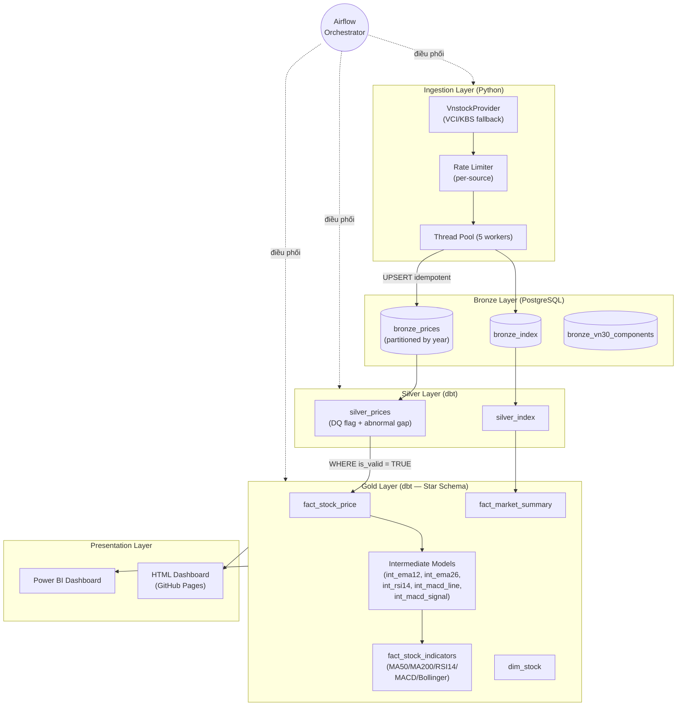

# SYSTEM REFERENCE

> Tài liệu kỹ thuật tập trung. AI đọc file này khi cần hiểu kiến trúc, schema, data contract.
> Không cần đọc lại nếu đã đọc trong cùng session.

---

## 1. Project Status

| Mục | Trạng thái |
|---|---|
| Pipeline (Ingestion → Bronze → Silver → Gold) | ✅ Production |
| Airflow DAGs (daily + backfill + publish) | ✅ Running |
| dbt models (Silver + Gold + Intermediate) | ✅ All pass |
| Power BI + HTML Dashboard | ✅ Connected |
| Data volume | ~494K rows (Bronze/Silver/Gold) |
| Coverage | Full HOSE (~403 mã) + VNINDEX + VN30 |

---

## 2. Stack

| Thành phần | Version | Ghi chú |
|---|---|---|
| Python | 3.12.x | WSL (3.12.3) |
| PostgreSQL | 17.x | Docker `postgres:17`, JSONB, partition by year |
| Apache Airflow | 3.2.x | Docker, LocalExecutor, SDK-based DAGs |
| dbt-core | 1.10.x (pin 1.10.19) | dbt-postgres 1.10.0 |
| vnstock | 4.x | Unified UI, fallback VCI/KBS |
| Power BI | Desktop | Import mode từ Gold schema |

---

## 3. Architecture

```
Provider Layer (VnstockProvider)
  → Ingestion Layer (Python, retry, idempotent UPSERT, ThreadPool 5 workers)
    → Bronze (PostgreSQL, raw JSONB, PK(code,date), partition by year)
      → Silver (dbt: clean, cast, DQ flag, abnormal gap detection)
        → Gold (dbt: star schema — facts + dims + intermediate indicators)
          → Power BI / HTML Dashboard
Airflow điều phối toàn bộ pipeline (3 DAGs)
```



---

## 4. Data Flow & Pipeline

Quy trình dbt: **Run → Test → Run → Test** (fail-fast):

1. **Ingestion** (Python): Fetch OHLCV từ VnstockProvider → UPSERT vào Bronze
2. **dbt run Silver**: Bronze → Silver. DQ flag (`invalid_close`, `high_less_than_low`, `abnormal_price_gap`...). Abnormal gaps tự correct bằng `prev_close_price`
3. **dbt test Silver**: Kiểm định unique, not_null. Fail → dừng, không chạy Gold
4. **dbt run Gold**: Silver (is_valid=TRUE) → fact_stock_price → intermediate models → fact_stock_indicators. fact_market_summary JOIN từ fact_stock_price + silver_index
5. **dbt test Gold**: RSI range, Bollinger logic, MA constraints

---

## 5. Module Layout (verified 2026-07-08)

```
deproject/
├── providers/              # Data provider abstraction
│   ├── base.py             # ABC: DataProvider, exception hierarchy
│   ├── vnstock_provider.py # VnstockProvider (VCI/KBS, per-source rate limiter)
│   ├── registry.py         # get_provider() factory
│   └── __init__.py
├── ingestion/              # Bronze ingestion
│   ├── config.py           # IngestionConfig dataclass, .env reader (SINGLE SOURCE)
│   ├── db.py               # Database connection & UPSERT logic
│   ├── fetch_prices.py     # Fetch OHLCV for stocks (VN30 / others modes)
│   ├── fetch_index.py      # Fetch VNINDEX, VN30 index
│   ├── backfill.py         # Historical backfill CLI
│   ├── utils.py            # Retry decorator, batch helpers
│   └── __init__.py
├── sql/
│   └── init_schema.sql     # Bronze schema + partitions (2020-2026)
├── dbt/
│   ├── models/
│   │   ├── sources.yml     # Bronze source declarations
│   │   ├── silver/         # silver_prices.sql, silver_index.sql, schema.yml
│   │   └── gold/
│   │       ├── intermediate/   # int_ema12, int_ema26, int_rsi14, int_macd_line, int_macd_signal
│   │       ├── fact_stock_price.sql
│   │       ├── fact_stock_indicators.sql  # MA50/MA200/RSI14/MACD/BB, materialized='table'
│   │       ├── fact_market_summary.sql
│   │       ├── dim_stock.sql
│   │       └── schema.yml
│   ├── macros/             # calculate_rsi.sql, calculate_ema.sql
│   └── seeds/              # dim_date.csv (calendar seed)
├── dags/
│   ├── dag_daily.py        # Daily pipeline: fetch → Silver → Gold (18:00 VN, Mon-Fri)
│   ├── dag_backfill.py     # Manual backfill: date range, VN30-only toggle
│   └── dag_publish_dashboard.py  # Auto-generate HTML + push GitHub Pages (18:20 VN)
├── tests/
│   ├── fixtures/           # mock_prices.csv, mock_index.csv
│   ├── test_providers.py
│   ├── test_ingestion.py
│   ├── test_idempotency_partial_write.py
│   └── test_indicators_talib.py
├── scripts/
│   ├── generate_dashboard_backup.py  # HTML dashboard generator
│   ├── generate_dim_date.py          # dim_date seed generator
│   └── verify_macd_g03.py           # MACD cross-check vs Python TA
├── docs/                   # Documentation (file này + operational guides)
├── reports/                # Power BI .pbix files
├── postgres/               # airflow_init.sql
├── docker-compose.yml
├── requirements.txt
├── .env / .env.example
└── README.md
```

---

## 6. Data Contracts (verified against DB 2026-07-08)

### 6.1 Bronze — Raw Ingestion

#### `bronze.bronze_prices` (partitioned by year)
| Column | Type | Nullable | Notes |
|---|---|---|---|
| code | VARCHAR(20) | NOT NULL | Stock symbol. PK part 1 |
| date | DATE | NOT NULL | Trading date. PK part 2 |
| open | NUMERIC(18,4) | YES | Raw open price |
| high | NUMERIC(18,4) | YES | Raw high price |
| low | NUMERIC(18,4) | YES | Raw low price |
| close | NUMERIC(18,4) | YES | Raw close price |
| volume | BIGINT | YES | Trading volume |
| raw_json | JSONB | YES | Full API response |
| source | TEXT | YES | Provider source (vci/kbs) |
| ingested_at | TIMESTAMPTZ | YES | Ingestion timestamp |

**PK:** `(code, date)` — enforced per partition

#### `bronze.bronze_index` (partitioned by year)
Same schema as `bronze_prices`. Stores VNINDEX, VN30 index data.

#### `bronze.bronze_vn30_components`
| Column | Type | Nullable |
|---|---|---|
| code | VARCHAR(20) | NOT NULL (PK) |
| ingested_at | TIMESTAMPTZ | YES (DEFAULT CURRENT_TIMESTAMP) |

---

### 6.2 Silver — Cleaned & Validated

#### `public_silver.silver_prices`
| Column | Type | Notes |
|---|---|---|
| symbol | VARCHAR(20) | Renamed from `code` |
| trade_date | DATE | Renamed from `date` |
| open_price | DOUBLE PRECISION | Cast from NUMERIC |
| high_price | DOUBLE PRECISION | Cast from NUMERIC |
| low_price | DOUBLE PRECISION | Cast from NUMERIC |
| close_price | DOUBLE PRECISION | Cast from NUMERIC |
| volume | BIGINT | |
| source | TEXT | |
| dq_flag | TEXT | `ok`, `invalid_close_price`, `high_less_than_low`, `invalid_ohlc`, `negative_volume`, `abnormal_price_gap` |
| is_valid | BOOLEAN | TRUE if dq_flag IN (`ok`, `abnormal_price_gap`) |
| loaded_at | TIMESTAMPTZ | dbt run timestamp |
| ingested_at | TIMESTAMPTZ | Passed through from Bronze |

**DQ Logic:** Abnormal price gaps (>15% change khi VNINDEX stable) tự correct bằng `prev_close_price`, đánh dấu `is_valid=TRUE`.

**Materialization:** `table` (full rebuild mỗi lần dbt run)

#### `public_silver.silver_index`
| Column | Type | Notes |
|---|---|---|
| index_code | VARCHAR(20) | `VNINDEX` hoặc `VN30` |
| trade_date | DATE | |
| open_price, high_price, low_price, close_price | DOUBLE PRECISION | |
| volume | BIGINT | |
| source, dq_flag, is_valid, loaded_at, ingested_at | (same as silver_prices) | |

---

### 6.3 Gold — Star Schema

#### `public_gold.fact_stock_price`
| Column | Type | Notes |
|---|---|---|
| symbol | VARCHAR(20) | PK part 1 |
| trade_date | DATE | PK part 2 |
| row_num | BIGINT | Sequential per symbol (for indicator warm-up) |
| open_price, high_price, low_price, close_price | DOUBLE PRECISION | Clean OHLCV |
| volume | BIGINT | |
| source | TEXT | |
| silver_loaded_at | TIMESTAMPTZ | |
| gold_loaded_at | TIMESTAMPTZ | |
| gain | DOUBLE PRECISION | MAX(daily_change, 0) — for RSI |
| loss | DOUBLE PRECISION | ABS(MIN(daily_change, 0)) — for RSI |

**Unique indexes:** `(symbol, trade_date)`, `(symbol, row_num)`
**Source:** `silver_prices WHERE is_valid = TRUE`
**Materialization:** `table`

#### `public_gold.fact_stock_indicators`
| Column | Type | Notes |
|---|---|---|
| symbol | VARCHAR(20) | PK part 1 |
| trade_date | DATE | PK part 2 |
| close_price | DOUBLE PRECISION | |
| ma50 | DOUBLE PRECISION | SMA(50), NULL if row_num < 50 |
| ma200 | DOUBLE PRECISION | SMA(200), NULL if row_num < 200 |
| bb_upper | DOUBLE PRECISION | BB(20) + 2σ |
| bb_lower | DOUBLE PRECISION | BB(20) - 2σ |
| rsi_14 | NUMERIC | Wilder RSI(14) from int_rsi14 |
| macd_line | DOUBLE PRECISION | EMA(12) - EMA(26) from intermediates |
| macd_signal | DOUBLE PRECISION | EMA(9) of MACD line (true EMA, not SMA) |
| macd_histogram | DOUBLE PRECISION | macd_line - macd_signal |

**Intermediate models (all `materialized='table'`):**
- `int_ema12` — EMA(12) of close_price
- `int_ema26` — EMA(26) of close_price
- `int_rsi14` — Wilder RSI(14)
- `int_macd_line` — EMA(12) - EMA(26)
- `int_macd_signal` — EMA(9) of macd_line

**Materialization:** `table` (full rebuild — ensures MA200 correct for all rows)

#### `public_gold.fact_market_summary`
| Column | Type | Notes |
|---|---|---|
| trade_date | DATE | PK |
| gainers | BIGINT | Stocks with gain > 0 |
| losers | BIGINT | Stocks with loss > 0 |
| unchanged | BIGINT | gain = 0 AND loss = 0 |
| total_symbols | BIGINT | |
| total_volume | NUMERIC | |
| vnindex_close | DOUBLE PRECISION | From silver_index |
| vn30_close | DOUBLE PRECISION | From silver_index |

**Source:** INNER JOIN fact_stock_price + silver_index (WHERE row_num > 1 to exclude first-day)

#### `public_gold.dim_stock`
| Column | Type | Notes |
|---|---|---|
| symbol | VARCHAR(20) | PK |
| exchange | TEXT | Data source (e.g., 'kbs') |
| default_exchange | TEXT | Always 'HOSE' |
| is_vn30 | BOOLEAN | From bronze_vn30_components |

**Note:** `dim_date` được nạp từ seed file (`seeds/dim_date.csv`) thông qua lệnh `dbt seed`.

---

## 7. Idempotency Contract

- Mọi fetch: `INSERT ... ON CONFLICT (code, date) DO UPDATE`
- Chạy 2 lần → không tăng dòng (verified)
- `ingested_at` UPDATE khi upsert → audit trail
- `source` ghi vci/kbs → truy vết provider
- dbt Gold models: `materialized='table'` → full rebuild, không risk incremental drift

---

## 8. Airflow DAGs

| DAG ID | Schedule | Mô tả |
|---|---|---|
| `daily_stock_pipeline` | `0 11 * * 1-5` (18:00 VN) | Daily: health_check → fetch (VN30 + others + index) → dbt Silver → test → dbt Gold → test → notify |
| `backfill_pipeline` | Manual trigger | Backfill: date range + VN30-only toggle |
| `publish_dashboard_pipeline` | `20 11 * * 1-5` (18:20 VN) | Generate HTML dashboard → git push GitHub Pages |

**Key design:**
- BashOperator only (code mounted at `/opt/airflow/project`)
- Retry 3x with exponential backoff for fetch tasks
- `trigger_rule='none_failed_min_one_success'` cho dbt_silver (tolerates skipped fetch_others)
- VN30 list dynamic from Listing API, not hardcoded

---

## 9. Architecture Decisions

| # | Quyết định | Lý do |
|---|---|---|
| ADR-001 | PostgreSQL 17 (not Big Data) | ~500K rows, JSONB + partition đủ dùng |
| ADR-002 | dbt-core 1.10.x | Bản ổn định lâu nhất, nhiều bản vá |
| ADR-003 | 1 VnstockProvider (not 4 providers) | vnstock 4.x tự fallback VCI/KBS |
| ADR-004 | MACD Signal = EMA9 thật | SMA9 sai 2-8% vs EMA9, vượt ngưỡng G-03 |
| ADR-005 | fact_stock_indicators = table (not incremental) | MA200 cần full history, incremental gây drift |
| ADR-006 | Pilot VN30 → full HOSE | Validate pipeline trước khi mở rộng |
| ADR-007 | Star schema ở Gold | dim_stock cho Power BI slicing |
| ADR-008 | Per-source rate limiter | 2.5x throughput vs global lock |
