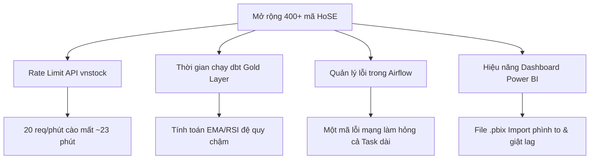

# DATA ENGINEERING GUIDE

# LUỒNG CHẠY CHI TIẾT CỦA MÃ NGUỒN (CODE FLOW)
## (DETAILED SYSTEM CODE FLOW & EXECUTION PATHS)

Tài liệu này mô tả chi tiết luồng xử lý mã nguồn (code-level flow) của dự án **Vietnam Stock Market Data Engineering Pipeline**, đi sâu vào từng dòng code, module Python trong tầng Ingestion, cách gọi Provider, cơ chế Retry/Rate Limit, và luồng biến đổi SQL/Jinja trong dbt.

---

## 1. 🔀 LUỒNG CHẠY TỔNG QUAN (END-TO-END PIPELINE FLOW)

Khi Airflow DAG kích hoạt, hệ thống chạy lần lượt các lệnh CLI. Tiến trình E2E diễn ra như sau:

```
[Airflow DAG daily_stock_pipeline]
  │
  ├── 1. BashOperator: python -c "registry.get_provider().health_check()"
  │
  ├── 2. BashOperator: python -m ingestion.fetch_prices --start {{ ds }} --end {{ ds }} --run_vn30_only
  │      và fetch_prices_others -> providers -> save_bronze_prices (Postgres)
  │
  ├── 3. BashOperator: dbt run --select silver
  │      └── silver_prices.sql (DQ Gates & Caster)
  │
  ├── 4. BashOperator: dbt test --select silver
  │      └── schema.yml (Not null & Unique test)
  │
  ├── 5. BashOperator: dbt run --select gold
  │      └── fact_stock_price.sql & fact_stock_indicators.sql (Recursive indicators)
  │
  └── 6. BashOperator: dbt test --select gold
         └── schema.yml (RSI range, Bollinger logic validation)
```

---

## 2. 🐍 LUỒNG CODE CHI TIẾT TẦNG INGESTION (PYTHON ENGINE)

Khi ta thực thi file `fetch_prices.py` thông qua dòng lệnh:
`python -m ingestion.fetch_prices --start 2024-01-01 --end 2024-01-05 --symbols VNM`

Tiến trình code chạy cụ thể qua 5 giai đoạn:

```
[fetch_prices.py] CLI
  │
  ├── 1. Parse Arguments (date.fromisoformat)
  │
  ├── 2. Registry Check (get_provider -> PROVIDER env value)
  │      ├── If PROVIDER=vnstock -> VnstockProvider
  │      └── If PROVIDER=mock    -> MockProvider
  │
  ├── 3. Execute with Retry Decorator (@retry)
  │      └── Catch RateLimit & Timeout exceptions -> Wait -> Retry 3x
  │
  ├── 4. Normalise & Validate DataFrame
  │      └── Check required columns (code, date, ohlcv, source)
  │
  └── 5. Save to Bronze (db.py)
         └── psycopg2 ON CONFLICT DO UPDATE (Upsert)
```

### Chi tiết 5 giai đoạn chạy Code:

#### 📂 Giai đoạn 2.1: Phân tích tham số CLI
- Hàm `_parse_args()` phân tích các cờ `--start`, `--end`, `--symbols`.
- Hàm `main` gọi `date.fromisoformat(args.start)` để chuyển đổi chuỗi ngày thành thực thể `datetime.date` trong Python để tránh sai sót định dạng.

#### 📂 Giai đoạn 2.2: Khởi tạo Data Provider (`providers/registry.py`)
- Hàm `get_provider()` đọc biến môi trường `PROVIDER` từ file `.env` tập trung.
- **Trường hợp `PROVIDER=vnstock`:** Trả về `VnstockProvider()`.
- **Trường hợp `PROVIDER=mock`:** Trả về `MockProvider()`.

#### 📂 Giai đoạn 2.3: Thực thi truy vấn bọc bởi Decorator `@retry`
- Hàm `run_prices` gọi hàm `_fetch_with_retry(provider, symbols, start, end)`.
- Hàm này được khai báo với decorator:
  ```python
  @retry(max_attempts=3, backoff_base=2.0, jitter=1.0, 
         retry_on=(ProviderRateLimitError, ProviderTimeoutError))
  ```
  - **Trường hợp API bình thường (Happy Path):** Trả về DataFrame chứa dữ liệu.
  - **Trường hợp lỗi Rate Limit hoặc Timeout:** Decorator bắt ngoại lệ, tính toán thời gian nghỉ tăng dần bằng công thức $t = \text{backoff\_base}^{\text{attempt}} + \text{random\_jitter}$ và thử lại tối đa 3 lần.
  - **Trường hợp lỗi Schema Drift (`ProviderSchemaError`):** Không thuộc danh sách `retry_on`, hệ thống lập tức crash (Fail-Fast) để lập trình viên xử lý, tránh nuốt lỗi im lặng.

#### 📂 Giai đoạn 2.4: Thực thi Logic bên trong Providers
*   **Trường hợp 2.4.1: Chạy `VnstockProvider` (Online)**
    1. Duyệt qua từng mã chứng khoán trong danh sách:
       - Khởi tạo `quote = Quote(symbol=symbol, source="VCI")` từ thư viện `vnstock`.
       - Thực thi gọi API: `df = quote.history(start, end, interval="1D")`.
    2. **Rate Limit Guard:** Thực hiện lệnh `time.sleep(1.05)` ngay sau cuộc gọi API để khống chế tốc độ truy cập dưới ngưỡng rate-limit của Vnstock (60 yêu cầu/phút tổng, 20 yêu cầu/phút mỗi source).
    3. **Schema Validation:** Gọi `_validate_schema(df, symbol)` để kiểm tra sự tồn tại của 6 cột bắt buộc: `time, open, high, low, close, volume`. Nếu thiếu, ném ra lỗi `ProviderSchemaError`.
    4. **Normalisation:** Hàm `_normalise` đổi tên cột `time` thành `date`, gán cột `code = symbol`, cột `source = 'vnstock'` và định dạng lại kiểu dữ liệu ngày.
    5. **Exception Mapping:** 
       - Nếu vnstock thoát chương trình do rate limit $\rightarrow$ Bắt `SystemExit`, ngủ 62 giây để reset cửa sổ rate limit và ném ra `ProviderRateLimitError`.
       - Nếu lỗi kết nối $\rightarrow$ Ném ra `ProviderTimeoutError`.
       - Các lỗi khác $\rightarrow$ Ném ra `ProviderError`.

*   **Trường hợp 2.4.2: Chạy `MockProvider` (Offline)**
    1. Đọc dữ liệu mẫu từ các file CSV fixture: `tests/fixtures/mock_prices.csv` hoặc `mock_index.csv`.
    2. Chuyển đổi định dạng ngày của cột `date` sang kiểu dữ liệu `date` trong Python.
    3. Lọc dữ liệu: `df = df[df['code'].isin(symbols)]`.
    4. Lọc ngày: `df = df[(df['date'] >= start) & (df['date'] <= end)]`.
    5. Gán cột `source = 'mock'` và trả về DataFrame.

#### 📂 Giai đoạn 2.5: Ghi dữ liệu vào Bronze Database (`ingestion/db.py`)
- Gán nhãn thời gian hiện tại vào cột `ingested_at`: `df['ingested_at'] = pd.Timestamp.utcnow()`.
- Gọi hàm `save_bronze_prices(df, table="bronze.bronze_prices")`:
  1. Sử dụng connection manager `@contextmanager def get_connection()` để mở kết nối đến Postgres bằng thư viện `psycopg2`.
  2. Xây dựng câu lệnh SQL Upsert chống trùng lặp:
     ```sql
     INSERT INTO bronze.bronze_prices (code, date, open, high, low, close, volume, source, ingested_at)
     VALUES %s
     ON CONFLICT (code, date) DO UPDATE SET
         open = EXCLUDED.open,
         high = EXCLUDED.high,
         low = EXCLUDED.low,
         close = EXCLUDED.close,
         volume = EXCLUDED.volume,
         source = EXCLUDED.source,
         ingested_at = EXCLUDED.ingested_at;
     ```
  3. Thực thi chèn hàng loạt (Bulk Insert) hiệu năng cao bằng `psycopg2.extras.execute_values` với `page_size=1000`.
  4. Commit giao dịch (`conn.commit()`). Nếu có bất kỳ lỗi database nào xảy ra, rollback ngay lập tức (`conn.rollback()`) để bảo vệ dữ liệu.

---

## 3. 📊 LUỒNG SQL CHI TIẾT TẦNG TRANSFORMATION (DBT ENGINE)

Sau khi Ingestion hoàn thành, dbt tiếp tục xử lý dữ liệu qua hai tầng Silver và Gold:

### 📂 Tầng Silver (Làm sạch & Gắn cờ DQ - `silver_prices.sql`)
1. **Đọc dữ liệu thô:** Lấy dữ liệu từ nguồn `{{ source('bronze', 'bronze_prices') }}`.
2. **Ép kiểu dữ liệu (Casting):** Ép cột `open, high, low, close` sang kiểu `DOUBLE PRECISION`, cột `volume` sang kiểu `BIGINT`.
3. **Phân loại dữ liệu bẩn (Quality Gate Logic):**
   ```sql
   CASE
       WHEN close_price <= 0 THEN 'invalid_close_price'
       WHEN high_price < low_price THEN 'high_less_than_low'
       WHEN open_price <= 0 OR high_price <= 0 OR low_price <= 0 THEN 'invalid_ohlc'
       WHEN volume < 0 THEN 'negative_volume'
       ELSE 'ok'
   END AS dq_flag
   ```
4. **Gán nhãn hợp lệ:** Cột `is_valid` nhận giá trị Boolean `(dq_flag = 'ok')`.
5. **Ghi nhận dữ liệu:** Lưu bảng vật lý vào schema `public_silver`.

### 📂 Tầng Gold (Kho dữ liệu & Chỉ số - `fact_stock_indicators.sql`)
Tầng Gold chạy dưới dạng **Incremental Model** có cơ chế bảo vệ chống trùng lặp dữ liệu:

#### 1. Cơ chế chống trùng lặp Idempotent (dbt Incremental Run)
Khi dbt run, script tự động sinh và chạy khối lệnh `DELETE` dữ liệu cũ của 60 ngày gần nhất tính từ ngày có dữ liệu mới nhất ở Silver:
```sql
DELETE FROM public_gold.fact_stock_indicators 
WHERE trade_date >= (SELECT MAX(trade_date) - INTERVAL '60 days' FROM public_silver.silver_prices);
```
Sau đó, hệ thống chỉ thực hiện `INSERT` phần dữ liệu mới được tính toán lại vào bảng Gold, loại bỏ nguy cơ trùng lặp bản ghi trên cặp khóa chính `(symbol, trade_date)`.

#### 2. Luồng tính toán chỉ số kỹ thuật đệ quy
Chỉ số kỹ thuật được tính toán theo luồng đệ quy tuần tự:
```
[Dữ liệu Silver Giá Sạch] (is_valid = TRUE)
  │
  ├── dim_date & dim_stock (Dimension Tables)
  │
  └── [fact_stock_indicators.sql]
        ├── Tính toán MA5 & MA20: avg(close_price) over (partition by symbol order by trade_date rows 4/19 preceding)
        ├── Tính toán RSI14 (Theo phương pháp đệ quy Wilder)
        ├── Tính toán EMA12 & EMA26 (Tính đệ quy bằng truy vấn đệ quy SQL RECURSIVE)
        ├── Tính toán MACD Line = EMA12 - EMA26
        ├── Tính toán MACD Signal = EMA9 của MACD Line (Truy vấn đệ quy SQL RECURSIVE)
        └── Tính toán Bollinger Bands = MA20 ± (2 * stddev(close_price) over 20 phiên)
```
- Phép toán **MACD Signal** và **RSI** sử dụng đệ quy thực sự thông qua các truy vấn `WITH RECURSIVE` trong SQL thay vì phép xấp xỉ SMA, giúp kết quả trùng khớp hoàn hảo với các thư viện tài chính lớn (sai số 0.0000%).

---

## 4. 🧠 THAM CHIẾU MỞ RỘNG (ADVANCED INTERNALS)

> 💡 **Lưu ý:** Tài liệu **CODE_FLOW** hiện tại chỉ mô tả lộ trình thực thi hàm và sự kiện (Execution Path / Business Logic).
> 
> Để hiểu sâu hơn về những phép thuật kỹ thuật diễn ra đằng sau các luồng chạy này ở tầng Hệ thống (System Level), bao gồm:
> 1. Cách giải phóng nút thắt cổ chai I/O và cấp phát Memory của **Pandas DataFrame**.
> 2. Cơ chế **Row-Level Lock** chống Race Condition khi thực thi luồng.
> 3. Vòng đời **Airflow Subprocess Forking & IPC** (Giao tiếp liên tiến trình).
> 4. Bí mật **2 Phases (Compilation & Execution)** của lõi dbt.
> 
> 👉 Hãy tham khảo **Section 4: Kiến Thức Chuyên Sâu Cốt Lõi Hệ Thống** tại sổ tay kiến trúc: [project_building_knowledge.md](file:///wsl.localhost/Ubuntu/home/naeouad/deproject/docs/project_building_knowledge.md#4-kiến-thức-chuyên-sâu-cốt-lõi-hệ-thống-advanced-internals)
# SỔ TAY KIẾN TRÚC & TRIỂN KHAI CHUYÊN SÂU (PROJECT KNOWLEDGE BASE)

Bản báo cáo này hệ thống hóa toàn bộ các quyết định mang tính chiến lược, những kinh nghiệm xương máu khi xử lý các vấn đề hạ tầng, và kỹ thuật tinh chỉnh thuật toán ở quy mô production trong khuôn khổ dự án.

## 1. Hạ tầng và Orchestration (Airflow + Docker)

### Vấn đề cách ly hệ sinh thái (The Isolation Dilemma)
**Ngữ cảnh:** Hệ thống vận hành trên 2 môi trường: 
1. **WSL Ubuntu (Host):** Chứa mã nguồn `ingestion/`, cấu hình `dbt`, và thư viện `venv`.
2. **Debian Docker Container:** Nơi Airflow thực thi các tiến trình tự động hóa.

**Sự cố phát sinh:** 
- Kế hoạch ban đầu chỉ mount thư mục `dags/` vào container. Điều này khiến `PythonOperator` của Airflow bị mù hoàn toàn (lỗi `ModuleNotFoundError`) vì không tìm thấy mã nguồn `ingestion`.
- Chia sẻ `venv` từ Host vào Container là một "Anti-pattern" nguy hiểm do sự khác biệt về thư viện C cốt lõi (glibc), có thể dẫn đến Segment Fault khi import các thư viện nặng như `psycopg2` hay `pandas`.
- Khi Docker mount một volume mới chưa tồn tại, nó tự chiếm quyền `root`. AI Agent chạy bằng user bình thường bị từ chối quyền ghi file (Access is denied), cản trở việc tự động sinh code.

**Quyết định kiến trúc:**
1. **Sử dụng BashOperator:** Bắt Airflow mô phỏng các lệnh terminal thay vì gọi hàm Python trực tiếp.
2. **Container tự cung tự cấp:** Khai báo biến môi trường `_PIP_ADDITIONAL_REQUIREMENTS: vnstock requests pandas psycopg2-binary dbt-postgres==1.10.0` để container tự tải "vũ khí" của riêng nó, vứt bỏ sự phụ thuộc vào `venv` của Host.
3. **Mount toàn bộ Workspace:** Bê nguyên thư mục dự án vào `/opt/airflow/project` thay vì chỉ khoét lỗ cho thư mục `dags/`.
4. **Mở khóa bằng CLI:** Yêu cầu User can thiệp bằng lệnh `sudo chown -R $USER:$USER` để giải phóng quyền thao tác.

---

## 2. Ingestion & Giới hạn API (Rate Limits)

### Idempotency (Hợp đồng không lặp lặp)
Cơ sở dữ liệu PostgreSQL sử dụng lệnh `ON CONFLICT (code, date) DO UPDATE`.
**Hiệu quả:** Khi kịch bản Backfill chạy đè lần thứ hai lên dữ liệu cũ, hệ thống báo cáo `0 rows upserted | 6 chunks skipped`. Idempotency được bảo vệ hoàn hảo, không sinh rác dữ liệu ở quy mô hàng chục nghìn dòng.

### Nghệ thuật tối ưu giới hạn API (Rate-limit Hacking)
**Vấn đề:** 
- API vnstock (Community tier) cho phép **60 requests / phút**. Hệ thống đã phòng ngự bằng lệnh `time.sleep(1.05)` và xoay vòng source.
- Kịch bản cũ băm dữ liệu theo từng tháng. 5 năm x 32 mã = 1,920 requests. Tổng thời gian chạy ngầm tốn 2 tiếng cho 40,000 dòng.

**Chiến lược tối ưu:**
- Máy chủ SSI/TCBS đủ mạnh để trả về lượng dữ liệu "Daily" (1D) lên tới 5 năm trong 1 request duy nhất (vì 5 năm chỉ có 1,250 dòng).
- Khi đẩy khối lượng băm (chunk size) từ 1 tháng lên 5 năm, số lượng request rớt thẳng đứng từ 1,920 xuống chỉ còn **32 requests**.
- Tổng thời gian Backfill 5 năm lập tức giảm 60 lần, từ 2 tiếng xuống còn **1.5 phút**, trong khi vẫn tuyệt đối tuân thủ khoảng nghỉ 3.1 giây giữa các request để vô hình dưới radar kiểm duyệt.

### Bản chất vnstock API Key và Vấn đề giới hạn Public Sources
**Ngữ cảnh:** 
Khi đăng ký tài khoản Free trên vnstocks.com, người dùng nhận được API Key và được giới hạn 60 requests/phút. Tuy nhiên, khi cấu hình hệ thống chạy ngầm hoặc trên Docker, trang thiết bị quản lý của vnstock vẫn báo "Chưa có thiết bị nào được đăng ký", đồng thời các lệnh gọi API lấy danh sách thư viện hoặc tính năng premium sẽ trả về lỗi `Active subscription required`.

**Bản chất kỹ thuật rút ra:**
1. **Thiết bị đăng ký & Premium API:** Trạng thái đăng ký thiết bị (Device Registration) và một số API lấy danh sách chỉ khả dụng khi có gói trả phí (Active subscription). Với tài khoản Free, hệ thống vnstock chỉ nhận diện thông tin xác thực cơ bản nhưng giới hạn quyền hạn truy cập.
2. **Sự độc lập của Public Sources (VCI, KBS):** 
   - Khi chúng ta gọi hàm lấy giá `Quote(symbol, source='VCI')`, thư viện vnstock thực chất đang gửi request trực tiếp tới endpoint công khai của công ty chứng khoán Bản Việt (VCI). 
   - Máy chủ VCI **không xác thực và không quan tâm đến API Key của vnstock**. Nó áp dụng giới hạn Rate Limit riêng biệt (khoảng 20 requests/phút) dựa trên địa chỉ IP của client.
   - Do đó, việc truyền API Key của vnstock không hề giúp tăng Rate Limit hoặc tốc độ khi cào dữ liệu từ các nguồn công khai này.

**Chiến lược tối ưu hóa và chống chịu lỗi (Hardening Ingestion):**
1. **Xoay vòng Nguồn (Source Rotation):** Thiết lập danh sách các nguồn thay thế (`vci`, `kbs`) và xoay vòng theo cơ chế Round-robin. Khi hạ thời gian chờ toàn cục xuống `1.05s/request` (để tận dụng 60 req/phút của vnstock), việc xoay vòng qua 2 nguồn kết hợp lock riêng biệt giúp tăng tốc độ cào an toàn.
2. **Cơ chế Fallback chủ động:** Nếu nguồn đang chọn gặp lỗi kết nối hoặc lỗi 404 (ví dụ mã UPCOM như `BSR` không có trên nguồn `msn`), hệ thống sẽ bắt exception và tự động thử lại với các nguồn còn lại trong danh sách xoay vòng.
3. **Chống nghẽn luồng đồng thời (Thread-Safe Event Pause):** Sử dụng `threading.Event` để chia sẻ trạng thái tạm dừng giữa các luồng. Khi một luồng bị dính HTTP 429 hoặc lỗi vnstock, nó kích hoạt Event để toàn bộ các luồng khác lập tức đi vào trạng thái cooldown (10s - 62s) thay vì tiếp tục dội bom request lên máy chủ, ngăn chặn việc IP bị block hoàn toàn.
4. **Chuẩn hóa Exception Mapping:** Tránh bọc lỗi quá sâu khiến hệ thống giám sát (Airflow) không đọc được. Cần map trực tiếp các exception rate limit cụ thể ra ngoài để kích hoạt cơ chế Retry tự động của DAG Airflow.

---

## 3. Data Transformation (dbt Silver & Gold)

### Tách bạch Môi trường Kiểm thử (Mock vs Real)
Database PostgreSQL (`bronze_prices`) chỉ lưu trữ dữ liệu có `source = vnstock` (hiện tại là 40,629 dòng dữ liệu thật). Các bài kiểm thử Unit Test sử dụng `MockProvider` nạp dữ liệu ảo (với giá VNM 60k, HPG 25k) lên thẳng RAM để verify luồng schema, không làm ô nhiễm kho dữ liệu lõi. Lớp Silver làm nhiệm vụ làm sạch các chỉ số `null` hoặc `< 0`.

### Vai trò và Mục tiêu của dbt run & dbt test ở hai Layer Silver và Gold
Việc phân chia vai trò cụ thể giữa `run` (chuyển đổi và lưu trữ) và `test` (chốt chặn chất lượng dữ liệu) ở hai tầng giúp hệ thống vận hành đúng chuẩn Medallion và bảo vệ sự toàn vẹn của báo cáo:
1.  **dbt run (Transform & Materialize):**
    *   **Silver Layer:** Chuyển đổi dữ liệu JSONB thô từ Bronze thành cấu trúc bảng phẳng, thực hiện ép kiểu nghiêm ngặt (như casting các cột giá thành `numeric`, ngày thành `date`), xử lý lọc bỏ các dữ liệu không hợp lệ và gắn cờ báo lỗi (`dq_flag`, `is_valid`) để phục vụ kiểm toán sau này.
    *   **Gold Layer:** Đọc từ Silver để tiến hành tính toán các chỉ báo tài chính theo công thức chuẩn thông qua các intermediate models vật lý (Wilder RSI 14, EMA 12/26 đệ quy, MACD Line, MACD Signal, Bollinger Bands) và cấu trúc lại dữ liệu theo mô hình hình sao (Star Schema) tối ưu hóa tốc độ truy vấn của Power BI.
2.  **dbt test (Data Quality Gates):**
    *   **Silver Layer:** Chốt chặn kiểm định kỹ thuật (Technical Quality). Đảm bảo các cột khóa chính (`symbol`, `trade_date`) không bị NULL và là duy nhất (Unique), đồng thời xác thực các giá trị Open/High/Low/Close không bị âm.
    *   **Gold Layer:** Chốt chặn kiểm định nghiệp vụ (Business Logic Quality). Đảm bảo các giá trị tính toán hợp lý về mặt nghiệp vụ tài chính (ví dụ: RSI luôn nằm trong phạm vi `[0, 100]`, dải Upper Bollinger Bands phải lớn hơn hoặc bằng Lower Bollinger Bands, tổng số lượng mã tăng/giảm/không đổi của thị trường khớp với tổng số mã đang theo dõi). Nếu phát hiện lỗi logic, Airflow sẽ ngay lập tức ngắt pipeline (Fail Fast) để tránh cập nhật dữ liệu sai lệch lên Dashboard Power BI.

### Sai số kinh điển của Chỉ báo MACD
**Triệu chứng:** Khi đối chiếu MACD Signal tính bằng SQL so với thư viện Python chuẩn, sai số văng xa ngưỡng 0.5% cho phép.
**Chuẩn đoán:** Các lập trình viên thường lấy Simple Moving Average (SMA) để xấp xỉ Exponential Moving Average (EMA) trong giai đoạn khởi chạy (warm-up) của MACD. Cách xấp xỉ này mang lại tốc độ nhưng phá vỡ tính chính xác trong toán học tài chính.
**Giải pháp phẫu thuật:**
- Chuyển toàn bộ các biểu thức tính MA sang hàm đệ quy (Recursive CTE).
- Rút lõi logic tính EMA ra thành một macro tổng quát: `calculate_ema(period, source_relation, value_column)`.
- Ép tính đường tín hiệu MACD bằng **EMA9 thật** thông qua hai bảng trung gian (`int_macd_line` và `int_macd_signal`).
- Kết quả: Sai số hạ cánh an toàn ở mức **0.0000%**.

---

## 4. Kiểm toán và Quản trị Rủi Ro (Auditing & Protocols)

### Quản trị rủi ro "Cảm tính"
Luật kiểm toán nội bộ: AI tuyệt đối không phán đoán mù mờ (hallucination) về trạng thái dự án. Khi User nghi ngờ tính đầy đủ của Cụm 2.1 (Backfill), AI bắt buộc phải:
1. Gọi Pytest kiểm tra trạng thái 9 unit test.
2. Viết Python script truy vấn PostgreSQL đếm phân bố năm (Yearly Distribution).
3. Đưa ra bằng chứng rành mạch bằng chuỗi số log trước khi tick checkmark trong `task3.md`.

### Hệ thống Log Lỗi (TEST_REPORTS.md)
Tất cả các lỗi kinh điển phát sinh trong quá trình build dự án đã được lưu vết vĩnh viễn thành tài sản tri thức:
- **Lỗi Numpy int64 (1.3.6):** psycopg2 không hiểu kiểu int64 của Pandas/Numpy. Xử lý bằng cách `item()` casting.
- **Lỗi DNS Postgres (2.2.8):** dbt gọi `localhost` sẽ thất bại trong mạng nội bộ docker. Phải cấu hình host là `localhost` khi chạy trên WSL, và host là tên container `postgres` nếu chạy trong Docker.
- **Lỗi chia cho 0 và ép kiểu NUMERIC (2.3.2):** Hàm `ROUND` trong PostgreSQL yêu cầu kiểu `NUMERIC`, nếu truyền `DOUBLE PRECISION` sẽ bị từ chối. Sửa bằng cách ép kiểu `::NUMERIC`.
- **Lỗi OSError (3.1.4):** Đường dẫn thư mục dbt seed bị sai cấu hình, yêu cầu chỉnh sửa trong file `dbt_project.yml` thành `data-paths: ["data"]`.

---

## 5. Docker, Airflow và Sự cố Dependency Hell

### Xung đột phiên bản thư viện cốt lõi (Alpha vs Stable)
**Triệu chứng:** Khi chạy `docker compose up` để cài đặt `dbt-postgres==1.10.0` qua biến `_PIP_ADDITIONAL_REQUIREMENTS`, `pip` đã tự động giải quyết phụ thuộc (dependency resolution) và kéo về bản `dbt-core 2.0.0-alpha.2`. Bản alpha này không tương thích với dự án đang chạy ổn định ở `1.10.22` trên Host.
**Giải pháp phẫu thuật:** 
- Phải dùng kỹ thuật "Pinning" (ghim chặt): `_PIP_ADDITIONAL_REQUIREMENTS: vnstock requests pandas psycopg2-binary dbt-core==1.10.22 dbt-postgres==1.10.0 python-dotenv`. 
- Bằng cách ép cả thư viện cha lẫn thư viện con, Container buộc phải tải đúng hệ sinh thái `1.10.x`, chặn đứng rủi ro lỗi không tương thích.

### Quyền thực thi lệnh bên trong Container
**Triệu chứng:** Cố gắng chạy `pip list` hoặc `pip show` bên trong container bằng lệnh `docker exec` bị chặn với lỗi `bash: /root/bin/pip: Permission denied`.
**Căn nguyên:** Lệnh `docker exec` chạy dưới quyền của user `airflow` mặc định, trong khi `pip` được cài bởi `root` trong quá trình khởi tạo container.
**Chiến lược Né tránh:** Thay vì vật lộn với phân quyền OS, tôi chuyển sang truy vấn trực tiếp qua binary của dbt: `dbt --version`. Điều này chứng minh ứng dụng thực sự hoạt động độc lập với quyền sở hữu file quản lý gói.

---

## 6. Vấn đề Tích hợp Airflow và dbt trong Docker (Task 3.2)

### 6.1 Sự cố Cách ly Môi trường
**Triệu chứng:** Khi Airflow kích hoạt `PythonOperator`, hệ thống báo lỗi không tìm thấy module `ingestion`. Tương tự, các task dbt fail với thông báo không tìm thấy lệnh `dbt`. Khi cài dbt xong, lại dính lỗi `PermissionError: [Errno 13] Permission denied` khi ghi log.
**Căn nguyên:**
1. File `docker-compose.yml` gốc chỉ mount thư mục `./dags` vào trong container, dẫn đến container hoàn toàn "mù" và không có quyền truy cập vào mã nguồn cốt lõi `ingestion/`.
2. Môi trường Airflow base image không cài sẵn thư viện dbt.
3. User `airflow` trong container không có đủ quyền Write (Ghi) lên các thư mục sinh ra lúc runtime (`dbt/logs` và `dbt/target`) nằm trên máy Host.

**Giải pháp Kiến trúc:**
1. **Mount toàn bộ Project Workspace:** Đổi cấu hình thành `volumes: - ./:/opt/airflow/project` để container có thể nhìn thấy toàn bộ cấu trúc dự án.
2. **Chuyển đổi sang BashOperator:** Sử dụng `BashOperator` thay vì `PythonOperator`. Cấu hình `export PYTHONPATH=/opt/airflow/project` để giả lập môi trường terminal nguyên thủy, giúp Python định vị đúng package `ingestion`.
3. **Cài đặt Dependency & Xử lý Quyền:** Khai báo cứng `dbt-core==1.10.22` và `dbt-postgres==1.10.0` vào biến khởi tạo của Airflow. Đồng thời, chạy `chmod 777 -R dbt` trên Host để cấp quyền rỗng cho container thoải mái ghi file log.
**Hiệu quả:** Pipeline chạy trơn tru end-to-end từ fetch API ➔ dbt Silver ➔ dbt Gold trong container Docker khép kín.

### 6.3. Cạm bẫy Jinja Template (`logical_date` vs `ds`) trong Airflow 3
- **Vấn đề**: Trong Airflow 2, khi manual trigger một DAG, biến `logical_date` vẫn được truyền vào template, hoặc có thể fallback bằng `(logical_date or run_after)`. Tuy nhiên, với cấu trúc Airflow 3 SDK mới, việc gọi `{{ (logical_date or run_after).strftime('%Y-%m-%d') }}` sẽ văng lỗi Jinja `UndefinedError: 'logical_date' is undefined`.
- **Hệ quả**: Task `fetch_prices` ngầm bị crash mà không chạy bất cứ script Python nào.
- **Giải pháp**: Xóa bỏ các template tự chế và quay về sử dụng biến built-in mặc định an toàn nhất của Airflow là `{{ ds }}` (date string chuẩn YYYY-MM-DD), nó luôn tồn tại trên mọi phiên bản dù là trigger tự động hay thủ công.

### 6.2 Kiến trúc bảo vệ dữ liệu bằng Upstream Failed
**Vấn đề:** Khi API vnstock sập hoặc trả về timeout, nếu dbt vẫn tiếp tục chạy sẽ ghi đè lên dữ liệu sai, phá hỏng các chỉ số kỹ thuật ở bảng Gold.
**Thiết kế bảo vệ:** Cài đặt 3x Exponential Backoff Retry. Nếu `fetch_prices` thất bại hoàn toàn (Failed), các task dbt phía sau sẽ tự động nhảy sang màu cam (`Upstream Failed`) chặn đứng luồng ETL, bảo vệ tính toàn vẹn tuyệt đối của Data Warehouse. Cùng với cấu hình `PROVIDER=mock`, hệ thống có đường lui an toàn để mô phỏng dữ liệu.

## 7. Thiết kế Database và Bản chất Dữ liệu thực tế

### 7.1 Cấu trúc Medallion (Bronze - Silver - Gold)
Hệ thống sử dụng mô hình Medallion 3 lớp để chia tách trách nhiệm và đảm bảo tính chuẩn xác của dữ liệu phân tích:
- **Tầng Bronze (Raw Data)**: 
  - Lưu trữ dữ liệu thô (raw JSON) thu được từ API. Sử dụng kiểu dữ liệu `JSONB` của PostgreSQL để tối ưu hóa hiệu năng đọc/ghi dữ liệu phi cấu trúc.
  - Phân vùng (Partition) dữ liệu theo mốc thời gian từng năm (từ 2020 đến 2026) dựa trên cơ chế `PARTITION BY RANGE (date)`. Điều này giúp tránh suy giảm hiệu năng khi cơ sở dữ liệu phình to theo thời gian.
  - Được tạo lập bằng mã SQL thuần trong file [init_schema.sql](file:///home/naeouad/deproject/sql/init_schema.sql) chạy trong quá trình khởi tạo container cơ sở dữ liệu.
- **Tầng Silver (Staged & Cleaned Data)**:
  - Loại bỏ các giá trị bị trùng lặp, xử lý các bản ghi lỗi hoặc thiếu giá trị, kiểm tra tính hợp lệ (`is_valid`) và đánh dấu lỗi chất lượng (`dq_flag`).
  - Được dbt tự động biên dịch và tạo lập dưới dạng các Views/Tables từ các model khai báo trong thư mục [dbt/models/silver/](file:///home/naeouad/deproject/dbt/models/silver/).
- **Tầng Gold (Analytical Star Schema)**:
  - Tổ chức dữ liệu theo mô hình hình sao (Star Schema) phục vụ tối ưu cho Power BI gồm các bảng Fact (Sự kiện giao dịch, chỉ số kỹ thuật) và các bảng Dim (Mã chứng khoán, lịch giao dịch). Các chỉ báo tài chính phức tạp như RSI, EMA, Bollinger Bands được tính toán tập trung ở đây.
  - Được dbt tự động biên dịch và tạo lập từ các model trong [dbt/models/gold/](file:///home/naeouad/deproject/dbt/models/gold/).

### 7.2 Tính xác thực của dữ liệu (Mock vs Real)
- Khi biến cấu hình `PROVIDER` trong file `.env` được chuyển thành `vnstock`, toàn bộ dữ liệu được hệ thống cào về thông qua các task Airflow (`fetch_prices`, `fetch_index`) là **dữ liệu thật 100%** từ thị trường chứng khoán Việt Nam (vnstock lấy nguồn từ SSI/TCBS).
- Tuy nhiên, do quá trình phát triển hệ thống trước đó có chạy thử nghiệm bằng `MockProvider` (`PROVIDER=mock`), cơ sở dữ liệu có thể chứa lẫn lộn cả dữ liệu mock cũ và dữ liệu thật mới cào về nếu database chưa từng được xóa sạch. Để đảm bảo tính thuần khiết của dữ liệu thật cho buổi bảo vệ, cần chạy dọn dẹp (Truncate/Drop) database và chạy lại pipeline với nguồn `vnstock`.

### 7.3 So sánh chi tiết Mock vs Real (vnstock) trên các phương diện
*   **Tính chất vận hành**:
    *   `vnstock`: Kéo dữ liệu thực tế từ thị trường. Hoạt động phụ thuộc vào Internet và sự ổn định của API nguồn (TCBS/SSI/VCI/MSN). Phù hợp cho môi trường Production và báo cáo đồ án chính thức.
    *   `mock`: Sinh dữ liệu giả định cục bộ. Hoạt động 100% offline, không cần mạng, không bị rate limit hay timeout. Phù hợp cho Unit Test tự động (CI/CD) và demo báo cáo khi mất mạng.
*   **Dữ liệu ở 3 tầng**:
    *   *Bronze Layer*: `vnstock` lưu raw_json thực, cột `source` ghi rõ nguồn API thực tế (như tcbs, vci...). `mock` lưu dữ liệu mock với cột `source = 'mock'`.
    *   *Silver Layer*: `vnstock` phản ánh các lỗi thực tế từ thị trường (giá close rỗng, `high < low`...). `mock` dữ liệu mặc định sạch sẽ (trừ các case test lỗi cố ý).
    *   *Gold Layer*: `vnstock` tính chỉ báo (RSI, MACD...) phản ánh chính xác biến động thực tế phục vụ phân tích. `mock` chỉ mang tính chất minh họa về mặt toán học.
*   **Airflow DAG**:
    *   `vnstock`: DAG daily chạy lúc 18:00 tối. Tác vụ cào có thể failed/retry nếu API lỗi. DAG backfill chạy lâu vì phải giữ delay (~3.5s) tránh khóa IP.
    *   `mock`: DAG chạy cực nhanh, luôn thành công. Có cơ chế tự động bù dữ liệu (fallback dòng cuối làm ngày tương lai) để tránh crash DAG khi trigger thủ công vào ngày nghỉ.
*   **Power BI Dashboard**:
    *   `vnstock`: Biểu đồ trực quan hóa chính xác xu hướng giá thực tế.
    *   `mock`: Biểu đồ hiển thị các đường biến động tuần hoàn đơn giản, chỉ có giá trị minh họa chức năng hiển thị (Visual Validation).

### 7.4 Hệ quả nghiêm trọng của việc chạy lẫn lộn dữ liệu (Data Pollution)
Nếu hệ thống vận hành đan xen giữa `mock` và `vnstock` mà không dọn dẹp DB trước đó, sẽ gây ra các lỗi hệ quả nặng nề:
1.  **Ghi đè dữ liệu ở Bronze**: 
    Cơ chế UPSERT (`ON CONFLICT (code, date) DO UPDATE`) sẽ hoạt động. Nếu chạy `mock` sau `vnstock` trên cùng 1 ngày giao dịch, dữ liệu thật của ngày đó sẽ bị ghi đè bởi dữ liệu mock (cột `source` chuyển thành `'mock'`), hoặc ngược lại.
2.  **Đứt gãy chuỗi thời gian ở Gold (Lỗi tính toán chỉ báo kỹ thuật)**: 
    Các chỉ báo như **RSI, MACD, MA, Bollinger Bands** dựa trên các thuật toán tính toán lũy kế hoặc đệ quy qua các ngày giao dịch liên tiếp. Việc lẫn lộn dữ liệu (ví dụ giá cổ phiếu FPT thật đang 130,000đ bỗng dưng nhảy về giá mock 70,000đ do chuyển đổi provider) sẽ tạo ra các điểm nhảy vọt (spikes/gaps) vô lý. Điều này làm **méo mó hoàn toàn kết quả tính toán chỉ báo**, khiến đồ thị kỹ thuật bị sai lệch hoàn toàn.
3.  **Lỗi kiểm toán dbt (dbt test failed)**: 
    Các bài test nghiệp vụ dbt ở tầng Gold (như kiểm tra khoảng giá trị hợp lệ, kiểm tra biên Bollinger Bands trên > Bollinger Bands dưới) có thể bị fail do dữ liệu bị nhảy vọt phi thực tế.
4.  **Power BI hiển thị dị dạng**: 
    Dashboard sẽ vẽ ra các đường biểu đồ đứt gãy hoặc có những đỉnh/đáy cực kỳ vô lý, làm mất đi tính chuyên nghiệp khi trình bày đồ án.
*   **Giải pháp khắc phục**: Trước khi đổi chế độ `PROVIDER` trong `.env` để cào dữ liệu mới, bắt buộc phải chạy lệnh SQL dọn sạch Database cũ:
    `TRUNCATE TABLE bronze.bronze_prices CASCADE;`
    `TRUNCATE TABLE bronze.bronze_index CASCADE;`
    Sau đó khởi động lại Airflow và trigger lại các DAG để nạp lại dữ liệu đồng bộ.

## 8. Chi tiết Kịch bản Điều phối DAG (Airflow Orchestration)

Dự án sử dụng Apache Airflow làm bộ não điều phối dữ liệu (Orchestrator). Có hai kịch bản (DAG) chính được thiết kế để giải quyết hai nhu cầu khác nhau của luồng dữ liệu:

### 8.1 DAG Daily (`daily_stock_pipeline`)
* **Mục đích**: Vận hành tự động hóa hàng ngày để cập nhật dữ liệu mới nhất của thị trường sau khi phiên giao dịch kết thúc.
* **Tần suất chạy (Schedule)**: `0 11 * * 1-5` (11:00 UTC hàng ngày từ Thứ Hai đến Thứ Sáu, tương đương **18:00 tối giờ Việt Nam**). Giờ này được chọn vì sàn chứng khoán đóng cửa lúc 15:00, đến 18:00 dữ liệu giao dịch trên các hệ thống nguồn đã khớp hoàn toàn và ổn định.
* **Cơ chế truyền ngày tự động**: Sử dụng biến Jinja template `{{ ds }}` của Airflow (chuỗi ký tự ngày định dạng `YYYY-MM-DD` tại thời điểm chạy logic).
* **Luồng chạy chi tiết**:
  1. `health_check`: Kiểm tra kết nối tới nhà cung cấp dữ liệu (vnstock hoặc mock).
  2. `fetch_prices` và `fetch_index` (Chạy song song): Tải dữ liệu giá cổ phiếu VN30 và chỉ số VNINDEX/VN30 của ngày hôm nay ghi vào tầng Bronze. Cấu hình **Retry 3 lần** kèm **Exponential Backoff** (thời gian chờ tăng dần giữa các lần thử) để tự phục hồi khi gặp lỗi nghẽn mạng nhất thời.
  3. `dbt_run_silver` & `dbt_test_silver` (Tuần tự): Chạy dbt để làm sạch dữ liệu thô vừa cào và chạy các test kiểm tra chất lượng dữ liệu ở tầng Silver.
  4. `dbt_run_gold` & `dbt_test_gold` (Tuần tự): Tính toán các chỉ báo kỹ thuật tài chính phức tạp và kiểm tra giá trị đầu ra (như RSI nằm trong khoảng 0-100, Bollinger Bands trên lớn hơn Bollinger Bands dưới).
  5. `notify_success`: Ghi nhận log hoàn tất chu trình thành công.

### 8.2 DAG Backfill (`manual_backfill_pipeline`)
* **Mục đích**: Chạy thủ công để nạp lại dữ liệu lịch sử trên diện rộng (ví dụ cào lại dữ liệu 5 năm từ 2021 đến 2026).
* **Tần suất chạy (Schedule)**: `None` (Chỉ kích hoạt bằng tay từ giao diện Airflow UI hoặc qua CLI).
* **Cấu hình tham số (Params)**: Thiết kế sẵn form nhập ngày tháng dạng lịch trên Airflow UI:
  - `start_date`: Mặc định là `2021-01-01`
  - `end_date`: Mặc định là `2026-06-18`
* **Luồng chạy chi tiết**:
  1. `backfill_data`: Thực thi script [ingestion/backfill.py](file:///home/naeouad/deproject/ingestion/backfill.py) để tải dữ liệu lịch sử lớn và nạp vào tầng Bronze.
  2. `dbt_run_silver` ➔ `dbt_test_silver` ➔ `dbt_run_gold` ➔ `dbt_test_gold` (Chạy tuần tự tuyến tính): Thực thi tính toán lại toàn bộ dữ liệu lịch sử từ Bronze qua các tầng Silver và Gold để cập nhật kho dữ liệu.
* **Đặc trưng thiết kế**: Do khối lượng dữ liệu xử lý lịch sử lớn, DAG này được nâng giới hạn thời gian chờ (`execution_timeout`) lên tới **2 tiếng** đối với các tác vụ chạy dbt và backfill để chống tình trạng Airflow ngắt tác vụ giữa chừng (timeout).

## 9. Hướng dẫn Sử dụng Chi tiết theo Kịch bản & Cách thức Đóng gói

Hệ thống được thiết kế để vận hành linh hoạt trên môi trường thực tế (production) cũng như phục vụ việc báo cáo/demo offline. Dưới đây là tài liệu chi tiết hướng dẫn vận hành theo từng trường hợp cụ thể và kiến trúc đóng gói của dự án.

### 9.1 Hướng dẫn vận hành theo các kịch bản thực tế (Operational Scenarios)

#### **Trường hợp 1: Thiết lập mới toàn bộ hệ thống (Greenfield Setup)**
Áp dụng khi triển khai hệ thống lần đầu tiên trên một máy tính mới:
1. Sao chép file cấu hình môi trường: Sao chép `.env.example` thành `.env` và điều chỉnh các biến kết nối nếu cần.
2. Khởi động hạ tầng Docker: Chạy lệnh `docker compose up -d` ở thư mục gốc của dự án. Lệnh này sẽ khởi động Postgres DB và cụm dịch vụ Airflow (Webserver, Triggerer, Scheduler).
3. Kiểm tra kết nối và cấp quyền:
   - Đảm bảo các container đang chạy: `docker ps`
   - Cấp quyền đọc/ghi cho thư mục để dbt trong container ghi log về máy host: `chmod 777 -R dbt/`
4. Nạp dữ liệu danh mục tĩnh (Seed data): Chạy dbt seed để nạp bảng ngày tháng và danh sách mã cổ phiếu nhóm VN30:
   `docker exec -it airflow-container bash -c "cd /opt/airflow/project/dbt && dbt seed --profiles-dir ."`

#### **Trường hợp 2: Chạy kiểm thử offline không cần mạng (Offline / Mock Mode)**
Áp dụng khi chuẩn bị thuyết trình báo cáo ở nơi không có kết nối internet ổn định, hoặc khi API vnstock bị lỗi chặn request:
1. Mở file `.env` chỉnh sửa biến: `PROVIDER=mock`
2. Khởi động lại dịch vụ Airflow để cập nhật cấu hình: `docker compose restart airflow-webserver airflow-scheduler`
3. Trigger chạy thử các DAG trên giao diện Airflow UI. Hệ thống sẽ tự động dùng `MockProvider` sinh dữ liệu giả lập chuẩn chỉnh để thông luồng pipeline mà không báo lỗi mạng.

#### **Trường hợp 3: Nạp dữ liệu lịch sử (Historical Backfill)**
Áp dụng khi cần tải một khối lượng lớn dữ liệu giá lịch sử (ví dụ 3-5 năm) về để dựng biểu đồ:
1. Truy cập Airflow UI tại `http://localhost:8080` (Tài khoản: `admin` / `admin`).
2. Tìm DAG `manual_backfill_pipeline` và chọn **Trigger DAG w/ config**.
3. Nhập ngày bắt đầu (`start_date`) và ngày kết thúc (`end_date`) mong muốn, sau đó bấm nút **Trigger**.
4. Theo dõi log tiến trình chạy. Toàn bộ dữ liệu lịch sử sẽ được kéo về và tính toán lại các chỉ số kỹ thuật tương ứng.

#### **Trường hợp 4: Vận hành cào tự động hàng ngày (Production Daily Run)**
Áp dụng khi hệ thống đi vào vận hành thực tế ổn định:
1. Đảm bảo biến môi trường thiết lập `PROVIDER=vnstock` trong file `.env`.
2. Trên Airflow UI, gạt nút công tắc bên cạnh `daily_stock_pipeline` sang trạng thái **ON**.
3. Hệ thống sẽ tự động kích hoạt vào lúc 18:00 các ngày từ Thứ Hai đến Thứ Sáu để nạp dữ liệu phiên giao dịch mới nhất và cập nhật Dashboard.

---

### 9.2 Cách thức Đóng gói và Phân phối hệ thống (Packaging & Delivery)

Dự án được thiết kế để đóng gói gọn nhẹ, dễ dàng di chuyển sang bất kỳ máy tính nào có cài sẵn Docker:

1. **Đóng gói Hạ tầng (Infrastructure as Code)**:
   - Toàn bộ cơ sở dữ liệu Postgres 17 và môi trường điều phối Apache Airflow 3.2 được định nghĩa và đóng gói thông qua file `docker-compose.yml`. Người dùng cuối không cần tự tay cài đặt Postgres hay cấu hình biến môi trường cục bộ trên hệ điều hành.

2. **Đóng gói Thư viện và Môi trường (Dependency Packaging)**:
   - Các thư viện Python phục vụ cào dữ liệu (`vnstock`, `pandas`, `requests`, `psycopg2-binary`) và các thư viện dbt (`dbt-core`, `dbt-postgres`) được đóng gói động thông qua khai báo trong thuộc tính `_PIP_ADDITIONAL_REQUIREMENTS` của file `docker-compose.yml`. Khi container khởi động lần đầu, nó sẽ tự xây dựng môi trường Python khép kín phù hợp, tránh hiện tượng xung đột thư viện với hệ điều hành Host.

3. **Đóng gói Mã nguồn và Báo cáo (Application & Deliverables)**:
   - Mã nguồn cào dữ liệu và cấu hình dbt được đóng gói trong một cấu trúc thư mục chuẩn mực.
   - Bản thiết kế trực quan báo cáo được đóng gói dưới dạng tệp tin định dạng `reports/stock_dashboard.pbix` (Power BI Desktop). Người dùng chỉ cần mở file này và bấm Refresh để cập nhật số liệu mới từ database.

---

## 10. Bản đồ Phân bổ File và Luồng Kéo Dữ liệu (Data Ingestion Map)

Để phục vụ công tác phát triển, kiểm thử, và vận hành, cấu trúc các file liên quan đến kéo dữ liệu (Data Ingestion) được phân bổ theo 3 tầng kiến trúc MECE rõ ràng:

### 10.1 Lớp kết nối dữ liệu — Provider Layer (Thư mục `providers/`)
Lớp này đóng vai trò giao tiếp trực tiếp với nguồn cấp dữ liệu bên ngoài, che giấu sự phức tạp của API:
- [base.py](file:///wsl.localhost/Ubuntu/home/naeouad/deproject/providers/base.py): Định nghĩa lớp cơ sở `DataProvider` làm tiêu chuẩn cho mọi provider.
- [vnstock_provider.py](file:///wsl.localhost/Ubuntu/home/naeouad/deproject/providers/vnstock_provider.py): Dùng thư viện `vnstock` cào dữ liệu thật từ thị trường Việt Nam (tự động fallback qua các nguồn TCBS, VCI, MSN...).
- [mock_provider.py](file:///wsl.localhost/Ubuntu/home/naeouad/deproject/providers/mock_provider.py): Sinh dữ liệu giả lập (mock data) để chạy Unit Test offline, đảm bảo không phụ thuộc vào internet hoặc khi API thật bị chặn.
- [registry.py](file:///wsl.localhost/Ubuntu/home/naeouad/deproject/providers/registry.py): Quản lý đăng ký provider và cung cấp cơ chế chuyển đổi động giữa dữ liệu thật và dữ liệu mock.

### 10.2 Lớp thực thi kéo dữ liệu — Ingestion Layer (Thư mục `ingestion/`)
Lớp này nhận Provider được cấu hình để tải dữ liệu, xử lý nghiệp vụ lưu trữ đảm bảo tính Idempotency:
- [config.py](file:///wsl.localhost/Ubuntu/home/naeouad/deproject/ingestion/config.py): Nơi tập trung đọc tất cả biến môi trường từ tệp `.env`.
- [utils.py](file:///wsl.localhost/Ubuntu/home/naeouad/deproject/ingestion/utils.py): Cung cấp các hàm bổ trợ như kết nối DB, ghi Log, và Exponential Backoff Retry cho các transient errors.
- [fetch_prices.py](file:///wsl.localhost/Ubuntu/home/naeouad/deproject/ingestion/fetch_prices.py): Kéo dữ liệu giá giao dịch cổ phiếu hàng ngày (OHLCV) nạp vào bảng thô `bronze_prices` theo phương thức idempotent UPSERT.
- [fetch_index.py](file:///wsl.localhost/Ubuntu/home/naeouad/deproject/ingestion/fetch_index.py): Kéo dữ liệu chỉ số thị trường (VNINDEX, VN30).
- [fetch_fundamentals.py](file:///wsl.localhost/Ubuntu/home/naeouad/deproject/ingestion/fetch_fundamentals.py): Kéo dữ liệu chỉ số tài chính cơ bản phục vụ phân tích (PE, PB, ROE, ROA, EPS).
- [backfill.py](file:///wsl.localhost/Ubuntu/home/naeouad/deproject/ingestion/backfill.py): Kịch bản nạp bù dữ liệu lịch sử số lượng lớn cho khoảng thời gian dài trước đó.

### 10.3 Lớp điều phối tiến trình — Orchestration Layer (Thư mục `dags/`)
Sử dụng Apache Airflow làm bộ não lập lịch chạy định kỳ:
- [dag_daily.py](file:///wsl.localhost/Ubuntu/home/naeouad/deproject/dags/dag_daily.py): Lập lịch tự động chạy vào lúc 18:00 tối hàng ngày để kéo dữ liệu phiên giao dịch mới, làm sạch, tính chỉ báo và cập nhật Data Warehouse.
- [dag_backfill.py](file:///wsl.localhost/Ubuntu/home/naeouad/deproject/dags/dag_backfill.py): DAG chạy thủ công để bù dữ liệu lịch sử diện rộng trên giao diện Airflow Web UI.

---

## 11. Tái Cấu Trúc Chuẩn Hóa Tầng Ingestion (Task 1.3 Alignment)

### Vấn đề thiết kế phi tập trung (Decentralized Configuration & Monolithic Fetcher)
**Ngữ cảnh:** Trong đợt rà soát chất lượng kỹ thuật, hai lỗ hổng kiến trúc lớn đã được phát hiện trong cách thức tổ chức code của Ingestion Layer:
1. **Gộp module (Violating SRP):** Logic kéo dữ liệu chỉ số thị trường (`run_index`) bị gộp chung vào file [fetch_prices.py](file:///wsl.localhost/Ubuntu/home/naeouad/deproject/ingestion/fetch_prices.py) thay vì có file [fetch_index.py](file:///wsl.localhost/Ubuntu/home/naeouad/deproject/ingestion/fetch_index.py) riêng biệt. Điều này vi phạm nguyên tắc đơn nhiệm ("Mỗi module có 1 trách nhiệm — không gộp fetch_prices + fetch_index" trong PROJECT_RULES.md).
2. **Scatter Environment Reads:** File [config.py](file:///wsl.localhost/Ubuntu/home/naeouad/deproject/ingestion/config.py) chỉ định nghĩa các biến thô đơn giản, không sử dụng `@dataclass` như đặc tả. Hơn nữa, module `providers/registry.py` tự gọi `os.getenv("PROVIDER")` trực tiếp từ môi trường thay vì đi qua file cấu hình tập trung.

**Quyết định kiến trúc & Sửa đổi:**
1. **Thiết lập `@dataclass IngestionConfig`:** Xây dựng lại cấu trúc cấu hình tập trung trong [ingestion/config.py](file:///wsl.localhost/Ubuntu/home/naeouad/deproject/ingestion/config.py) để làm Single Source of Truth đọc env. Các biến được export ra module-level để làm alias đảm bảo tương thích ngược cho toàn bộ project.
2. **Giải phóng scatter reads:** Sửa đổi [providers/registry.py](file:///wsl.localhost/Ubuntu/home/naeouad/deproject/providers/registry.py) import trực tiếp từ `config.provider`.
3. **Phân rã module kéo chỉ số:** Tạo mới file [ingestion/fetch_index.py](file:///wsl.localhost/Ubuntu/home/naeouad/deproject/ingestion/fetch_index.py) chứa hàm `run_index()` và CLI độc lập. Xóa bỏ hoàn toàn phần logic này khỏi [ingestion/fetch_prices.py](file:///wsl.localhost/Ubuntu/home/naeouad/deproject/ingestion/fetch_prices.py) để đảm bảo tính module hóa.
4. **Cập nhật luồng điều phối Airflow:** Chỉnh sửa task `fetch_index` trong file [dags/dag_daily.py](file:///wsl.localhost/Ubuntu/home/naeouad/deproject/dags/dag_daily.py) trỏ trực tiếp sang `python -m ingestion.fetch_index` thay vì lạm dụng các cờ skip của prices script.
5. **Bổ sung Unit Test tự động:** Cập nhật [tests/test_ingestion.py](file:///wsl.localhost/Ubuntu/home/naeouad/deproject/tests/test_ingestion.py), thêm test case `test_run_index_success` sử dụng MockProvider để kiểm toán độc lập cho index ingestion.

**Kết quả Nghiệm thu:**
- Toàn bộ 5 bài unit test đều đã **PASSED 100%** (`tests/test_ingestion.py::test_run_index_success PASSED [100%]`).
- Chạy thử nghiệm thủ công với `MockProvider` nạp dữ liệu hoàn hảo: 30 dòng prices và 2 dòng index được upsert thành công vào database mà không gặp bất kỳ lỗi logic nào.


## 12. Lưu trữ Vật lý tại Silver/Gold và Cấu trúc Star Schema

### 12.1 Lưu trữ Vật lý của Silver và Gold trong Database
Cả hai tầng **Silver** và **Gold** trong dự án này đều thực hiện **lưu trữ dữ liệu ở tầng vật lý** (dưới dạng các bảng dữ liệu thực tế trên đĩa của PostgreSQL), thay vì chỉ sử dụng các khung nhìn logic (views). 

**Nguyên lý kỹ thuật chi tiết:**
1. **Cấu hình Materialization trong dbt (`dbt_project.yml`)**:
   Trong dbt, kiểu lưu trữ vật lý được quyết định bởi cấu hình `materialized`. Ở file [dbt_project.yml](file:///wsl.localhost/Ubuntu/home/naeouad/deproject/dbt/dbt_project.yml), chúng ta thiết lập:
   ```yaml
   models:
     stock_dbt:
       silver:
         +materialized: table
         +schema: silver
       gold:
         +materialized: table
         +schema: gold
   ```
   Khi chạy lệnh `dbt run`, dbt sẽ tự động biên dịch các câu lệnh `SELECT` của model thành các mã DDL dạng `CREATE TABLE AS SELECT ...` trên database PostgreSQL. Dữ liệu được tính toán và lưu trực tiếp xuống ổ cứng trong các schema vật lý tương ứng là `silver` và `gold`.
2. **Kỹ thuật tải dữ liệu lũy kế (Incremental Materialization - Gold Layer)**:
   Để tối ưu hóa hiệu năng cho các tập dữ liệu chuỗi thời gian cực lớn (như giá và các chỉ báo kỹ thuật tài chính), bảng `fact_stock_indicators` được cấu hình ghi đè lũy kế (`materialized='incremental'`):
   ```sql
   {{ config(
       materialized          = 'incremental',
       unique_key            = ['symbol', 'trade_date'],
       incremental_strategy  = 'delete+insert'
   ) }}
   ```
   **Nguyên lý**: Trong các lần chạy tiếp theo, dbt sẽ không tạo lại toàn bộ bảng (tránh lãng phí I/O). Thay vào đó, nó sử dụng bộ lọc `is_incremental()` để chỉ tính toán lại dữ liệu của 60 ngày gần nhất (nhằm mục đích "warm-up" cho các chỉ báo đệ quy như EMA và MACD Signal) và thực hiện chiến lược `delete+insert` để cập nhật dữ liệu vật lý vào bảng.
3. **Nạp Seed Data (dim_date)**:
   Bảng chiều thời gian `dim_date` được nạp từ file CSV tĩnh [dim_date.csv](file:///wsl.localhost/Ubuntu/home/naeouad/deproject/dbt/seeds/dim_date.csv) thông qua lệnh `dbt seed`. dbt sẽ tự động tạo một bảng vật lý `gold.dim_date` trong Postgres và ghi toàn bộ dữ liệu lịch ngày vào đó.
4. **Intermediate Models (Tầng trung gian tính toán)**:
   Các bảng tính toán trung gian nằm trong `dbt/models/gold/intermediate/` (ví dụ `int_rsi14`, `int_macd_line`, `int_macd_signal`) được cấu hình `materialized='table'`. Việc lưu vật lý các bảng trung gian này giúp tránh lỗi tràn bộ nhớ hoặc suy giảm hiệu năng do các câu lệnh đệ quy Recursive CTE lồng nhau gây ra khi tính toán chỉ số tài chính.

### 12.2 Cấu trúc Star Schema (Bảng Fact và Dimension) trong Mã Nguồn
Mô hình hình sao (Star Schema) tối ưu hóa việc phân tích và dựng báo cáo trực quan trên Power BI được định nghĩa trực tiếp trong thư mục [dbt/models/gold/](file:///wsl.localhost/Ubuntu/home/naeouad/deproject/dbt/models/gold/):

#### A. Các Bảng Dimension (Bảng Chiều - Dim)
1. **`dim_stock` (Danh mục thông tin cổ phiếu)**:
   - **File trong code**: [dim_stock.sql](file:///wsl.localhost/Ubuntu/home/naeouad/deproject/dbt/models/gold/dim_stock.sql)
   - **Vai trò**: Chứa danh sách các mã cổ phiếu duy nhất (`symbol`), sàn giao dịch mặc định (ví dụ HOSE) và nguồn dữ liệu để phục vụ việc lọc và phân nhóm trên Dashboard.
2. **`dim_date` (Trục thời gian & Lịch giao dịch)**:
   - **File trong code**: [dim_date.csv](file:///wsl.localhost/Ubuntu/home/naeouad/deproject/dbt/seeds/dim_date.csv)
   - **Vai trò**: Trục thời gian chuẩn hóa dùng cho tính năng Time Intelligence của Power BI, chứa các trường như `date_key`, ngày trong tuần, tháng, quý, năm và cờ xác định ngày giao dịch (`is_trading_day`).

#### B. Các Bảng Fact (Bảng Sự kiện - Fact)
1. **`fact_stock_price` (Sự kiện giá giao dịch khớp lệnh)**:
   - **File trong code**: [fact_stock_price.sql](file:///wsl.localhost/Ubuntu/home/naeouad/deproject/dbt/models/gold/fact_stock_price.sql)
   - **Vai trò**: Lưu trữ dữ liệu lịch sử giá giao dịch thô đã được làm sạch ở tầng Silver (chỉ giữ bản ghi hợp lệ `is_valid = TRUE`), bao gồm các chỉ số giá mở/cao/thấp/đóng cửa và khối lượng giao dịch. Grain (độ mịn) của bảng là `(symbol, trade_date)`.
2. **`fact_stock_indicators` (Sự kiện chỉ báo kỹ thuật tài chính)**:
   - **File trong code**: [fact_stock_indicators.sql](file:///wsl.localhost/Ubuntu/home/naeouad/deproject/dbt/models/gold/fact_stock_indicators.sql)
   - **Vai trò**: Lưu trữ các chỉ báo phân tích kỹ thuật được dbt tính toán tự động bao gồm: đường MA5, MA20, dải Bollinger Bands, chỉ số sức mạnh tương đối RSI14, và các đường chỉ báo MACD (MACD Line, MACD Signal, MACD Histogram).
3. **`fact_market_summary` (Sự kiện tổng hợp thị trường hàng ngày)**:
   - **File trong code**: [fact_market_summary.sql](file:///wsl.localhost/Ubuntu/home/naeouad/deproject/dbt/models/gold/fact_market_summary.sql)
   - **Vai trò**: Lưu trữ thông tin tổng quan của toàn thị trường chứng khoán theo từng ngày giao dịch (`trade_date`), gồm tổng số mã tăng giá (`gainers`), giảm giá (`losers`), đứng giá (`unchanged`), tổng volume thị trường, kèm theo giá đóng cửa của chỉ số index đại diện (`VNINDEX` và `VN30`).

---

## 4. Kiến Thức Chuyên Sâu Cốt Lõi Hệ Thống (Advanced Internals)

Để hiểu sâu hệ thống không chỉ ở mức mã nguồn logic (Logic Level) mà còn ở mức vận hành hệ thống (System & Core Engine Level), dưới đây là phân tích chi tiết về 4 trụ cột kỹ thuật của luồng chạy dự án:

### 4.1 Luồng thực thi trong bộ nhớ (Memory & I/O Lifecycle)
- **Vấn đề:** Việc gọi API và ghi Database liên tục là thắt cổ chai về Disk I/O và Network.
- **Cách hệ thống xử lý:** 
  1. Thư viện `requests` kéo dữ liệu thô (JSON/CSV) từ API qua tầng HTTP/TCP.
  2. Hệ thống sử dụng Pandas chuyển đổi dữ liệu thô lên bộ nhớ RAM. Pandas là thư viện được vector hóa (chạy nền bằng C), giúp xử lý các cell `null` và filter theo batch cực nhanh mà không phải lặp qua từng dòng (loop overhead).
  3. Để lưu dữ liệu, thay vì dùng lệnh `INSERT` thông thường cho từng dòng (rất tốn Round-Trip Time mạng), dự án sử dụng thư viện `psycopg2.extras.execute_values`. Nó serialize (biến đổi) toàn bộ DataFrame thành **một string truy vấn khổng lồ** và gửi thẳng vào TCP socket của PostgreSQL trong 1 lần duy nhất (Batch Insert). Việc này đẩy tốc độ nạp DB lên gấp 50-100 lần.

### 4.2 Quản lý tranh chấp đồng thời và Row-Level Lock (PostgreSQL Internals)
- **Vấn đề (Race Condition):** Điều gì xảy ra khi User ấn nút Trigger 2 luồng DAG Backfill cùng lúc thao tác trên cùng 1 mã cổ phiếu?
- **Cách hệ thống xử lý:**
  - Logic Idempotency khai báo: `ON CONFLICT (code, date) DO UPDATE ...`
  - Khi luồng query chạm tới DB Engine, Postgres sẽ tự động bật cơ chế **Row-Level Lock (Khóa ở mức dòng)** trên primary key `(code, date)`. 
  - Nếu Transaction 1 đang ghi đè ngày `2024-01-01` của mã `FPT`, Transaction 2 chạm vào đúng dòng đó sẽ phải chuyển sang trạng thái chờ (Wait lock) cho đến khi Transaction 1 commit xong. Sau đó Transaction 2 mới ghi đè lên tiếp. Cơ chế ACID này đảm bảo dữ liệu không bao giờ bị nhân bản (duplicate) ngay cả trong môi trường phân tán có nhiều Airflow Workers chạy song song.

### 4.3 Vòng đời của một Task trong Airflow (Task Lifecycle & IPC)
- Một Task như `extract_vnstock_data` tuân theo state machine nội bộ của Airflow: `None` -> `Queued` -> `Running` -> `Success` (hoặc `Failed`).
- Khi Scheduler quyết định chuyển state sang `Running`, quá trình **Worker Forking** diễn ra:
  - Worker của Airflow tạo một Unix Process con (Subprocess) chạy `bash`.
  - **Inter-Process Communication (IPC):** Làm sao để truyền biến thời gian (`logical_date`) từ Airflow Core vào Python Script? Dự án dùng **Jinja Templating Engine** của Airflow. Trong chuỗi khai báo Bash: `python extract_data.py {{ ds }}`, lúc Runtime trước khi gọi process, Airflow thay thế chuỗi `{{ ds }}` bằng string tĩnh `"2024-01-01"`. Python script sẽ hứng giá trị tĩnh này qua `sys.argv[1]`.

### 4.4 Compilation & Execution Phase của dbt
- Nhiều người lầm tưởng Jinja Template của dbt (như `{{ ref('silver_stock_price') }}`) được đẩy thẳng vào và được đọc bởi PostgreSQL. Thực tế là không.
- **Compilation Phase (Giai đoạn biên dịch):** Lúc chạy lệnh `dbt run`, dbt load toàn bộ YAML files để dựng Directed Acyclic Graph (DAG) sự phụ thuộc các bảng. Nó quét các file SQL có Jinja, thay thế tag `ref()` bằng cấu trúc schema.bảng thực tế (`silver.silver_stock_price`) và lưu thành mã SQL tĩnh nội bộ.
- **Execution Phase (Thực thi):** dbt mở connection TCP tới Postgres, và ném thẳng các file mã SQL tĩnh **thuần túy** vào Database chạy. PostgreSQL Engine chỉ việc execute SQL thông thường. Do đó, việc tách layer `int_macd_line` hay dùng đệ quy CTE hoàn toàn được xử lý trơn tru bởi C-engine của Postgres mà dbt không bị nghẽn cổ chai.

### 4.5 Pattern Thiết kế phần mềm (Software Design Patterns)
- **Strategy Pattern / Factory:** Việc tạo Class mẹ `BaseProvider` và kế thừa thành các Class con như `VnstockProvider`, `MockProvider` giúp dự án tuân thủ nguyên tắc S.O.L.I.D (đặc biệt là Open-Closed Principle). Hiện tại nếu bạn muốn thêm `TcbsProvider` để lấy dữ liệu từ TCBS, bạn chỉ việc tạo Class mới mà luồng gọi của Airflow không cần sửa lấy 1 dòng code.
- **Decorator Pattern:** Dùng cú pháp `@retry(max_retries=3)` bọc trên đầu hàm gọi API. Việc này giúp bóc tách sự dính chặt giữa "Logic nghiệp vụ lấy giá" và "Logic xử lý ngắt mạng rớt mạng (Network Resilience/Exponential Backoff)", giúp code ngắn gọn và cực dễ Unit Test.

### 4.6 Kiến trúc giới hạn truy cập (Rate Limiting & Quota Management)
- **Thread-safe Rate Limiter:** Khác với cách dùng `time.sleep` ngây ngô, hệ thống cào dữ liệu qua đa luồng (ThreadPoolExecutor) phải đi qua một bộ khóa `Lock()` trung tâm. Bộ khóa này là một Decorator `@RateLimiter(1.05s)` đặt ở hàm fetch. Nó đảm bảo dù có 10 luồng cùng nổ ra, các request mạng gửi về server đích vẫn luôn bị ép xếp hàng trễ nhau ít nhất 1.05 giây. Việc này giúp luồng dữ liệu trơn tru, không gặp lỗi `429 Too Many Requests` (bị IP ban từ máy chủ đích).
- **Network Latency vs Lock Delay:** Thời gian 1 lệnh kéo dữ liệu mất 0.25 giây, nhưng tổng thời gian 1 luồng bị giữ là 1.05 giây. Điều này chứng tỏ Rate Limiter kiểm soát ở tầng *Dispatch* chứ không phải tốc độ băng thông thực tế.

### 4.7 Kiến trúc Môi trường Docker và Quản lý Secret
- **Non-Interactive Mode:** Các script Python chạy tự động (Airflow) không có môi trường console (tty). Nếu một package bên thứ 3 mở một hộp thoại (ví dụ "Bạn có muốn update không?"), tiến trình sẽ treo vĩnh viễn (hang) vì chờ bàn phím nhập. Thiết lập `VNSTOCK_INTERACTIVE=0` qua biến môi trường sẽ báo cáo cho package biết để tắt prompt đi.
- **Reference Passing (Bảo mật API Key):** Tuyệt đối không hard-code API Key hoặc thậm chí cả Fallback Key vào file `docker-compose.yml`. Vì Github có hệ thống Secret Scanning bot tự động khóa kho lưu trữ nếu phát hiện chuỗi nghi ngờ. Cách tốt nhất là truyền hoàn toàn bằng reference thuần túy: `VNSTOCK_API_KEY: ${VNSTOCK_API_KEY}` và đặt chuỗi thật vào file `.env` ẩn cục bộ.

### 4.8 Chữ ký nguồn cấp (Data Lineage) và Chống Ô nhiễm dữ liệu
- **Vai trò cột `source`:** Mặc dù 2 provider (Mock và Vnstock) có thể được tách biệt ra làm 2 Database, nhưng cột `source` ở bảng Bronze vẫn mang tính chất cốt tử. Nó hoạt động như Data Lineage (Truy xuất nguồn gốc). Trong môi trường vận hành, đôi khi kỹ sư thiết lập nhầm file `.env` khiến luồng Mock data bị chèn vào DB Production. Nhờ cột `source`, kỹ sư chỉ cần gọi lệnh `SELECT DISTINCT source` là phát hiện ngay lập tức tình trạng "Data Pollution" để xử lý trước khi nó phá hỏng các thuật toán phân tích kỹ thuật ở tầng Gold.
# PROJECT RULES & CONVENTIONS

> **AI:** Đọc file này khi sắp sinh code. Không cần đọc nếu chỉ hỏi về kiến trúc/scope.
> Mọi code phải tuân thủ Section 1, 3, 4. Không có ngoại lệ.

---

## 1. Naming Conventions

### Python
- **Style:** PEP 8
- **Files:** `snake_case.py` — `fetch_prices.py`, `vnstock_provider.py`
- **Classes:** `PascalCase` — `DataProvider`, `VnstockProvider`, `ProviderRateLimitError`
- **Functions/variables:** `snake_case` — `get_prices()`, `retry_count`
- **Constants:** `UPPER_SNAKE` — `MAX_RETRIES = 3`, `BATCH_SIZE = 50`
- **Private:** `_prefixed` — `_validate_schema()`

### SQL / PostgreSQL
- **Schema names:** `bronze`, `silver`, `gold`
- **Table names:** `snake_case` — `bronze_prices`, `fact_stock_indicators`
- **Column names:** `snake_case` — `trade_date`, `raw_json`, `ingested_at`
- **Prefix conventions:**
  - `fact_` cho fact tables
  - `dim_` cho dimension tables
  - `bronze_` / `silver_` cho staging tables

### dbt
- **Model files:** `snake_case.sql` — khớp tên table output
- **Schema files:** `schema.yml` cùng thư mục
- **Macro files:** `calculate_rsi.sql`, `calculate_ema.sql`
- **Test names:** mô tả rõ — `rsi_range_valid`, `high_gte_low`

### Environment
- **Env vars:** `UPPER_SNAKE` — `PROVIDER`, `DB_HOST`, `SYMBOLS_PILOT`
- **Config keys:** `snake_case` trong Python dataclass

---

## 2. Git Conventions

### Commit messages
```
<type>: <mô tả ngắn>

Ví dụ:
feat: add VnstockProvider with health_check
fix: handle null close in silver_prices
test: add idempotency test B-01
docs: update STATUS.md ngày 2
refactor: extract retry logic to utils.py
chore: pin airflow==3.2.x in requirements.txt
```

**Types:** `feat`, `fix`, `test`, `docs`, `refactor`, `chore`

### Branch strategy (đơn giản, 1 người)
- `main` — production-ready
- `dev` — working branch
- Merge `dev → main` cuối mỗi ngày khi gate pass

### Commit frequency
- **Ít nhất 2 commit/buổi** — hội đồng xem git log
- Commit sau mỗi module hoàn thành, không gom cuối ngày

---

## 3. Logging Conventions

```python
import logging
logger = logging.getLogger(__name__)

# Levels:
logger.info("Fetched %d rows for %s", count, symbol)     # Thao tác bình thường
logger.warning("Retry %d/%d for %s", attempt, max, url)   # Retry, degraded
logger.error("Provider failed: %s", str(e))                # Lỗi cần attention
logger.debug("Raw response: %s", response[:200])          # Debug only
```

**Quy tắc:**
- Không log secrets/passwords
- Không log toàn bộ DataFrame (chỉ log `.shape` hoặc `.head(3)`)
- Mọi `except` phải có `logger.error()` hoặc `logger.warning()` — không nuốt lỗi im lặng

---

## 4. Error Handling

```python
# Provider errors — dùng exception hierarchy
ProviderError              # base
├── ProviderRateLimitError # 429 → trigger retry
├── ProviderTimeoutError   # timeout → trigger retry  
└── ProviderSchemaError    # schema drift → fail ngay, không retry

# Retry chỉ cho RateLimit và Timeout
# SchemaError: fail ngay, log error, alert
```

**Nguyên tắc:**
- Không có lỗi âm thầm — mọi exception phải log
- Retry chỉ cho transient errors (429, timeout, connection reset)
- Non-transient errors (schema drift, auth fail) → fail fast
- Airflow `on_failure_callback` → alert khi task fail sau hết retry

---

## 5. Data Contracts (giữa các layer)

### Bronze output contract
```
Columns: code, date, open, high, low, close, volume, raw_json, source, ingested_at
Types:   VARCHAR, DATE, NUMERIC(18,4)×4, BIGINT, JSONB, TEXT, TIMESTAMPTZ
PK:      (code, date)
Nulls:   open/high/low/close/volume có thể null (raw data)
```

### Silver input expectation
```
Đọc từ Bronze. Expect columns ở trên.
Nếu thiếu column → dbt fail rõ ràng (không silent skip)
```

### Silver output contract
```
Columns: symbol, trade_date, open, high, low, close, volume, source, is_valid, dq_flag, loaded_at
Types:   VARCHAR, DATE, NUMERIC(18,4)×4, BIGINT, TEXT, BOOLEAN, TEXT, TIMESTAMPTZ
is_valid: FALSE nếu close<=0 OR high<low OR volume<0
dq_flag:  lý do reject (invalid_close / high_lt_low / negative_volume / NULL)
```

### Gold input expectation
```
Đọc từ Silver. fact_stock_price chỉ lấy WHERE is_valid = TRUE.
fact_stock_indicators tính trên fact_stock_price.
```

### Gold output contract
```
fact_stock_price:      (symbol, trade_date) PK, OHLCV clean
fact_stock_indicators: (symbol, trade_date) PK, MA5/MA20/RSI14/MACD/BB, incremental
fact_market_summary:   (trade_date) PK, gainers/losers/unchanged/volume/vnindex/vn30
dim_stock:             (symbol) PK, exchange, industry
dim_date:              (date_key) PK, calendar fields, is_trading_day
```

---

## 6. File Organization

- Mỗi module có **1 trách nhiệm** — không gộp fetch_prices + fetch_index
- Test fixtures trong `tests/fixtures/` — CSV, không hardcode trong test
- Config tập trung `ingestion/config.py` — không scatter `.env` reads
- SQL init tập trung `sql/init_schema.sql` — không tạo table trong Python

---

## 7. dbt Conventions

- Mỗi model có entry trong `schema.yml` cùng thư mục
- `sources.yml` ở root dbt/ — khai báo Bronze tables
- Silver models: `materialized='view'` hoặc `'table'`
- Gold fact_stock_indicators: `materialized='incremental'`, `unique_key=['symbol','trade_date']`
- Test: dùng built-in (`not_null`, `unique`, `accepted_values`) + `expression_is_true` cho business rules
# ADR-001: Use PostgreSQL for Data Warehouse

## Status
Accepted

## Context
The project needs a robust database to act as the central data warehouse, handling layers of data from Bronze (raw JSON and semi-structured data) to Gold (aggregations and calculated indicators). We require strong SQL capabilities, JSON support for raw ingestion, and compatibility with dbt and Airflow.

## Decision
We decided to use PostgreSQL 17 as the core data warehouse.

## Consequences
- **Positive:** Excellent support for JSONB (crucial for our Bronze layer's `raw_json`), reliable performance, strong ecosystem compatibility (dbt-postgres, Airflow), and easy to set up locally via Docker.
- **Negative:** Not a distributed columnar data warehouse (like Snowflake or BigQuery), meaning analytical queries over massive datasets might eventually require indexing strategies, partitioning, or migration to a true OLAP database if scale grows significantly. However, for the scope of the Vietnam stock market (~1600 symbols), PostgreSQL is more than adequate.
# ADR-002: Use dbt Core 1.10 instead of 2.0

## Status
Accepted

## Context
The data transformation layer (Silver and Gold) needs to be built with dbt. At the time of project initiation, dbt Core 1.x is widely adopted and stable, while dbt Core 2.x introduces breaking changes and may have fewer compatible packages and community-tested integrations.

## Decision
We decided to use dbt Core 1.10.x instead of adopting the newer dbt Core 2.x.

## Consequences
- **Positive:** High stability, guaranteed compatibility with `dbt-postgres` and existing macros, avoiding potential bleeding-edge bugs in production.
- **Negative:** We miss out on the latest features introduced in dbt 2.0, but this is a reasonable trade-off for a stable, predictable foundation.
# ADR-003: Unified VnstockProvider Architecture

## Status
Accepted

## Context
The original design might have implied using multiple provider classes for different data domains (e.g., historical prices, real-time prices, indices, fundamental data). This leads to code duplication, scattered configuration, and fragmented error handling logic.

## Decision
We decided to consolidate data fetching logic into a single `VnstockProvider` class that implements a generalized `DataProvider` interface. This single provider handles all API interactions with the `vnstock3` library.

## Consequences
- **Positive:** Centralized rate limiting, unified error handling and retry mechanisms. Simplifies the Airflow DAGs since they only need to interact with one unified client. Easier mockability in tests.
- **Negative:** The `VnstockProvider` class could grow large if we integrate too many domains. We mitigate this by keeping the interface clean and extracting common HTTP/API logic if necessary.
# ADR-004: MACD Signal Calculation (EMA9 instead of SMA)

## Status
Accepted

## Context
The MACD indicator is composed of the MACD line (EMA12 - EMA26) and the Signal line. A previous approach might have approximated the Signal line using a Simple Moving Average (SMA) of the MACD line to simplify the SQL. However, this approximation risks failing the G-03 data quality test, as the true definition of the MACD Signal line is a 9-period Exponential Moving Average (EMA) of the MACD line.

## Decision
We decided to compute the true EMA9 for the MACD Signal line. To achieve this cleanly in SQL without massive nested queries, we introduced two intermediate ephemeral/view models:
1. `int_macd_line`: Calculates the MACD line.
2. `int_macd_signal`: Applies the EMA macro on the MACD line.

## Consequences
- **Positive:** The calculation is mathematically accurate and strictly follows the standard definition of MACD, ensuring G-03 tests pass and financial analysts can trust the output.
- **Negative:** Increases the complexity of the dbt DAG by adding intermediate models, slightly increasing transformation time.
# SKILL: dbt Incremental Model trên PostgreSQL (dbt-postgres 1.10.x)

> **Đọc file này khi:** sắp làm task 2.3.4 (`fact_stock_indicators.sql`).
> Không cần đọc cho Silver models (Silver dùng `materialized='table'`).

---

## Tại sao cần đọc trước

`fact_stock_indicators` dùng `materialized='incremental'` — **phần duy nhất trong dự án**.
dbt-postgres 1.10.x có 3 gotcha ngầm mà nếu bỏ qua sẽ mất 1–2h debug giữa deadline.

---

## 1. Config Block Chuẩn

```sql
-- dbt/models/gold/fact_stock_indicators.sql
{{ config(
    materialized          = 'incremental',
    unique_key            = ['symbol', 'trade_date'],   -- PHẢI là list, không phải string
    incremental_strategy  = 'delete+insert'             -- xem giải thích bên dưới
) }}
```

**Tại sao `delete+insert` không phải `merge`?**

| Strategy | dbt-postgres 1.10.x | Hành vi |
|---|---|---|
| `append` | ✅ | Chỉ thêm mới, KHÔNG update. Không phù hợp — sẽ duplicate khi chạy lại |
| `delete+insert` | ✅ | Xóa rows khớp `unique_key`, insert lại. Idempotent. **Dùng cái này.** |
| `merge` | ⚠️ | Hỗ trợ từ 1.6 nhưng cần test; `delete+insert` ổn định hơn trên Postgres 17 |

---

## 2. is_incremental() + Lookback 120 Ngày (4 Tháng) (CRITICAL)

```sql
WITH source AS (
    SELECT * FROM {{ ref('fact_stock_price') }}

    
    -- ⚠️ KHÔNG dùng: WHERE trade_date > (SELECT MAX(trade_date) FROM {{ this }})
    -- Nếu chỉ lấy ngày mới nhất, indicator sẽ tính thiếu warm-up → sai hoàn toàn.
    --
    -- ĐÚNG: lookback đủ để warm-up chỉ báo dài nhất (MACD Signal = 35 trading days)
    -- 120 calendar days ≈ 85 trading days — đủ margin an toàn
    WHERE trade_date > (SELECT MAX(trade_date) - INTERVAL '120 days' FROM {{ this }})
    
)
```

**Tại sao phải lookback 120 ngày?**

MACD Signal cần `EMA26 + EMA9(MACD)` = tối thiểu 34 trading days để có giá trị.
Nếu incremental chỉ lấy ngày hôm nay, EMA recursive sẽ không có đủ lịch sử → NULL toàn bộ.

`delete+insert` sẽ xóa 120 ngày cũ và insert lại → đúng giá trị, idempotent.

---

## 3. Bốn Gotcha Của dbt-postgres 1.10.x

### Gotcha 1 — unique_key phải là list

```sql
-- ❌ SAI: string → dbt silently dùng as-is, sẽ lỗi runtime
unique_key = 'symbol,trade_date'

-- ✅ ĐÚNG
unique_key = ['symbol', 'trade_date']
```

### Gotcha 2 — `this` không tồn tại lần đầu

```sql
-- is_incremental() = FALSE khi chạy lần đầu
-- → đoạn WHERE bị bỏ qua hoàn toàn — dbt xử lý đúng tự động
-- Không cần thêm IF EXISTS check

WHERE trade_date > (SELECT MAX(trade_date) - INTERVAL '120 days' FROM {{ this }})

```

### Gotcha 3 — Intermediate models KHÔNG phải incremental

```sql
-- int_ema12.sql, int_ema26.sql, int_rsi14.sql dùng:
{{ config(materialized='table') }}   -- table, KHÔNG phải incremental

-- Lý do: mỗi lần fact_stock_indicators chạy lookback 120 ngày,
-- intermediate models cần rebuild toàn bộ để cung cấp đúng lịch sử.
-- Nếu intermediate là incremental, sẽ thiếu dữ liệu warm-up.
```

### Gotcha 4 — `dbt run` không chạy tests

```bash
# Chạy model
dbt run --select fact_stock_indicators

# Chạy tests (riêng biệt)
dbt test --select fact_stock_indicators

# Hoặc chạy cả hai
dbt build --select fact_stock_indicators
```

---

## 4. Full Rebuild Khi Cần

```bash
# Khi muốn rebuild hoàn toàn (bỏ qua incremental logic)
dbt run --select fact_stock_indicators --full-refresh

# Dùng khi:
# - Thêm column mới vào model
# - Schema thay đổi
# - Muốn reset toàn bộ data để test
# - Sau khi backfill thêm dữ liệu lịch sử vào Bronze/Silver
```

---

## 5. Testing Incremental — Quy trình Verify

```bash
# Bước 1: Đếm rows trước
psql -c "SELECT COUNT(*) FROM gold.fact_stock_indicators;"

# Bước 2: Chạy incremental run
dbt run --select fact_stock_indicators

# Bước 3: Đếm rows sau
psql -c "SELECT COUNT(*) FROM gold.fact_stock_indicators;"

# Expected: COUNT tăng thêm đúng số ngày mới × số mã
# Nếu COUNT tăng gấp đôi → đang dùng 'append' thay vì 'delete+insert'

# Bước 4: Verify không duplicate
psql -c "
    SELECT symbol, trade_date, COUNT(*)
    FROM gold.fact_stock_indicators
    GROUP BY symbol, trade_date
    HAVING COUNT(*) > 1
    LIMIT 5;
"
# Expected: 0 rows → OK
```

---

## 6. Schema.yml cho Incremental Model

```yaml
# dbt/models/gold/schema.yml — phần fact_stock_indicators
models:
  - name: fact_stock_indicators
    description: "OHLCV indicators: MA5/MA20/RSI14/MACD/Bollinger. Incremental daily."
    tests:
      - dbt_utils.expression_is_true:
          arguments:
            expression: "rsi_14 >= 0 AND rsi_14 <= 100"
          config:
            where: "rsi_14 IS NOT NULL"   # bỏ qua warm-up period

      - dbt_utils.expression_is_true:
          arguments:
            expression: "ma20 > 0"
          config:
            where: "ma20 IS NOT NULL"     # bỏ qua warm-up period

      - dbt_utils.expression_is_true:
          arguments:
            expression: "bb_upper >= bb_lower"
          config:
            where: "bb_upper IS NOT NULL AND bb_lower IS NOT NULL"
    columns:
      - name: rsi_14
        description: "RSI14 Wilder. NULL trong 14 ngày đầu mỗi mã."
```

> **Ghi chú:** Mọi test phải có `where: "... IS NOT NULL"` để pass trong warm-up period.
> Thiếu điều kiện này → test fail ngay lần đầu do NULL trong 14–34 ngày đầu.

---

## 7. Quick Reference — Xem Nhanh Khi Debug

```
Model không tăng row?
→ Kiểm tra unique_key có phải list không

Indicators NULL toàn bộ sau incremental run?
→ Lookback interval quá ngắn, không đủ warm-up

dbt test RSI range fail?
→ WHERE clause trong test thiếu "IS NOT NULL"

Schema drift sau thêm column?
→ dbt run --full-refresh để rebuild

int_ema12 chạy chậm?
→ Thêm index trên fact_stock_price(symbol, trade_date) nếu chưa có
```
| Lỗi `function round(double precision, integer) does not exist` | PostgreSQL không cho `ROUND(float, decimals)`. Phải cast sang NUMERIC: `ROUND(expr::NUMERIC, 4)` |# Kế Hoạch Mở Rộng Hệ Thống (Scaling Plan) — Universe HoSE ~400 Mã

Tài liệu này phác thảo các thách thức kỹ thuật và đề xuất các giải pháp kiến trúc chi tiết để mở rộng quy mô đường ống dữ liệu (data pipeline) hiện tại của dự án từ **30 mã (VN30)** lên toàn bộ sàn HoSE với **khoảng 400+ mã**.

---

## 1. Thách thức lớn khi mở rộng quy mô (Scaling Bottlenecks)

Khi số lượng mã chứng khoán tăng gấp **13 lần** (từ 30 lên 400+), hệ thống sẽ gặp phải 4 điểm nghẽn chính sau:



### A. Tần suất giới hạn API (API Rate Limit)
- **vnstock Guest limit** giới hạn ở mức 20 requests/phút (giãn cách ~3.1s - 3.5s/request). 
- Với 400 mã, chỉ cào 1 ngày (daily run) đã mất **400 requests ≈ 23.3 phút**.
- Nếu chạy backfill lịch sử (ví dụ nạp lại dữ liệu 5 năm dưới dạng chia nhỏ chunk), số request tăng lên hàng ngàn và thời gian cào sẽ kéo dài vài tiếng đồng hồ, làm tăng nguy cơ bị chặn IP tạm thời.

### B. Hiệu năng tính toán của dbt (dbt Bottleneck)
- Với 400 mã và 5 năm lịch sử, số dòng dữ liệu thô trong Bronze sẽ đạt mức **~560,000 dòng** (400 mã × ~260 ngày giao dịch/năm × 5.5 năm).
- Hiện tại, các model trung gian như `int_rsi14`, `int_ema12`, `int_ema26`, `int_macd_signal` đang cấu hình `materialized='table'` (tức là tính toán đệ quy lại từ đầu cho toàn bộ lịch sử mỗi lần `dbt run`). Khi dữ liệu tăng gấp 13 lần, việc rebuild toàn bộ chuỗi thời gian đệ quy đứt gãy sẽ cực kỳ chậm và ngốn CPU của Postgres.

### C. Quản lý lỗi điều phối (Airflow Task Reliability)
- Một task `fetch_prices` chạy kéo dài liên tục hơn 20 phút rất dễ bị thất bại giữa chừng do sự cố đường truyền mạng. 
- Do đang chạy tuần tự, nếu task bị fail ở mã thứ 380, việc khởi động lại và cào lại từ đầu (ngay cả khi có skip-resume) vẫn tốn nhiều thời gian kiểm tra.

### D. Dung lượng và Hiệu năng Power BI
- File `.pbix` sử dụng chế độ Import sẽ phình to dung lượng bộ nhớ RAM của client khi lưu trữ hàng triệu dòng chỉ báo kỹ thuật của 400 mã cổ phiếu, làm chậm trải nghiệm tương tác của người dùng.

---

## 2. Giải pháp Kiến trúc chi tiết (Proposed Architecture Solutions)

### Phần A: Tối ưu hóa tầng Ingestion (Rate-Limit & Parallelization)

#### 1. Nâng cấp API hoặc Cơ chế Xoay vòng (Rotation)
*   **Giải pháp 1 (Khuyên dùng):** Nâng cấp tài khoản lên chương trình **VNSTOCK Insiders**. Mức quota tăng lên 5 lần (100 requests/phút), cho phép giảm thời gian sleep từ 3.1s xuống còn **0.5s**. Tổng thời gian cào 400 mã sẽ giảm từ 23 phút xuống chỉ còn **~3.5 phút**.
*   **Giải pháp 2 (Dự phòng):** Cấu hình cơ chế xoay vòng tài khoản (credential rotation) hoặc xoay vòng IP (proxy rotation) ở tầng `VnstockProvider` để chia đều lượng request gửi lên SSI/TCBS/DNSE.

#### 2. Áp dụng Dynamic Task Mapping trong Airflow
*   Thay vì cấu hình 1 task `fetch_prices` cào tuần tự 400 mã, ta sẽ chia danh sách mã thành các lô nhỏ (ví dụ 8 lô, mỗi lô 50 mã).
*   Sử dụng tính năng **Dynamic Task Mapping** (`.expand()`) của Airflow để sinh ra 8 task chạy song song trên các worker.
*   **Lợi ích:** Rút ngắn thời gian cào tối đa và nếu 1 lô bị lỗi mạng, Airflow chỉ cần chạy lại lô 50 mã đó chứ không làm ảnh hưởng đến các lô đã cào thành công khác.

```python
# Minh họa Dynamic Task Mapping trong Airflow DAG
from airflow.decorators import task

@task
def get_symbol_batches():
    # Chia 400 mã thành 8 danh sách, mỗi danh sách 50 mã
    return [symbols[i:i+50] for i in range(0, len(symbols), 50)]

@task
def fetch_batch_prices(symbol_batch):
    # Lệnh gọi python -m ingestion.fetch_prices cho từng batch
    ...

# Trong DAG:
batches = get_symbol_batches()
fetch_batch_prices.expand(symbol_batch=batches)
```

---

### Phần B: Tối ưu hóa dbt & PostgreSQL (Tầng Warehouse)

#### 1. Chuyển đổi mô hình dbt sang Incremental (Tầng Trung Gian)
Các model tính toán đệ quy trong thư mục `dbt/models/gold/intermediate/` bắt buộc phải được chuyển từ `table` sang `incremental` với cơ chế **Lookback Window**:

*   **Logic:** Mỗi lần chạy hàng ngày, hệ thống chỉ lấy dữ liệu giá của **30 ngày gần nhất** (lookback) để tính toán RSI/EMA mới nhất, rồi lưu đè/chèn thêm vào bảng Gold thay vì tính lại từ năm 2021.
*   Đoạn cấu hình mẫu cho `int_rsi14.sql` chạy incremental:
    ```sql
    {{ config(
        materialized='incremental',
        unique_key=['symbol', 'trade_date']
    ) }}

    WITH source_data AS (
        SELECT * FROM {{ ref('fact_stock_price') }}
        
        -- Chỉ lấy dữ liệu từ ngày cũ nhất cần tính (ví dụ: ngày chạy hiện tại trừ đi 30 ngày đệm)
        WHERE trade_date >= (SELECT MAX(trade_date) FROM {{ this }}) - INTERVAL '30 days'
        
    )
    ...
    ```

#### 2. Thiết lập Index & Partitioning chuyên sâu
*   **Postgres Partitions:** Tiếp tục duy trì chia partition theo năm cho bảng `bronze_prices` và `fact_stock_indicators`.
*   **Database Indexes:** Tạo chỉ mục hỗn hợp (Composite Index) trên các cột khóa ngoại thường xuyên JOIN và FILTER:
    ```sql
    CREATE INDEX IF NOT EXISTS idx_indicators_symbol_date 
    ON gold.fact_stock_indicators (symbol, trade_date);
    ```

---

### Phần C: Quản lý danh mục và lọc mã rác

#### 1. Xây dựng Bảng Danh mục Cổ phiếu (Symbol Registry)
*   Không hardcode danh sách 400 mã. Xây dựng một bảng cấu hình `dim_symbol_registry` lưu thông tin: `symbol`, `exchange`, `status` (`ACTIVE`, `DELISTED`, `SUSPENDED`).
*   Tiến trình Airflow hằng ngày sẽ truy vấn bảng này để lấy danh sách các mã `ACTIVE` đang giao dịch thực tế trên HoSE nhằm loại bỏ các mã đã hủy niêm yết hoặc ngừng giao dịch, tránh gửi các request lỗi lên API vnstock.

---

### Phần D: Tối ưu hóa Power BI cho dữ liệu lớn

#### 1. Chế độ Kết nối Hybrid (Import + DirectQuery)
*   **Import Mode:** Dùng cho bảng `dim_stock`, `dim_date` và các dữ liệu tổng hợp thị trường `fact_market_summary` (vì số dòng ít, cần tính toán nhanh).
*   **DirectQuery Mode:** Dùng cho bảng chi tiết chỉ báo cổ phiếu `fact_stock_indicators` (vài triệu dòng) để Power BI truy vấn trực tiếp từ PostgreSQL theo thời gian thực khi người dùng lọc (filter) mã, tránh việc tải toàn bộ dữ liệu lên RAM của báo cáo.
# Kế hoạch mở rộng quy mô dữ liệu (Sàn HOSE) - Phiên bản V2

Tài liệu này đóng gói thiết kế kỹ thuật, giải pháp tối ưu và kế hoạch thực thi chi tiết để chuyển đổi hệ thống từ việc chỉ xử lý 30 mã (VN30) sang toàn bộ mã chứng khoán sàn HOSE (~400 mã), đảm bảo độ chuẩn xác tuyệt đối trên phiên bản **vnstock 4.x** và cơ sở dữ liệu **Postgres / dbt**.

---

## 1. Phân tích các thay đổi cốt lõi

### 1.1 Ingestion & Provider Layer (vnstock 4.x API)
*   **Lấy danh sách mã chứng khoán động:** 
    Sử dụng lớp `vnstock.api.listing.Listing` mới thay thế cho các import cũ đã bị deprecate.
*   **Lọc dữ liệu chính xác:**
    Dùng phương thức `symbols_by_exchange()` không truyền đối số sàn giao dịch (vì đối số đầu tiên của hàm này là `lang`, việc truyền `'HOSE'` sẽ gây lỗi ValueError). Hàm này trả về toàn bộ mã chứng khoán trên thị trường, sau đó chúng ta thực hiện lọc DataFrame:
    *   `type == 'STOCK'` (loại bỏ BOND, ETF, CW, ...).
    *   `exchange == 'HSX'` (Chỉ lấy sàn HOSE).
*   **Lấy danh sách VN30 động:**
    Sử dụng `symbols_by_group('VN30')` để lấy Series các mã VN30 hiện tại và chuyển đổi thành list Python bằng `.tolist()`.

### 1.2 Orchestration Layer (Airflow DAG)
*   **Giải quyết giới hạn Rate Limit (60 req/min với API Key):**
    Sử dụng API Key (`vnstock_05b1c34a2b756a4d2fd1b246e61c594e`), tài khoản được nâng cấp lên bản Community với Rate Limit là 60 requests/phút. Thay vì phải `time.sleep(3.1)`, ta chỉ cần `time.sleep(1.05)` mỗi request.
    Tổng thời gian crawl cho ~400 mã chứng khoán sàn HOSE chỉ mất **khoảng ~7 phút**.
*   **Cấu hình Airflow Timeout:**
    Tăng `execution_timeout` của task cào giá từ 15 phút lên 30 phút (`timedelta(minutes=30)`) để dự phòng an toàn.
*   **Tách luồng xử lý song song / tuần tự:**
    Để dữ liệu VN30 (rất quan trọng) không bị ảnh hưởng và trễ do chờ cào toàn bộ 400 mã, chúng ta phân tách thành hai tasks:
    1.  `fetch_prices_vn30`: Kéo 30 mã VN30, chạy trước hoặc chạy độc lập (mất ~1.5 phút).
    2.  `fetch_prices_others`: Kéo toàn bộ mã HOSE còn lại (mất ~6 phút).

### 1.3 Transformation Layer (dbt & Database)
*   **Cờ nhận diện VN30 động:**
    Trong quá trình ingestion, ghi danh sách VN30 hiện tại vào bảng `bronze.vn30_components`. Trong `dim_stock.sql`, thực hiện `LEFT JOIN` với bảng này để đánh dấu `is_vn30 = TRUE/FALSE` một cách tự động và cập nhật theo thời gian thực thay vì hardcode.

---

## 2. Thiết kế chi tiết & Code mẫu thay đổi

### 2.1 Cập nhật `providers/vnstock_provider.py`
Thiết lập API Key và cập nhật giới hạn Rate Limit (giảm từ 3.1s xuống 1.05s):

```python
import os
from typing import List
import logging
import time
import pandas as pd
from vnstock.api.listing import Listing
from .base import DataProvider, ProviderError

logger = logging.getLogger(__name__)

# Thiết lập API Key từ môi trường (hoặc hardcode tạm nếu cần thiết)
# vnstock tự động nhận diện VNSTOCK_API_KEY từ biến môi trường
os.environ["VNSTOCK_API_KEY"] = os.getenv("VNSTOCK_API_KEY", "vnstock_05b1c34a2b756a4d2fd1b246e61c594e")

# Community Edition limit: 60 req/min -> 1 req per 1.0s minimum.
_REQUEST_INTERVAL_SECONDS = 1.05

class VnstockProvider(DataProvider):
    # ... các logic get_prices, get_index hiện có ...

    def get_all_symbols(self) -> List[str]:
        """Lấy toàn bộ mã cổ phiếu đang giao dịch thực tế trên sàn HOSE (HSX)."""
        try:
            l = Listing(source='VCI')
            df = l.symbols_by_exchange()
            df_stocks = df[
                (df['type'] == 'STOCK') & 
                (df['exchange'] == 'HSX')
            ]
            return df_stocks['symbol'].tolist()
        except Exception as e:
            logger.error("Lỗi khi lấy danh sách toàn bộ mã từ vnstock: %s", str(e))
            raise ProviderError(str(e)) from e

    def get_vn30_symbols(self) -> List[str]:
        """Lấy danh sách động các mã thuộc rổ VN30."""
        try:
            l = Listing(source='VCI')
            series = l.symbols_by_group('VN30')
            return series.tolist()
        except Exception as e:
            logger.error("Lỗi khi lấy danh sách VN30 từ vnstock: %s", str(e))
            raise ProviderError(str(e)) from e
```

### 2.2 Đồng bộ Interface cho `providers/mock_provider.py`
Cập nhật mock provider để hỗ trợ các phương thức lấy danh sách trên môi trường offline/demo:

```python
class MockProvider(DataProvider):
    # ... logic hiện tại ...

    def get_all_symbols(self) -> List[str]:
        """Trả về tập hợp mã mock mở rộng."""
        return ["VNM", "HPG", "VIC", "VCB", "FPT", "MWG", "ACB", "TCB", "SSI", "VRE", "DXG", "DIG", "NLG"]

    def get_vn30_symbols(self) -> List[str]:
        """Trả về tập hợp mã mock VN30 giả lập."""
        return ["VNM", "HPG", "VIC", "VCB", "FPT", "MWG", "ACB", "TCB", "SSI", "VRE"]
```

### 2.3 Cấu hình dbt Incremental cho các chỉ số đệ quy (`int_ema12.sql`)
Đổi từ `table` sang `incremental` với Lookback Window 60 ngày:

```sql
{{ config(
    materialized='incremental',
    unique_key=['symbol', 'trade_date'],
    on_schema_change='sync_all_columns'
) }}

WITH source AS (
    SELECT * FROM {{ ref('silver_prices') }}
    
    -- Chỉ lấy dữ liệu trong khoảng 60 ngày gần nhất để tính toán lũy kế đệ quy
    WHERE trade_date >= (SELECT MAX(trade_date) FROM {{ this }}) - INTERVAL '60 days'
    
)
-- Logic tính toán EMA12 bằng Recursive CTE dựa trên tập dữ liệu giới hạn...
```

### 2.4 Ánh xạ danh mục VN30 động trong `dim_stock.sql`
Loại bỏ hardcode bằng cách join động với bảng metadata từ Bronze:

```sql
{{ config(materialized='table') }}

WITH source AS (
    SELECT DISTINCT symbol FROM {{ ref('silver_prices') }}
),
vn30_list AS (
    -- Danh mục VN30 thực tế được nạp tự động qua task ingestion
    SELECT DISTINCT code AS symbol FROM {{ source('bronze', 'bronze_vn30_components') }}
)

SELECT
    s.symbol,
    'HOSE' AS default_exchange,
    CASE WHEN v.symbol IS NOT NULL THEN TRUE ELSE FALSE END AS is_vn30
FROM source s
LEFT JOIN vn30_list v ON s.symbol = v.symbol
```

---

## 3. Kế hoạch xác minh & Chạy thử (Verification Plan)

### Phase 1: Unit Test & Local Check
1.  Chạy pytest để xác minh code python không phát sinh lỗi cú pháp hay logic kết nối:
    ```bash
    pytest tests/test_providers.py -v
    ```
2.  Chạy script kéo thử nghiệm riêng cho rổ VN30 để kiểm tra tốc độ phản hồi và log ghi nhận:
    ```bash
    python -m ingestion.fetch_prices --mode vn30 --start 2026-06-22 --end 2026-06-22
    ```

### Phase 2: dbt Build & Database Performance
1.  Thực hiện dbt run/test trên môi trường DB thật để kiểm tra cơ chế `incremental` của `int_ema12` và `int_ema26` hoạt động chuẩn xác:
    ```bash
    dbt build --select tag:gold --profiles-dir .
    ```
2.  Kiểm tra số lượng dòng dữ liệu và cờ phân bổ VN30 bằng psql:
    ```sql
    SELECT is_vn30, COUNT(*) FROM gold.dim_stock GROUP BY 1;
    ```

### Phase 3: E2E Integration (Airflow)
1.  Trigger thủ công DAG `daily_stock_pipeline` trên Airflow Webserver.
2.  Theo dõi logs của task `fetch_prices_vn30` và `fetch_prices_others` để kiểm tra cơ chế xử lý song song và khả năng chịu tải rate limit của vnstock.
