# THESIS DIAGRAMS (MERMAID CODE DEFINITIONS)

This file contains the complete and correct source code for all the Mermaid diagrams referenced in the graduation thesis. These can be rendered directly using any markdown viewer supporting Mermaid or translated to PNG files.

---

## Hình 2.1 — Sơ đồ Lineage các mô hình dữ liệu trong dbt

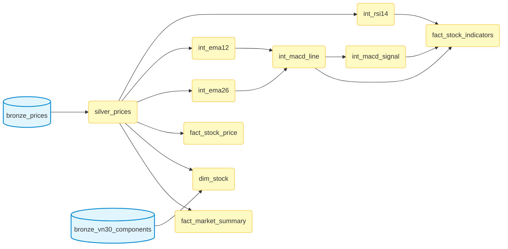

---

## Hình 3.1 — Sơ đồ kiến trúc Luồng dữ liệu tổng thể

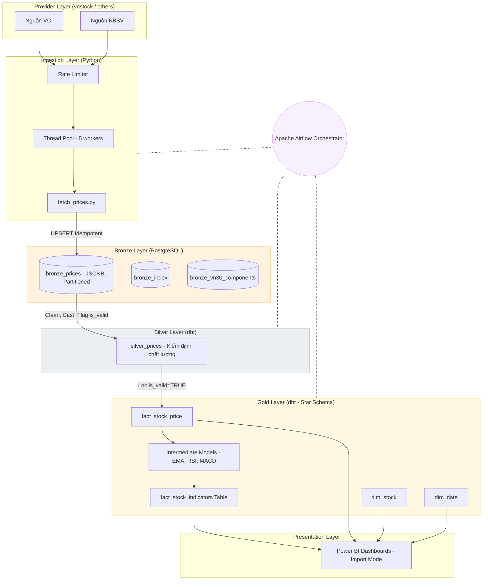

---

## Hình 3.2 — Sơ đồ Thực thể Liên kết (ERD)

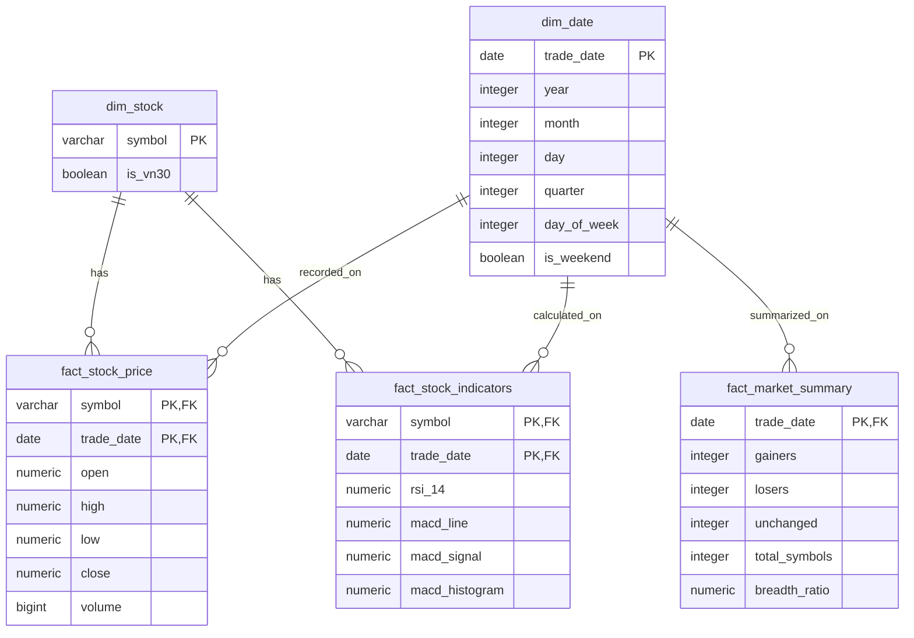

---

## Hình 3.3 — Sơ đồ mô phỏng cơ chế ngắt mạch (Circuit Breaker)

```mermaid
graph TD
    subgraph KB_C [Kịch bản C: Ngắt mạch tầng Silver]
        C0[(Bronze Tables)] -->|Dữ liệu thô| C1[dbt_run_silver]
        C1 --> C3[dbt_test_silver]
        C3 -->|Phát hiện lỗi Cấu trúc| C4((Ngắt mạch))
        C4 -.->|Upstream Failed| C5[Tầng Gold]
        
        style C4 fill:#ffcccc,stroke:#ff0000
        style C5 fill:#f9f9f9,stroke:#999,stroke-dasharray: 5 5
    end

    subgraph KB_D [Kịch bản D: Ngắt mạch tầng Gold]
        D1[Tầng Silver] -->|Thành công| D2[dbt_run_gold]
        D2 --> D3[dbt_test_gold]
        D3 -->|Phát hiện lỗi Nghiệp vụ| D4((Ngắt mạch))
        D4 -.->|Ngăn chặn| D5[Power BI Refresh]
        
        style D4 fill:#ffcccc,stroke:#ff0000
        style D5 fill:#f9f9f9,stroke:#999,stroke-dasharray: 5 5
    end
```

---

## Hình 4.1 — Kiến trúc Triển khai Tổng thể (Docker Compose)

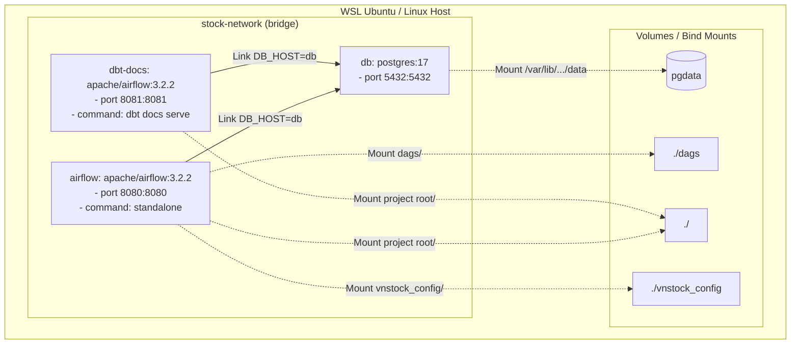

---

## Hình 4.2 — Airflow UI DAG Graph View — daily_stock_pipeline

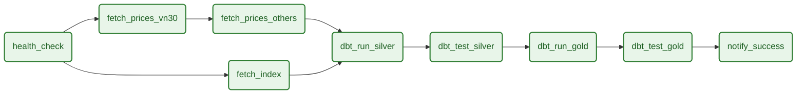

---

## Hình 4.3 — Airflow UI DAG Runs history

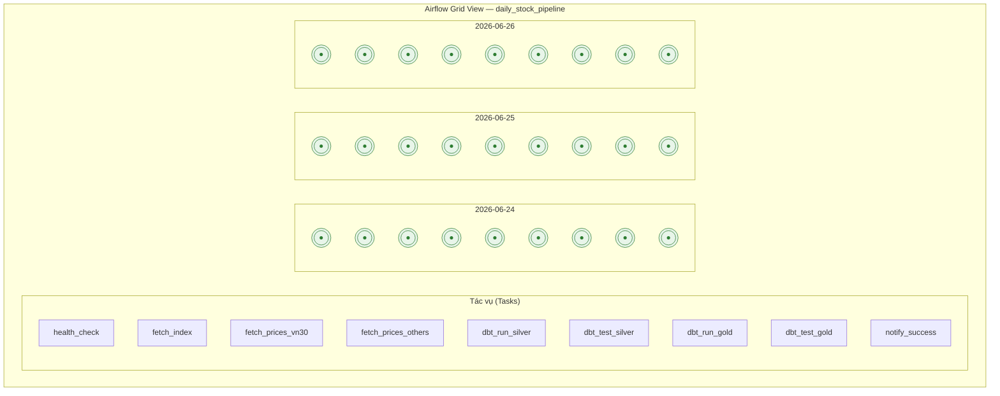

---

## Hình 5.1 — Airflow tự động ngắt mạch pipeline khi API thất bại

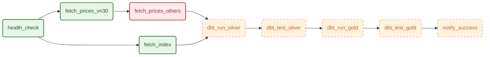

---

## Hình 5.2 — Giao diện Airflow tự động ngắt mạch pipeline khi dbt test tầng Silver thất bại

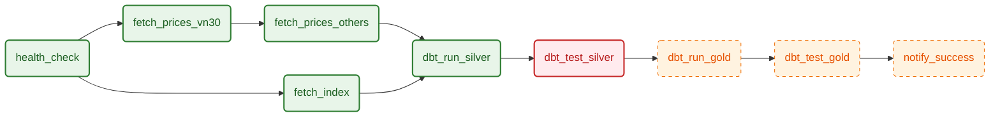

---

## Hình 5.3 — Giao diện Airflow ngắt mạch trước khi báo cáo cập nhật do dbt test tầng Gold thất bại

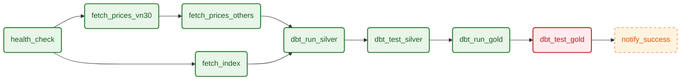

---

## Hình 5.4 — Sơ đồ rẽ nhánh có điều kiện (run_vn30_only) trong daily_stock_pipeline

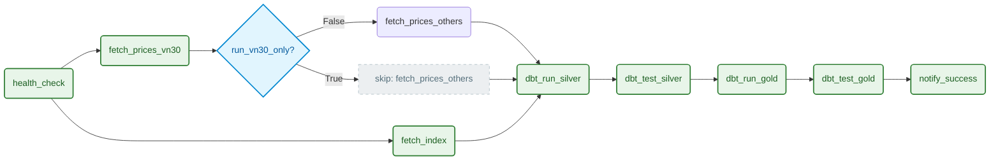

---

## Hình 5.5 — Sơ đồ luồng chạy tuần tự có điều kiện của manual_backfill_pipeline

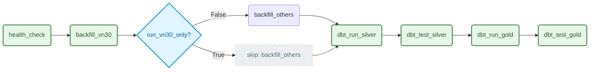

