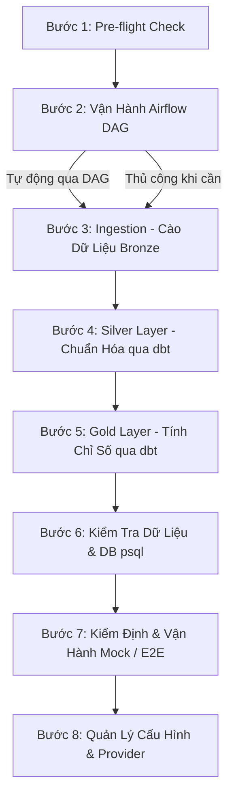

# HƯỚNG DẪN SỬ DỤNG TERMINAL & CÔNG CỤ DÒNG LỆNH

Tài liệu này cung cấp hướng dẫn chi tiết về cách sử dụng các lệnh Terminal để vận hành, kiểm tra và kiểm thử toàn bộ hệ thống **Vietnam Stock Market Data Engineering Pipeline**. Các lệnh được sắp xếp theo **trình tự tuần tự** mà bạn hoặc AI Agent thực hiện trong quá trình phát triển dự án.

---

## 🗺️ BẢN ĐỒ QUY TRÌNH VẬN HÀNH TUẦN TỰ

Để xây dựng hoặc cập nhật dữ liệu, quy trình làm việc thủ công (qua Terminal) được thực hiện theo các bước sau:



---

## 📋 CHI TIẾT CÁC BƯỚC VÀ CÂU LỆNH TERMINAL

### 1. BƯỚC 1: KIỂM TRA TRẠNG THÁI HẠ TẦNG (PRE-FLIGHT CHECK)
> **Mục tiêu:** Đảm bảo Docker container, database PostgreSQL và kết nối dbt đang hoạt động bình thường trước khi thực hiện bất kỳ lệnh nào khác.

#### Lệnh 1.1: Kiểm tra trạng thái các Docker Container
Kiểm tra xem Postgres và Airflow có đang chạy và có trạng thái "Up" hay không:
```bash
docker ps --filter "name=postgres" --filter "name=airflow" --format "{{.Names}} {{.Status}}"
```
* **Giải thích tham số:**
  * `--filter "name=..."`: Lọc ra các container có tên chứa từ khóa tương ứng.
  * `--format "{{.Names}} {{.Status}}"`: Định dạng output chỉ hiển thị Tên và Trạng thái của container để dễ nhìn.
* **Kết quả mong đợi:**
  ```text
  airflow-container Up X hours
  postgres-container Up X hours
  ```

#### Lệnh 1.2: Kiểm tra kết nối tới cơ sở dữ liệu PostgreSQL
Gửi lệnh truy vấn nhanh `SELECT 1;` trực tiếp vào container chứa Postgres để kiểm tra xem DB đã sẵn sàng nhận kết nối hay chưa:
```bash
docker exec postgres-container psql -U airflow -d stock_db -c "SELECT 1;"
```
* **Giải thích tham số:**
  * `docker exec [container_name] [command]`: Thực thi một lệnh bên trong container.
  * `psql`: Công cụ dòng lệnh CLI của PostgreSQL.
  * `-U airflow`: Đăng nhập bằng user `airflow` (cấu hình mặc định).
  * `-d stock_db`: Kết nối vào database tên là `stock_db`.
  * `-c "SELECT 1;"`: Thực thi câu lệnh SQL (`-c` đại diện cho command) rồi thoát ra ngay.
* **Kết quả mong đợi:**
  ```text
   ?column? 
  ----------
          1
  (1 row)
  ```

#### Lệnh 1.3: Kiểm tra kết nối và cấu hình của dbt (dbt debug)
Chạy lệnh debug của dbt bên trong container Airflow để đảm bảo file cấu hình profiles.yml và kết nối từ dbt sang Postgres đã chuẩn xác:
```bash
docker exec airflow-container bash -c "cd /opt/airflow/project/dbt && dbt debug --profiles-dir ."
```
* **Giải thích tham số:**
  * `bash -c "[commands]"`: Chạy một chuỗi các câu lệnh Linux trong môi trường Shell của container.
  * `cd /opt/airflow/project/dbt`: Di chuyển vào thư mục dự án dbt trong container.
  * `dbt debug`: Lệnh kiểm tra cấu hình kết nối của dbt.
  * `--profiles-dir .`: Chỉ định thư mục chứa file `profiles.yml` (ở đây là thư mục hiện tại `.`).
* **Kết quả mong đợi:**
  ```text
  Configuration:
    profiles.yml file [OK found and valid]
    dbt_project.yml file [OK found and valid]
  Required dependencies:
    - git [OK found]
  Connection test: [OK connection ok]
  All checks passed!
  ```

---

### 2. BƯỚC 2: VẬN HÀNH AIRFLOW DAG
> **Mục tiêu:** Trigger, monitor, debug, và quản lý vòng đời các DAG Airflow hoàn toàn qua terminal — không cần mở Web UI.

---

#### 📋 THÔNG TIN THAM CHIẾU NHANH

| DAG ID | Lịch chạy | Mô tả |
| :--- | :--- | :--- |
| `daily_stock_pipeline` | 18:00 VN (11:00 UTC) Thứ 2–6 | Cào toàn bộ HOSE → Silver → Gold |
| `backfill_stock_pipeline` | Trigger thủ công | Backfill nhiều ngày lịch sử |

**Tất cả lệnh Airflow CLI đều chạy qua:** `docker exec airflow-container airflow ...`

**REST API base URL:** `http://localhost:8080/api/v1` — Auth: `admin/admin`

---

#### 2.1 — Kiểm tra và Quản lý trạng thái DAG

**List tất cả DAG hiện có (tên + trạng thái paused/active):**
```bash
docker exec airflow-container airflow dags list
```

**Xem chi tiết một DAG cụ thể (schedule, tags, owner):**
```bash
docker exec airflow-container airflow dags details daily_stock_pipeline
```

**Unpause DAG** (kích hoạt lịch tự động — mặc định DAG mới bị paused):
```bash
docker exec airflow-container airflow dags unpause daily_stock_pipeline
docker exec airflow-container airflow dags unpause backfill_stock_pipeline
```

**Pause DAG** (tắt lịch tự động — không ảnh hưởng run đang chạy):
```bash
docker exec airflow-container airflow dags pause daily_stock_pipeline
```

---

#### 2.2 — Trigger DAG thủ công

**Trigger `daily_stock_pipeline` với config mặc định (toàn bộ HOSE):**
```bash
docker exec airflow-container airflow dags trigger daily_stock_pipeline
```

**Trigger `daily_stock_pipeline` chỉ VN30** (chạy nhanh ~5 phút, bỏ qua ~373 mã còn lại):
```bash
docker exec airflow-container airflow dags trigger daily_stock_pipeline \
  --conf '{"run_vn30_only": true}'
```

**Trigger `daily_stock_pipeline` với ngày logic cụ thể** (giả lập lại ngày hôm qua):
```bash
docker exec airflow-container airflow dags trigger daily_stock_pipeline \
  --logical-date 2026-06-23T11:00:00+00:00
```

**Trigger `backfill_stock_pipeline` với date range** (các DAG nhận conf start/end):
```bash
docker exec airflow-container airflow dags trigger backfill_stock_pipeline \
  --conf '{"start_date": "2026-06-01", "end_date": "2026-06-23"}'
```

---

#### 2.3 — Xem lịch sử DAG Runs

**Xem 5 lần chạy gần nhất của daily pipeline:**
```bash
docker exec airflow-container airflow dags list-runs \
  --dag-id daily_stock_pipeline \
  --no-backfill \
  --state all \
  --output table \
  | head -n 20
```
* **`--state`**: Lọc theo trạng thái: `running` | `success` | `failed` | `queued` | `all`
* **`--output table`**: Hiển thị dạng bảng dễ đọc (thay vì JSON mặc định)

**Xem run đang chạy (nếu có):**
```bash
docker exec airflow-container airflow dags list-runs \
  --dag-id daily_stock_pipeline --state running
```

---

#### 2.4 — Xem trạng thái từng Task Instance

**List tất cả task trong một DAG (tên + trạng thái dependency):**
```bash
docker exec airflow-container airflow tasks list daily_stock_pipeline --tree
```
* **`--tree`**: Hiển thị dạng cây phụ thuộc — giúp bạn thấy thứ tự chạy.
* **Kết quả mong đợi** cho `daily_stock_pipeline`:
  ```text
  health_check
  ├── fetch_prices_vn30
  │   └── fetch_prices_others
  │       └── dbt_run_silver
  │           └── dbt_test_silver
  │               └── dbt_run_gold
  │                   └── dbt_test_gold
  │                       └── notify_success
  └── fetch_index
      └── dbt_run_silver
  ```

**Xem trạng thái từng task instance của một run cụ thể** (thay `<run_id>` bằng ID lấy từ lệnh 2.3):
```bash
docker exec airflow-container airflow tasks states-for-dag-run \
  daily_stock_pipeline <run_id>
```

**Ví dụ thực tế** (với run ID mặc định khi trigger thủ công):
```bash
docker exec airflow-container airflow tasks states-for-dag-run \
  daily_stock_pipeline manual__2026-06-24T11:00:00+00:00
```

---

#### 2.5 — Xem Logs của Task từ Terminal

**Xem log của một task cụ thể** (sau khi run xong hoặc đang chạy):
```bash
docker exec airflow-container airflow tasks logs \
  daily_stock_pipeline fetch_prices_vn30 \
  --run-id manual__2026-06-24T11:00:00+00:00
```
* **Cú pháp:** `airflow tasks logs <dag_id> <task_id> --run-id <run_id>`
* Logs được hiển thị trực tiếp vào terminal — bao gồm stdout của BashOperator.

**Theo dõi realtime Docker logs của Airflow container** (khi DAG đang chạy):
```bash
docker logs airflow-container -f --tail 100
```
* **`-f`**: Follow — tiếp tục stream log mới (tương đương `tail -f`).
* **`--tail 100`**: Chỉ hiển thị 100 dòng gần nhất trước khi follow.
* **Nhấn `Ctrl+C`** để dừng follow.

**Lọc log theo keyword** (ví dụ: chỉ xem log liên quan đến task fetch):
```bash
docker logs airflow-container 2>&1 | grep -E "(fetch|dbt_run|ERROR|FAILED)" | tail -n 30
```

---

#### 2.6 — Clear và Re-run Task Instance

**Clear một task để chạy lại** (ví dụ: `dbt_run_silver` bị failed, muốn chạy lại):
```bash
docker exec airflow-container airflow tasks clear \
  daily_stock_pipeline \
  --task-ids dbt_run_silver \
  --start-date 2026-06-24 \
  --end-date 2026-06-24 \
  --yes
```
* **`--task-ids`**: Tên task cần clear (có thể nhiều task, cách nhau dấu phẩy).
* **`--yes`**: Bỏ qua xác nhận tương tác (cần thiết khi dùng trong script).
* Sau khi clear, Airflow sẽ tự động re-queue và chạy lại task đó.

**Clear toàn bộ một DAG run** (chạy lại toàn bộ từ đầu):
```bash
docker exec airflow-container airflow dags clear \
  daily_stock_pipeline \
  --start-date 2026-06-24 \
  --end-date 2026-06-24 \
  --yes
```

---

#### 2.7 — Backfill nhiều ngày liên tiếp qua Airflow CLI

**Chạy backfill tự động nhiều ngày** (Airflow tự tạo các run cho mỗi ngày trong range):
```bash
docker exec airflow-container airflow dags backfill \
  daily_stock_pipeline \
  --start-date 2026-06-01 \
  --end-date 2026-06-20 \
  --yes
```
> ⚠️ **Lưu ý:** Lệnh này tạo nhiều DAG run liên tiếp theo schedule interval. Với `daily_stock_pipeline`, đây là các run theo từng ngày. Dùng `backfill_stock_pipeline` nếu bạn muốn một run duy nhất kéo toàn bộ range.

---

#### 2.8 — Kiểm tra Airflow Connections và Variables

**Xem tất cả Connection đã cấu hình:**
```bash
docker exec airflow-container airflow connections list
```

**Xem tất cả Variable:**
```bash
docker exec airflow-container airflow variables list
```

**Xem giá trị của một variable cụ thể:**
```bash
docker exec airflow-container airflow variables get PROVIDER
```

---

#### 2.9 — Vận hành qua REST API (Nâng cao)

> REST API cho phép tự động hóa qua script shell — không cần vào container.
> **Auth:** `-u admin:admin` (user/pass mặc định từ `docker-compose.yml`)

**List tất cả DAGs:**
```bash
curl -s -u admin:admin http://localhost:8080/api/v1/dags | python3 -m json.tool | grep -E '"dag_id"|"is_paused"'
```

**Trigger DAG với config:**
```bash
curl -s -u admin:admin -X POST http://localhost:8080/api/v1/dags/daily_stock_pipeline/dagRuns \
  -H "Content-Type: application/json" \
  -d '{"conf": {"run_vn30_only": false}}'
```

**Trigger chỉ VN30 (nhanh):**
```bash
curl -s -u admin:admin -X POST http://localhost:8080/api/v1/dags/daily_stock_pipeline/dagRuns \
  -H "Content-Type: application/json" \
  -d '{"conf": {"run_vn30_only": true}}'
```

**Xem danh sách DAG runs gần nhất:**
```bash
curl -s -u admin:admin \
  "http://localhost:8080/api/v1/dags/daily_stock_pipeline/dagRuns?limit=5&order_by=-execution_date" \
  | python3 -m json.tool | grep -E '"dag_run_id"|"state"|"execution_date"'
```

**Xem trạng thái từng task trong một run** (thay `<run_id>` bằng `dag_run_id` lấy ở trên):
```bash
curl -s -u admin:admin \
  "http://localhost:8080/api/v1/dags/daily_stock_pipeline/dagRuns/<run_id>/taskInstances" \
  | python3 -m json.tool | grep -E '"task_id"|"state"|"duration"'
```

**Pause / Unpause DAG qua API:**
```bash
# Unpause
curl -s -u admin:admin -X PATCH http://localhost:8080/api/v1/dags/daily_stock_pipeline \
  -H "Content-Type: application/json" \
  -d '{"is_paused": false}'

# Pause
curl -s -u admin:admin -X PATCH http://localhost:8080/api/v1/dags/daily_stock_pipeline \
  -H "Content-Type: application/json" \
  -d '{"is_paused": true}'
```

---

### 3. BƯỚC 3: CÀO DỮ LIỆU THỦ CÔNG (INGESTION - BRONZE LAYER)
> **Mục tiêu:** Kích hoạt các script python cào dữ liệu từ Vnstock (hoặc Mock data) để ghi vào các bảng tầng Bronze.

#### Lệnh 2.1: Cào giá cổ phiếu (fetch_prices)
Ví dụ cào dữ liệu giá cổ phiếu của rổ VN30 trong khoảng thời gian từ `2026-06-20` đến `2026-06-24`:
```bash
docker exec airflow-container bash -c "cd /opt/airflow/project && PYTHONPATH=/opt/airflow/project python3 -m ingestion.fetch_prices --mode vn30 --start 2026-06-20 --end 2026-06-24"
```
* **Giải thích tham số:**
  * `PYTHONPATH=/opt/airflow/project`: Khai báo biến môi trường chỉ định đường dẫn root của project để Python hiểu cách import các package/module nội bộ như `providers`, `ingestion`.
  * `-m ingestion.fetch_prices`: Chạy module Python dưới dạng script executable.
  * `--mode vn30`: Chế độ cào cho nhóm VN30 (bạn cũng có thể dùng `--mode all` để cào toàn bộ HOSE).
  * `--start 2026-06-20 --end 2026-06-24`: Giới hạn khoảng thời gian backfill/cào dữ liệu.
* **Lưu ý khác:** Bạn cũng có thể cào các mã cụ thể bằng tham số `--symbols`:
  ```bash
  docker exec airflow-container bash -c "cd /opt/airflow/project && PYTHONPATH=/opt/airflow/project python3 -m ingestion.fetch_prices --symbols FPT,TCB,VNM --start 2026-06-20 --end 2026-06-24"
  ```

#### Lệnh 2.2: Cào dữ liệu chỉ số thị trường (fetch_index)
Cào dữ liệu chỉ số VNINDEX hoặc các chỉ số chung trong cùng khoảng thời gian:
```bash
docker exec airflow-container bash -c "cd /opt/airflow/project && PYTHONPATH=/opt/airflow/project python3 -m ingestion.fetch_index --start 2026-06-20 --end 2026-06-24"
```

---

### 4. BƯỚC 4: DỌN DẸP & CHUẨN HÓA DỮ LIỆU (SILVER LAYER)
> **Mục tiêu:** Chạy dbt chuyển đổi dữ liệu thô (Bronze) thành dữ liệu sạch, đã được chuẩn hóa định dạng và gắn nhãn chất lượng dữ liệu (Silver).

#### Lệnh 3.1: Chạy dbt chuyển đổi tầng Silver
Chạy các model dbt nằm trong thư mục `models/silver`:
```bash
docker exec airflow-container bash -c "cd /opt/airflow/project/dbt && dbt run --select models/silver --profiles-dir ."
```
* **Giải thích tham số:**
  * `dbt run`: Thực thi biên dịch và chạy các file SQL chuyển đổi dữ liệu thành bảng/view trong DB.
  * `--select models/silver`: Chỉ chạy các model nằm trong thư mục `models/silver` (chỉ chạy tầng Silver, bỏ qua Gold để tiết kiệm thời gian khi đang kiểm thử).

---

### 5. BƯỚC 5: TÍNH TOÁN CHỈ SỐ DOANH NGHIỆP & CHỈ BÁO KỸ THUẬT (GOLD LAYER)
> **Mục tiêu:** Tính toán các bảng dimension, fact, các chỉ báo tài chính (EMA, RSI, MACD) phục vụ báo cáo dashboard.

#### Lệnh 4.1: Chạy dbt chuyển đổi tầng Gold
```bash
docker exec airflow-container bash -c "cd /opt/airflow/project/dbt && dbt run --select models/gold --profiles-dir ."
```
* **Giải thích tham số:**
  * `--select models/gold`: Chỉ chạy các model thuộc tầng Gold.

#### Lệnh 4.2: Kiểm định chất lượng dữ liệu cuối cùng (dbt test)
Chạy các bài test ràng buộc dữ liệu (data quality tests) như unique, not null, check constraint trên tầng Gold:
```bash
docker exec airflow-container bash -c "cd /opt/airflow/project/dbt && dbt test --select models/gold --profiles-dir ."
```
* **Giải thích tham số:**
  * `dbt test`: Thực thi các truy vấn kiểm định chất lượng dữ liệu được cấu hình trong file `schema.yml`.
* **Kết quả mong đợi:** Tất cả các case đều trả về `PASS`. Nếu có `FAIL`, dbt sẽ chỉ ra cột nào của bảng nào vi phạm ràng buộc dữ liệu.

---

### 6. BƯỚC 6: KIỂM TRA DỮ LIỆU TRONG DATABASE (PSQL QUERY)
> **Mục tiêu:** Xác minh trực tiếp trạng thái dữ liệu thực tế lưu trong các schema `bronze`, `public_silver`, `public_gold`.

#### Lệnh 5.1: Đếm số lượng dòng dữ liệu trên tất cả các tầng
Sử dụng câu lệnh SQL ghép nối để xem lượng bản ghi đã được đẩy qua các tầng như thế nào:
```bash
docker exec postgres-container psql -U airflow -d stock_db -c "
SELECT '1. Bronze Prices' AS layer, COUNT(*) FROM bronze.bronze_prices 
UNION ALL 
SELECT '2. Silver Prices' AS layer, COUNT(*) FROM public_silver.silver_prices
UNION ALL
SELECT '3. Gold Fact Prices' AS layer, COUNT(*) FROM public_gold.fact_stock_price
UNION ALL
SELECT '4. Gold Indicators (Calculated)' AS layer, COUNT(*) FROM public_gold.fact_stock_indicators;
"
```
* **Ý nghĩa:** Giúp kiểm tra xem dữ liệu có bị rơi rụng (drop) trong quá trình lọc qua các tầng hay không.

#### Lệnh 5.2: Kiểm tra dữ liệu và các chỉ báo kỹ thuật của mã FPT
Truy vấn dữ liệu chi tiết của mã cổ phiếu FPT (để kiểm tra xem RSI, EMA, MACD có tính đúng không):
```bash
docker exec postgres-container psql -U airflow -d stock_db -c "
SELECT symbol, trade_date, close_price, rsi_14, ema_12, ema_26, macd_line, macd_signal 
FROM public_gold.fact_stock_indicators 
WHERE symbol = 'FPT' 
ORDER BY trade_date DESC 
LIMIT 10;
"
```
* **Ý nghĩa:** Hiển thị 10 ngày giao dịch gần nhất của FPT cùng các chỉ số được tính toán tự động qua dbt.

#### Lệnh 5.3: Kiểm tra các bản ghi lỗi bị giữ lại ở tầng Silver (Data Quality Gate)
Truy vấn các bản ghi bị đánh dấu `is_valid = false` ở Silver để biết lỗi phát sinh từ đâu:
```bash
docker exec postgres-container psql -U airflow -d stock_db -c "
SELECT symbol, trade_date, open_price, close_price, is_valid, dq_flag 
FROM public_silver.silver_prices 
WHERE is_valid = false 
LIMIT 10;
"
```

---

### 7. BƯỚC 7: PHÁT SINH DỮ LIỆU MẪU & KIỂM THỬ HỆ THỐNG (MOCK & UNIT TESTS)
> **Mục tiêu:** Sinh dữ liệu mock phục vụ kiểm thử offline và thực thi unit test đảm bảo logic code ổn định.

#### Lệnh 6.1: Tái sinh dữ liệu Mock Fixtures mới
Khi bạn muốn cập nhật file CSV chứa dữ liệu mẫu dùng làm input cho `MockProvider`:
```bash
docker exec airflow-container python3 -m ingestion.generate_mock
```
* **Ý nghĩa:** Chạy code python sinh ngẫu nhiên dữ liệu giá cổ phiếu của các mã pilot (như FPT, ACB...) lưu vào file `tests/fixtures/mock_prices.csv`.

#### Lệnh 6.2: Kiểm tra nội dung file mock fixtures (đọc CSV trên Linux)
Kiểm tra xem file CSV có được sinh ra đúng định dạng hay không bằng lệnh shell:
```bash
head -n 5 tests/fixtures/mock_prices.csv
```
Hoặc tìm kiếm nhanh dữ liệu của mã FPT trong file CSV mẫu:
```bash
grep "^FPT" tests/fixtures/mock_prices.csv | head -n 5
```
* **Giải thích tham số:**
  * `head -n 5`: Xem 5 dòng đầu tiên của file.
  * `grep "^FPT"`: Lọc ra các dòng bắt đầu bằng chữ `FPT`.

#### Lệnh 6.3: Chạy toàn bộ Unit Tests với pytest
Đảm bảo các thay đổi logic code của bạn không làm hỏng các test-case có sẵn:
```bash
docker exec airflow-container pytest tests/ -v
```
* **Giải thích tham số:**
  * `pytest tests/`: Chạy tất cả test case nằm trong thư mục `tests`.
  * `-v`: (Verbose) Hiển thị chi tiết tên từng test-case đang chạy và trạng thái PASS/FAIL.

---

### 8. BƯỚC 8: QUẢN LÝ CẤU HÌNH & CHUYỂN ĐỔI PROVIDER (vnstock ↔ mock)
> **Mục tiêu:** Chuyển đổi giữa chế độ cào dữ liệu thực tế (vnstock) và chế độ chạy giả lập offline (mock).

#### Lệnh 7.1: Xem cấu hình Provider hiện tại
Kiểm tra cấu hình biến môi trường `PROVIDER` đang thiết lập trong file `.env`:
```bash
cat .env | grep -E "PROVIDER|DB_"
```
* **Giải thích tham số:**
  * `cat .env`: Hiển thị nội dung file `.env`.
  * `grep -E "PROVIDER|DB_"`: Dùng Regular Expression tìm các dòng có chứa chữ "PROVIDER" hoặc "DB_".

#### Lệnh 7.2: Chuyển đổi nhanh qua Script Helper
Nếu dự án có sẵn helper script để chuyển đổi chế độ:
* Chuyển sang chế độ chạy thực tế (Real):
  ```bash
  python scripts/demo_helper.py switch-real
  ```
* Chuyển sang chế độ chạy demo offline (Mock):
  ```bash
  python scripts/demo_helper.py switch-demo
  ```
* **Sau khi chạy lệnh trên, cần khởi động lại container để áp dụng cấu hình mới:**
  ```bash
  docker compose down && docker compose up -d
  ```

---

## 🛠️ QUICK REFERENCE - CẨM NANG GỠ LỖI NHANH (DEBUG TROUBLESHOOTING)

### Lỗi hạ tầng

| Lỗi gặp phải | Lệnh xử lý nhanh |
| :--- | :--- |
| **Không kết nối được Postgres container** | Khởi động lại container DB: <br>`docker restart postgres-container` |
| **Port 5432 bị chiếm trên máy host** | Check port đang chạy: `netstat -tulnp \| grep 5432`<br> hoặc đổi port ngoài máy host trong `docker-compose.yml` |
| **dbt run báo lỗi "schema bronze not found"** | Bạn chưa chạy ingestion để tạo bảng thô. Chạy lại **Bước 3** trước. |
| **Airflow DAG bị khoá (Locked)** | Reset trạng thái DAG trên UI hoặc restart container: <br>`docker restart airflow-container` |
| **Lỗi Permission khi Docker ghi file** | Đổi quyền thư mục hoặc chạy lệnh dưới quyền root trong container:<br>`docker exec -u root airflow-container ...` |

### Lỗi Airflow DAG & REST API

| Lỗi gặp phải | Lệnh xử lý nhanh |
| :--- | :--- |
| **DAG không hiện trong list** | DAG chưa được parse: `docker logs airflow-container 2>&1 \| grep -i "error\|import"` |
| **DAG bị paused, không tự chạy** | `docker exec airflow-container airflow dags unpause <dag_id>` |
| **Task bị stuck ở trạng thái "running"** | Clear task: `docker exec airflow-container airflow tasks clear <dag_id> --task-ids <task_id> --yes` |
| **DAG run failed, muốn chạy lại từ task cụ thể** | Clear task đó rồi trigger lại hoặc đợi Airflow re-queue tự động |
| **REST API trả về 401 Unauthorized** | Sai user/pass — mặc định là `admin/admin` theo `docker-compose.yml` |
| **REST API trả về 404** | Sai dag_id hoặc run_id — kiểm tra lại bằng lệnh list (Lệnh 2.1) |

---

### Lỗi Ingestion & Database (Bronze Layer)

| Lỗi gặp phải | Nguyên nhân | Lệnh xử lý nhanh |
| :--- | :--- | :--- |
| **`CardinalityViolation: ON CONFLICT DO UPDATE command cannot affect row a second time`** | Provider trả về **duplicate `(code, date)`** trong cùng 1 batch. Không phải lỗi DB — lỗi ở dữ liệu đầu vào. | Đã xử lý tự động trong `db.py` (dedup trước upsert). Xem log để đếm số dòng bị drop. |
| **Muốn kiểm tra duplicate trong Bronze ngay trên DB** | Xác nhận dữ liệu đã có bị trùng chưa | Xem lệnh 5.4 bên dưới |
| **Backfill bị skip dù chưa có đủ data** | Skip check ≥ 80% đang trigger sai | Thêm `--force` vào lệnh backfill |
| **Lỗi kết nối provider vnstock (rate limit)** | 60 req/phút với Community plan | Chờ 60s rồi retry, hoặc switch `PROVIDER=mock` trong `.env` |

#### Lệnh 5.4: Kiểm tra duplicate `(code, date)` trong bảng Bronze
```bash
docker exec postgres-container psql -U airflow -d stock_db -c "
SELECT code, date, COUNT(*) as cnt
FROM bronze.bronze_prices
GROUP BY code, date
HAVING COUNT(*) > 1
ORDER BY cnt DESC
LIMIT 20;
"
```
* **Kết quả mong đợi:** Không có dòng nào (0 rows) — tức không có duplicate.
* Nếu có dòng → chạy lệnh dọn dẹp duplicate thủ công (giữ `ingested_at` mới nhất):
  ```bash
  docker exec postgres-container psql -U airflow -d stock_db -c "
  DELETE FROM bronze.bronze_prices
  WHERE ctid NOT IN (
    SELECT MIN(ctid)
    FROM bronze.bronze_prices
    GROUP BY code, date
  );
  "
  ```

#### Lệnh 5.5: Đếm số dòng theo từng mã trong Bronze (kiểm tra coverage)
```bash
docker exec postgres-container psql -U airflow -d stock_db -c "
SELECT code, COUNT(*) as total_days,
       MIN(date) as earliest, MAX(date) as latest
FROM bronze.bronze_prices
GROUP BY code
ORDER BY total_days DESC
LIMIT 20;
"
```
* **Ý nghĩa:** Phát hiện mã nào bị thiếu nhiều ngày so với kỳ vọng (~1300+ ngày từ 2021).

#### Lệnh 5.6: Xem log ingestion để đếm số duplicate bị drop
```bash
docker logs airflow-container 2>&1 | grep -E "(Dropped.*duplicate|CardinalityViolation|Failed to insert)" | tail -n 20
```
* **Ý nghĩa:** Sau khi fix, log sẽ in ra cảnh báo `WARNING Dropped N duplicate (code, date) rows` thay vì raise exception.

---

### 9. BƯỚC 9: TRUY VẤN DATABASE — ĐẾM DÒNG VÀ LẤY BẢN GHI THEO Ý MUỐN
> **Mục tiêu:** Tra cứu dữ liệu trực tiếp trong PostgreSQL trên mọi bảng của tất cả 3 tầng Bronze/Silver/Gold mà không cần mở UI. Schema thực tế: `bronze`, `public_silver`, `public_gold`.

---

#### 9.1 — Đếm số dòng nhanh: TẤT CẢ bảng pipeline (1 lệnh)

```bash
docker exec postgres-container psql -U airflow -d stock_db -c "
SELECT 'bronze.bronze_prices'              AS bang, COUNT(*) AS so_dong FROM bronze.bronze_prices
UNION ALL
SELECT 'bronze.bronze_index',                       COUNT(*) FROM bronze.bronze_index
UNION ALL
SELECT 'bronze.bronze_vn30_components',             COUNT(*) FROM bronze.bronze_vn30_components
UNION ALL
SELECT 'public_silver.silver_prices',               COUNT(*) FROM public_silver.silver_prices
UNION ALL
SELECT 'public_silver.silver_index',                COUNT(*) FROM public_silver.silver_index
UNION ALL
SELECT 'public_gold.dim_stock',                     COUNT(*) FROM public_gold.dim_stock
UNION ALL
SELECT 'public_gold.fact_stock_price',              COUNT(*) FROM public_gold.fact_stock_price
UNION ALL
SELECT 'public_gold.fact_stock_indicators',         COUNT(*) FROM public_gold.fact_stock_indicators
UNION ALL
SELECT 'public_gold.fact_market_summary',           COUNT(*) FROM public_gold.fact_market_summary;
"
```

**Kết quả thực tế (2026-06-24, sau backfill đầy đủ HOSE ~401 mã):**

| Bảng | Số dòng |
| :--- | ---: |
| `bronze.bronze_prices` | **514,942** |
| `bronze.bronze_index` | 2,792 |
| `bronze.bronze_vn30_components` | 30 |
| `public_silver.silver_prices` | **514,942** |
| `public_silver.silver_index` | 2,792 |
| `public_gold.dim_stock` | 401 |
| `public_gold.fact_stock_price` | **514,942** |
| `public_gold.fact_stock_indicators` | 4,727 |
| `public_gold.fact_market_summary` | 1,607 |

---

#### 9.2 — BRONZE LAYER — Truy vấn bảng `bronze.bronze_prices`

**Đếm số mã và phạm vi ngày:**
```bash
docker exec postgres-container psql -U airflow -d stock_db -c "
SELECT COUNT(DISTINCT code) AS so_ma,
       MIN(date) AS ngay_bat_dau,
       MAX(date) AS ngay_cuoi_cung,
       COUNT(*) AS tong_dong
FROM bronze.bronze_prices;"
```

**Top 15 mã có nhiều phiên nhất:**
```bash
docker exec postgres-container psql -U airflow -d stock_db -c "
SELECT code, COUNT(*) AS so_phien, MIN(date) AS tu_ngay, MAX(date) AS den_ngay
FROM bronze.bronze_prices
GROUP BY code
ORDER BY so_phien DESC
LIMIT 15;"
```

**Lấy N ngày gần nhất của 1 mã cụ thể:**
```bash
docker exec postgres-container psql -U airflow -d stock_db -c "
SELECT code, date, open, high, low, close, volume, source
FROM bronze.bronze_prices
WHERE code = 'VNM'
ORDER BY date DESC
LIMIT 10;"
```

**Lấy trong khoảng ngày cụ thể:**
```bash
docker exec postgres-container psql -U airflow -d stock_db -c "
SELECT code, date, close, volume
FROM bronze.bronze_prices
WHERE code = 'HPG'
  AND date BETWEEN '2026-01-01' AND '2026-06-24'
ORDER BY date;"
```

**Lấy nhiều mã cùng 1 ngày (snapshot thị trường):**
```bash
docker exec postgres-container psql -U airflow -d stock_db -c "
SELECT code, date, open, high, low, close, volume
FROM bronze.bronze_prices
WHERE code IN ('VNM', 'VCB', 'HPG', 'FPT', 'ACB', 'TCB')
  AND date = '2026-06-24'
ORDER BY code;"
```

**Lấy tất cả mã của 1 ngày (toàn thị trường):**
```bash
docker exec postgres-container psql -U airflow -d stock_db -c "
SELECT code, close, volume
FROM bronze.bronze_prices
WHERE date = '2026-06-24'
ORDER BY volume DESC
LIMIT 30;"
```

---

#### 9.3 — BRONZE INDEX — Truy vấn bảng `bronze.bronze_index`

```bash
# Tất cả chỉ số, N ngày gần nhất
docker exec postgres-container psql -U airflow -d stock_db -c "
SELECT code, date, open, high, low, close, volume
FROM bronze.bronze_index
ORDER BY date DESC
LIMIT 10;"
```

```bash
# Chỉ VN30 index
docker exec postgres-container psql -U airflow -d stock_db -c "
SELECT code, date, close
FROM bronze.bronze_index
WHERE code = 'VN30'
ORDER BY date DESC
LIMIT 20;"
```

---

#### 9.4 — SILVER LAYER — Truy vấn bảng `public_silver.silver_prices`

**Xem dữ liệu có cột quality (is_valid, dq_flag):**
```bash
docker exec postgres-container psql -U airflow -d stock_db -c "
SELECT symbol, trade_date, open_price, high_price, low_price, close_price,
       volume, is_valid, dq_flag
FROM public_silver.silver_prices
WHERE symbol = 'ACB'
ORDER BY trade_date DESC
LIMIT 10;"
```

**Chỉ bản ghi hợp lệ (is_valid = true):**
```bash
docker exec postgres-container psql -U airflow -d stock_db -c "
SELECT symbol, trade_date, close_price, volume
FROM public_silver.silver_prices
WHERE symbol = 'FPT' AND is_valid = true
ORDER BY trade_date DESC
LIMIT 15;"
```

**Xem bản ghi lỗi (data quality issues):**
```bash
docker exec postgres-container psql -U airflow -d stock_db -c "
SELECT symbol, trade_date, close_price, dq_flag
FROM public_silver.silver_prices
WHERE is_valid = false
ORDER BY trade_date DESC
LIMIT 10;"
```

**Silver index (VNINDEX, VN30):**
```bash
docker exec postgres-container psql -U airflow -d stock_db -c "
SELECT code, trade_date, open_price, close_price, volume
FROM public_silver.silver_index
ORDER BY trade_date DESC
LIMIT 10;"
```

---

#### 9.5 — GOLD LAYER — Truy vấn `public_gold.fact_stock_indicators`

**Xem đầy đủ chỉ báo kỹ thuật (RSI, EMA, MACD, Bollinger Bands):**
```bash
docker exec postgres-container psql -U airflow -d stock_db -c "
SELECT symbol, trade_date, close_price,
       ma5, ma20,
       rsi_14,
       ema_12, ema_26,
       macd_line, macd_signal, macd_histogram,
       bb_upper, bb_middle, bb_lower
FROM public_gold.fact_stock_indicators
WHERE symbol = 'HPG'
ORDER BY trade_date DESC
LIMIT 15;"
```

**Tìm mã có RSI quá mua (> 70):**
```bash
docker exec postgres-container psql -U airflow -d stock_db -c "
SELECT symbol, trade_date, close_price, rsi_14
FROM public_gold.fact_stock_indicators
WHERE trade_date = '2026-06-24'
  AND rsi_14 > 70
ORDER BY rsi_14 DESC;"
```

**Tìm mã có RSI quá bán (< 30):**
```bash
docker exec postgres-container psql -U airflow -d stock_db -c "
SELECT symbol, trade_date, close_price, rsi_14
FROM public_gold.fact_stock_indicators
WHERE trade_date = '2026-06-24'
  AND rsi_14 < 30
ORDER BY rsi_14 ASC;"
```

**MACD cross-up signal (macd_line vừa cắt lên macd_signal):**
```bash
docker exec postgres-container psql -U airflow -d stock_db -c "
SELECT symbol, trade_date, close_price, macd_line, macd_signal,
       macd_line - macd_signal AS macd_diff
FROM public_gold.fact_stock_indicators
WHERE trade_date >= CURRENT_DATE - INTERVAL '5 days'
  AND macd_line > macd_signal
ORDER BY trade_date DESC, symbol
LIMIT 20;"
```

---

#### 9.6 — GOLD LAYER — Truy vấn `public_gold.fact_stock_price`

```bash
# Giá N ngày gần nhất
docker exec postgres-container psql -U airflow -d stock_db -c "
SELECT symbol, trade_date, open_price, high_price, low_price, close_price, volume
FROM public_gold.fact_stock_price
WHERE symbol = 'VNM'
ORDER BY trade_date DESC
LIMIT 10;"
```

```bash
# Top mã khối lượng cao nhất trong ngày
docker exec postgres-container psql -U airflow -d stock_db -c "
SELECT symbol, trade_date, close_price, volume
FROM public_gold.fact_stock_price
WHERE trade_date = '2026-06-24'
ORDER BY volume DESC
LIMIT 15;"
```

---

#### 9.7 — GOLD LAYER — Truy vấn `public_gold.fact_market_summary`

```bash
# Thống kê thị trường 10 ngày gần nhất
docker exec postgres-container psql -U airflow -d stock_db -c "
SELECT trade_date, total_symbols, gainers, losers, unchanged,
       ROUND(avg_close_price::numeric, 2) AS avg_close,
       total_volume
FROM public_gold.fact_market_summary
ORDER BY trade_date DESC
LIMIT 10;"
```

```bash
# Ngày có nhiều mã tăng nhất trong 3 tháng gần đây
docker exec postgres-container psql -U airflow -d stock_db -c "
SELECT trade_date, gainers, losers, unchanged, total_symbols
FROM public_gold.fact_market_summary
WHERE trade_date >= CURRENT_DATE - INTERVAL '90 days'
ORDER BY gainers DESC
LIMIT 5;"
```

---

#### 9.8 — GOLD LAYER — Truy vấn `public_gold.dim_stock`

```bash
# Tất cả mã VN30
docker exec postgres-container psql -U airflow -d stock_db -c "
SELECT symbol, exchange, is_vn30
FROM public_gold.dim_stock
WHERE is_vn30 = true
ORDER BY symbol;"
```

```bash
# Tất cả mã HOSE (không phải VN30)
docker exec postgres-container psql -U airflow -d stock_db -c "
SELECT symbol, exchange
FROM public_gold.dim_stock
WHERE is_vn30 = false
ORDER BY symbol
LIMIT 30;"
```

---

#### 9.9 — Xem cấu trúc cột (schema) của bất kỳ bảng nào

```bash
# Bronze prices columns
docker exec postgres-container psql -U airflow -d stock_db -c \
  "SELECT column_name, data_type FROM information_schema.columns
   WHERE table_schema='bronze' AND table_name='bronze_prices'
   ORDER BY ordinal_position;"

# Silver prices columns
docker exec postgres-container psql -U airflow -d stock_db -c \
  "SELECT column_name, data_type FROM information_schema.columns
   WHERE table_schema='public_silver' AND table_name='silver_prices'
   ORDER BY ordinal_position;"

# Gold indicators columns
docker exec postgres-container psql -U airflow -d stock_db -c \
  "SELECT column_name, data_type FROM information_schema.columns
   WHERE table_schema='public_gold' AND table_name='fact_stock_indicators'
   ORDER BY ordinal_position;"
```

---

#### 📋 QUICK REFERENCE — Bảng tóm tắt Schema & Tên Cột

| Bảng | Schema | Cột ngày | Cột mã | Cột giá đóng |
| :--- | :--- | :--- | :--- | :--- |
| `bronze_prices` | `bronze` | `date` | `code` | `close` |
| `bronze_index` | `bronze` | `date` | `code` | `close` |
| `silver_prices` | `public_silver` | `trade_date` | `symbol` | `close_price` |
| `silver_index` | `public_silver` | `trade_date` | `code` | `close_price` |
| `fact_stock_price` | `public_gold` | `trade_date` | `symbol` | `close_price` |
| `fact_stock_indicators` | `public_gold` | `trade_date` | `symbol` | `close_price` |
| `fact_market_summary` | `public_gold` | `trade_date` | *(thị trường)* | `avg_close_price` |
| `dim_stock` | `public_gold` | *(không có)* | `symbol` | *(không có)* |

> **Ghi chú quan trọng:**
> - Bronze dùng `code` + `date` · Silver/Gold dùng `symbol` + `trade_date`
> - Luôn thêm `LIMIT N` khi query bảng lớn (bronze_prices: 514K dòng)
> - Kết nối nhanh nhất: `docker exec postgres-container psql -U airflow -d stock_db -c "..."`

